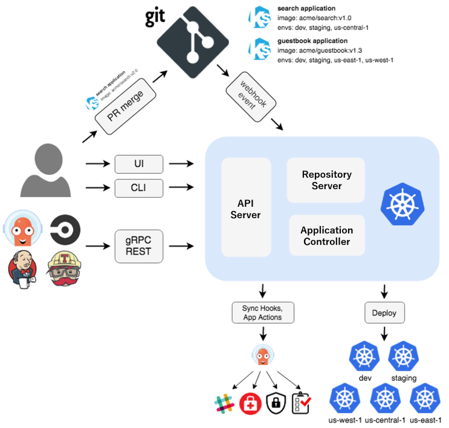

# Certified Argo Project Associate

_This exam is an online, proctored, multiple-choice exam._

## Resources

* <https://argo-workflows.readthedocs.io/en/stable/>
* <https://paulyu.dev/article/capa-study-guide/>

## Topics

<details>
  <summary>Argo Workflows (36%)</summary>

* Understand Argo Workflow Fundamentals
* Generating and Consuming Artifacts
* Understand Argo Workflow Templates
* Understand the Argo Workflow Spec
* Work with DAG (Directed-Acyclic Graphs)
* Run Data Processing Jobs with Argo Workflows

Argo Workflows is an open source container-native workflow engine for orchestrating parallel jobs on Kubernetes. It's implemented as a Kubernetes CRD.

Workflows are implemented as a Kubernetes CRD.

* Lightweight and easy to use.
* Designed from the ground up for containers without the overhead and limitations of legacy VM and server-based environments.

Components of Argo Workflows include:

* controller
* mainContainer
* executor
* server

## Core Concepts

The `Workflow`is the most important resourcein Argo and serves two functions:

1. It defines the workflow to be executed.
2. It stores the state of the workflow.

Should be treated as a "live" object. It's not just a static definition but it's also an "instance" of said definition.

In the `WorkflowSpec` the core structures are:

* `entrypoint` defines what the main function will be - that is, the first template to be executed.
* `templates` can be loosely thought of as functions, they define instructions to be executed.


The internals of a step Pod are:

* `main` container runs the Image that the user has indicated, where the `argoexec` utility is volume mounted and serves as the main command which calls **the configured Command as a sub-process**.
* `init` container is an `InitContainer` fetching artifacts and parameters and making them available to the `main` container.
* `wait` container performs tasks that are needed for clean up, including saving of parameters and artifacts.

There are six types of templates, divided into two categories:

* Work to be done:
  * **container** - The most common template type. The spec is the same as the one of a container spec in Kubernetes.
  * **script** - Convenience wrapper around a `container`. The spec is the same as for a container but adds the `source:` field for in-place scripts. The script will be saved in a file and executed for you. The result of the script will be automatically exported into an Argo variable:

    ```
    {{tasks.<NAME>.outputs.result}}
    {{steps.<NAME>.outputs.result}}
    ```

  * **resource** - Performs operations on cluster resources directly. It can be used to get, create, apply, delete replace or patch resouces on your cluster.
  * **suspend** - Suspend execution, either for aduration or until it is resumed manually.
  * **plugin** - Is a task that allows you to run an external plugin.
  * **containerSet** - Run multiple containers ina single Pod. Consolidate Pod spin-up time into one step in your workflow.
  * **data** - Get data from S3.
  * **http** - Is a task that allows you to make HTTP requests.
  * **steps** - A steps template you define your tasks in a series of steps. The structure of the template is a "list of lists". you can use synchronization to run the inner ones one by one. Control execution can be done with e.g. `when:`. Can include `container`, `scripts` or `dag`.
    * Outer lists will run sequentially
    * Inner lists will run in parallel
  * **dag** - Define tasks as a graph of dependencies. In a DAG, you list all your tasks and set which other tasks must complete before a particular task can begin. Tasks without any dependencies will run in immediately.

DAG = specify dependencies and allow for maximum parallelism.

## Workflows

The structure of Workflow Specs:

* Kubernetes header including meta-data
* Spec body
  * Entrypoint
  * List of template definitions
* For each template
  * Name
  * Inputs
  * Outputs
  * Container Invocation or a list of steps
    * For each step, a template invocation

`ClusterWorkflowTemplates` are cluster-scoped `WorkflowTemplates` that can be created cluster scped like a `ClusterRole`.

```
clusterScope: true
```

Indicates that the template is cluster-scoped.

## Artifacts

Are packaged as tarbals and gzipped by default. Skip by specifying `archive.none=false`.

Artifact garbae collection for artifacts you dont need can be done with `OnWorkflowCompletion` or `OnWorkflowDeletion`.

Strategies:
`artifactGC.strategy=Never`, set the strategy in the spec to make it global.

```
...
  artifactGC:
    strategy: OnWorkflowDeletion
    forceFinalizerRemoval: true
...
```

Hardwired Artifacts are static explicitly defined artifacts.

Condsider parameterizing your S3 keys by `workflow.uid` in case you have concurrent workflows of the same spec.

You can set a specific `serviceAccountName` for to override the service account used to access S3.

`artifactRepositoryRef` is used to specify the repository to use for the artifact. This is a reference to a `ConfigMap` or `Secret` that contains the configuration for the artifact repository.

## Service Accounts

In order for Argo to support features such as artifacts, outputs, access to secrets, etc. It needs to communicate with Kubernetes resources using the KAPI.

```
argo submit --serviceaccount <name> <workflow.yaml>
```

All Pods in a workflow run with the service account specified in the `workflow.spec.serviceAccountName` field. If omitted the default service account of the namespace is used.

It depends on how much access a workflow needs in the cluster.

For a executor to function properly we'll need:

* create
* patch

on `workflowtaskresults`.

## Variables

Template Tag kinds:

* simple (default) e.g. `{{workflow.name}}`
* expression e.g. `{{=workflow.name}}`

## Retry policies

Set under `spec.templates.retryStrategy`:

* `Always` - always retry
* `OnFailure` - retry steps whose main container is marked as failed in Kubernetes
* `OnError` - retry steps that encounter Argo controller errors, or whose init or way containers fail
* `OnTransientError` - retry steps that encounter errors defined as transient.

## Lifecycle Hooks

Triggers an actions based on a conditional expression or on completion of a step or template. On workflow or template level.

## Step Level memoization

Workflows ofthen have outputs that are expensive to compute. Memoization reduces cost and mworkflow execution time by reading the results of previous executions of the same step.

It stores the output of a template into a specfied cache.

## The WorkflowSpec

The `WorkflowSpec` is the main spec of a workflow. It defines the workflow to be executed and stores the state of the workflow.

* `activeDeadlineSeconds` - Duration in seconds relative to the workflow start time.
* `archiveLogs` - If the container logs should be archived.
* `arguments` - Contains the parameters and artifacts sent to the workflow entrypoint. Params are referencable globally using the `workdlow` variable
* `artifactGC` - The strategy to use when deleting artifacts from completed or deleted workflows.
* `artifacyRepositoryRef` - Specifies the configMap name and key containing the artifact repo config.
* `entrypoint` - Is a template reference to the starting point of the workflow.
* `podGC` - Strategy to use when deleting compelted Pods.
* `paralellism`- Number of max total parallel Pods that execute at the same time.
* `serviceAccountName` - The service account to use for the workflow, used for all Pods of the workflow.
* `templates` - List of workflow templates used in a workflow.

## The DAG

A dag templates

</details>

<details>
  <summary>Argo CD (34%)</summary>

* Understand Argo CD Fundamentals
* Synchronize Applications Using Argo CD
* Use Argo CD Application
* Configure Argo CD with Helm and Kustomize
* Identify Common Reconciliation Patterns



## Core Concepts

* Application - A group of Kubernetes resources as defined by a manifest. CRD.
* Application source type - Which **tool** is used to build the application.
* Target state - Desired state
* Live state - Current state
* Sync status - Does the live state match the target state?
* Sync - Process of moving an app to the target state
* Refresh - Compare latest code in Git with the live state
* Health - Is it running correctly?
* Tool - Tool to create manifests from a directory of files e.g. Kustomize.

## Architectural Overview

Components:

* API server - is gRPC/REST service which exposes the API consumed by the web UI
  * Application management and status reporting
  * Invoke of application operations (sync, rollback, user defined actions)
  * Manage repo and cluster credentials
  * Auth and auth delegation to external identity providers
  * RBAC enforcement
  * listener/forwarder for Git webhook events

* Repository server - internal service which maintains a local cache of the Git repository holding the application manifests
  * Generating and returning Kubernetes manifests when provided with the following inputs:
    * Repo URL
    * Revision
    * App path
    * Template specifics, params and or helm values.yaml

* Application controller - A continoususly monitors running applications and compares the current, live state against the desired target state (from repo). It detects `OutOfSync` application state and takes action. Lifecycle events are handled by this controller also, presync, sync, postsync.

## Tools

Argo CD supports the following tools:

* Kustomize applications
* Helm charts
* Directoy of YAML/JSON manifests including Jsonnet
* Custom config management tool

```yaml
apiVersion: argoproj.io/v1alpha1
kind: ConfigManagementPlugin
metadata:
  # The name of the plugin must be unique within a given Argo CD instance.
  name: my-plugin
spec:
  # The version of your plugin. Optional. If specified, the Application's spec.source.plugin.name field
  # must be <plugin name>-<plugin version>.
  version: v1.0
  # The init command runs in the Application source directory at the beginning of each manifest generation. The init
  # command can output anything. A non-zero status code will fail manifest generation.
  init:
    # Init always happens immediately before generate, but its output is not treated as manifests.
    # This is a good place to, for example, download chart dependencies.
    command: [sh]
    args: [-c, 'echo "Initializing..."']
  # The generate command runs in the Application source directory each time manifests are generated. Standard output
  # must be ONLY valid Kubernetes Objects in either YAML or JSON. A non-zero exit code will fail manifest generation.
  # To write log messages from the command, write them to stderr, it will always be displayed.
  # Error output will be sent to the UI, so avoid printing sensitive information (such as secrets).
  generate:
    command: [sh, -c]
    args:
      - |
        echo "{\"kind\": \"ConfigMap\", \"apiVersion\": \"v1\", \"metadata\": { \"name\": \"$ARGOCD_APP_NAME\", \"namespace\": \"$ARGOCD_APP_NAMESPACE\", \"annotations\": {\"Foo\": \"$ARGOCD_ENV_FOO\", \"KubeVersion\": \"$KUBE_VERSION\", \"KubeApiVersion\": \"$KUBE_API_VERSIONS\",\"Bar\": \"baz\"}}}"
  # The discovery config is applied to a repository. If every configured discovery tool matches, then the plugin may be
  # used to generate manifests for Applications using the repository. If the discovery config is omitted then the plugin 
  # will not match any application but can still be invoked explicitly by specifying the plugin name in the app spec. 
  # Only one of fileName, find.glob, or find.command should be specified. If multiple are specified then only the 
  # first (in that order) is evaluated.
```

## Projects

Porjects provide logical grouping of applications, which is useful when Argo CD is used by multiple teams. Projects provide the following features:

* Restrict what may be deployed
* Restrict where apps may be deployed
* Restrict which objects may or may not be deployed
* Defining project roles to provide application RBAC

All applications belongs to a single project. The default project is `default` and permits deployments from any source repo, to any cluster and all resource Kinds.

You cant delete the default project, but you can modify it.

You can create a project with the following command:

```bash
argocd proj create myproject -d https://kubernetes.default.svc,mynamespace -s https://github.com/argoproj/argocd-example-apps.git
```

You can use negations:

```
spec:
  sourceRepos:
    # Do not use the test repo in argoproj
    - '!ssh://git@GITHUB.com:argoproj/test'
    # Nor any Gitlab repo under group/ 
    - '!https://gitlab.com/group/**'
    # Any other repo is fine though
    - '*'
```

A source repository is considered valid if the following conditions hold:

1. Any allow source rule (i.e. a rule which isn't prefixed with !) permits the source
2. AND no deny source (i.e. a rule which is prefixed with !) rejects the source

```
argocd app set guestbook-default --project myproject
```

Key fields:

* `sourceRepos` - Repos that applicatiosn within the project can **pull manifests from**.
* `destinations` - Clusters and namespaces that applications within the project can deploy into.
* `roles` - Entities with definitions of their access to resources wihtin the project.

```yaml
spec:
  description: Example Project
  # Allow manifests to deploy from any Git repos
  sourceRepos:
  - '*'
  # Only permit applications to deploy to the guestbook namespace in the same cluster
  destinations:
  - namespace: guestbook
    server: https://kubernetes.default.svc
  # Deny all cluster-scoped resources from being created, except for Namespace
  clusterResourceWhitelist:
  - group: ''
    kind: Namespace
  # Allow all namespaced-scoped resources to be created, except for ResourceQuota, LimitRange, NetworkPolicy
  namespaceResourceBlacklist:
  - group: ''
    kind: ResourceQuota
  - group: ''
    kind: LimitRange
  - group: ''
    kind: NetworkPolicy
  # Deny all namespaced-scoped resources from being created, except for Deployment and StatefulSet
  namespaceResourceWhitelist:
  - group: 'apps'
    kind: Deployment
  - group: 'apps'
    kind: StatefulSet
  roles:
  # A role which provides read-only access to all applications in the project
  - name: read-only
    description: Read-only privileges to my-project
    policies:
    - p, proj:my-project:read-only, applications, get, my-project/*, allow
    groups:
    - my-oidc-group
  # A role which provides sync privileges to only the guestbook-dev application, e.g. to provide
  # sync privileges to a CI system
  - name: ci-role
    description: Sync privileges for guestbook-dev
    policies:
    - p, proj:my-project:ci-role, applications, sync, my-project/guestbook-dev, allow
    # NOTE: JWT tokens can only be generated by the API server and the token is not persisted
    # anywhere by Argo CD. It can be prematurely revoked by removing the entry from this list.
    jwtTokens:
    - iat: 1535390316
```

### Project roles

Projects inlclude a feature called roles that can be used to determine who and what can be done to the applications associated with the project.

`proj:<project-name>:<role-name>`

## Sync Options

Allows you to customize some aspects of how it syncs the desired state in the target cluster.

You can configure it in the `Application` resource and it can be set as annotation called `argocd.argoproj.io/sync-options`. Concatenate with a comma!

```yaml
metadata:
  annotations:
    argocd.argoproj.io/sync-options: Prune=false
```

Options:

* SkipDryRunOnMissingResource=true - skip the dry run for missing resource types.
* Delete=false - Retain resource after the application is deleted.
* Prune=false - Prevent object from being pruned.
* ApplyOutOfSyncOnly=true - Selective sync.
* PruneLast=true - Resource pruning to happen as a final, implicit wave of a sync operation.
* Replace=true - By default ArgoCD does a `kubectl apply`. With this option it will do a `kubectl replace` or `kubectl create`. Destructive!
* ServerSideApply=true - Resources are too big. Replace takes precedence over ServerSideApply.
* CreateNamespace=true

Namespace Metadata can be added to syncPolicy to add labels and annotations to the namespace being created.

Propagation policies:

* Background
* Foreground
* Orphan

## Application Set

Provides:

* Ability to use a single Kubernetes manifest to target multiple Kubernetes clusters
* The ability to use a single Kubernetes manifest to deploy multipl applications from one or multiple Git repositories with ArgoCD
* Improved support for monorepos, multiple applications in one Git repository

## Reconcile Optimizations

Argo CD defaults to refreshing every time a resource that belongs to it changes.

Other Kubernetes controllers often update the resources they watch periodically, causing continuous reconcile operation on the Application and high CPU usage.


## Other notes

In Argo CD i cannot see my application with `helm ls`. When deploying with ArgoCD and helm as the took it's only a template mechanism. After templating it does a `kubectl apply` basically.

The reason for this is that Argo CD shall be neutral to all manifest generators.

</details>

<details>
  <summary>Argo Rollouts (18%)</summary>

* Understand Argo Rollouts Fundamentals
* Use Common Progressive Rollout Strategies
* Describe Analysis Template and AnalysisRun

</details>

<details>
  <summary>Argo Events (12%)</summary>

* Understand Argo Events Fundamentals
* Understand Argo Event Components and Architecture

</details>
