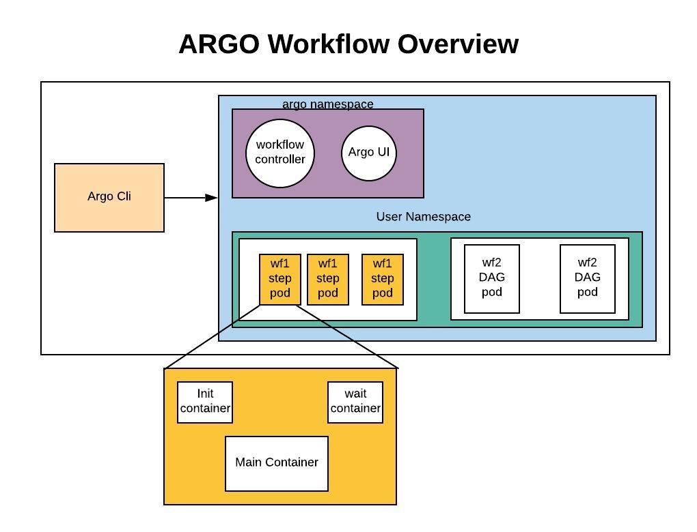

# Certified Argo Project Associate

_This exam is an online, proctored, multiple-choice exam._

## Resources

* <https://argo-workflows.readthedocs.io/en/stable/>

## Topics

<details>
  <summary>Argo Workflows (36%)</summary>

* Understand Argo Workflow Fundamentals
* Generating and Consuming Artifacts
* Understand Argo Workflow Templates
* Understand the Argo Workflow Spec
* Work with DAG (Directed-Acyclic Graphs)
* Run Data Processing Jobs with Argo Workflows

Argo Workflows is an open source container-native workflow engine for orchestrating parallel jobs on Kubernetes. It's implemented as a Kubernetes CRD.

Workflows are implemented as a Kubernetes CRD.

* Lightweight and easy to use.
* Designed from the ground up for containers without the overhead and limitations of legacy VM and server-based environments.

Components of Argo Workflows include:

* controller
* mainContainer
* executor
* server

## Core Concepts

The `Workflow`is the most important resourcein Argo and serves two functions:

1. Itdefines the workflow to be executed.
2. It stores the state of the workflow.

Should be treated as a "live" object. It's not just a static definition but it's also an "instance" of said definition.

In the `WorkflowSpec` the core structures are:

* `entrypoint` defines what the main function will be - that is, the first template to be executed.
* `templates` can be loosely thought of as functions, they define instructions to be executed.



The internals of a step Pod are:

* `main` container runs the Image that the user has indicated, where the `argoexec` utility is volume mounted and serves as the main command which calls **the configured Command as a sub-process**.
* `init` container is an `InitContainer` fetching artifacts and parameters and making them available to the `main` container.
* `wait` container performs tasks that are needed for clean up, including saving of parameters and artifacts.

There are six types of templates, divided into two categories:

* Work to be done:
  * **Container** - The most common template type. The spec is the same as the one of a container spec in Kubernetes.
  * **Script** - Convenience wrapper around a `container`. The spec is the same as for a container but adds the `source:` field for in-place scripts. The script will be saved in a file and executed for you. The result of the script will be automatically exported into an Argo variable:

    ```
    {{tasks.<NAME>.outputs.result}}
    {{steps.<NAME>.outputs.result}}
    ```

  * **Resource** - Performs operations on cluster resources directly. It can be used to get, create, apply, delete replace or patch resouces on your cluster.
  * **Suspend** - Suspend execution, either for aduration or until it is resumed manually.

* Invocators:
  * **Steps** - A steps template you define your tasks in a series of steps. The structure of the template is a "list of lists". you can use synchronization to run the inner ones one by one. Control execution can be done with e.g. `when:`.
    * Outer lists will run sequentially
    * Inner lists will run in parallel
  * **DAG** - Define tasks as a graph of dependencies. In a DAG, you list all your tasks and set which other tasks must complete before a particular task can begin. Tasks without any dependencies will run in immedately.

DAG = specify dependencies and allow for maxiumu parallelism.

## Workflows

The structure of Workflow Specs:

* Kubernetes header including meta-data
* Spec body
  * Entrypoint
  * List of template definitions
* For each template
  * Name
  * Inputs
  * Outputs
  * Container Invocation or a list of steps
    * For each step, a template invocation

`ClusterWorkflowTemplates` are cluster-scoped `WorkflowTemplates` that can be created cluster scped like a `ClusterRole`.

```
clusterScope: true
```

Indicates that the template is cluster-scoped.

## Artifacts

Are packaged as tarbals and gzipped by default. Skip by specifying `archive.none=false`.

Artifact garbae collection for artifacts you dont need can be done with `OnWorkflowCompletion` or `OnWorkflowDeletion`.

Strategies:
`artifactGC.strategy=Never`, set the strategy in the spec to make it global.

```
...
  artifactGC:
    strategy: OnWorkflowDeletion
    forceFinalizerRemoval: true
...
```

Hardwired Artifacts are static explicitly defined artifacts.

Condsider parameterizing your S3 keys by `workflow.uid` in case you have concurrent workflows of the same spec.

You can set a specific `serviceAccountName` for to override the service account used to access S3.

`artifactRepositoryRef` is used to specify the repository to use for the artifact. This is a reference to a `ConfigMap` or `Secret` that contains the configuration for the artifact repository.

## Service Accounts

In order for Argo to support features such as artifacts, outputs, access to secrets, etc. It needs to communicate with Kubernetes resources using the KAPI.

```
argo submit --serviceaccount <name> <workflow.yaml>
```

All Pods in a workflow run with the service account specified in the `workflow.spec.serviceAccountName` field. If omitted the default service account of the namespace is used.

It depends on how much access a workflow needs in the cluster.

For a executor to function properly we'll need:

* create
* patch

on `workflowtaskresults`.

## Variables

Template Tag kinds:

* simple (default) e.g. `{{workflow.name}}`
* expression e.g. `{{=workflow.name}}`

## Retry policies

Set under `spec.templates.retryStrategy`:

* `Always` - always retry
* `OnFailure` - retry steps whose main container is marked as failed in Kubernetes
* `OnError` - retry steps that encounter Argo controller errors, or whose init or way containers fail
* `OnTransientError` - retry steps that encounter errors defined as transient.

## Lifecycle Hooks

Triggers an actions based on a conditional expression or on completion of a step or template. On workflow or template level.

## Step Level memoization

Workflows ofthen have outputs that are expensive to compute. Memoization reduces cost and mworkflow execution time by reading the results of previous executions of the same step.

It stores the output of a template into a specfied cache.

</details>

<details>
  <summary>Argo CD (34%)</summary>

* Understand Argo CD Fundamentals
* Synchronize Applications Using Argo CD
* Use Argo CD Application
* Configure Argo CD with Helm and Kustomize
* Identify Common Reconciliation Patterns

</details>

<details>
  <summary>Argo Rollouts (18%)</summary>

* Understand Argo Rollouts Fundamentals
* Use Common Progressive Rollout Strategies
* Describe Analysis Template and AnalysisRun

</details>

<details>
  <summary>Argo Events (12%)</summary>

* Understand Argo Events Fundamentals
* Understand Argo Event Components and Architecture

</details>
