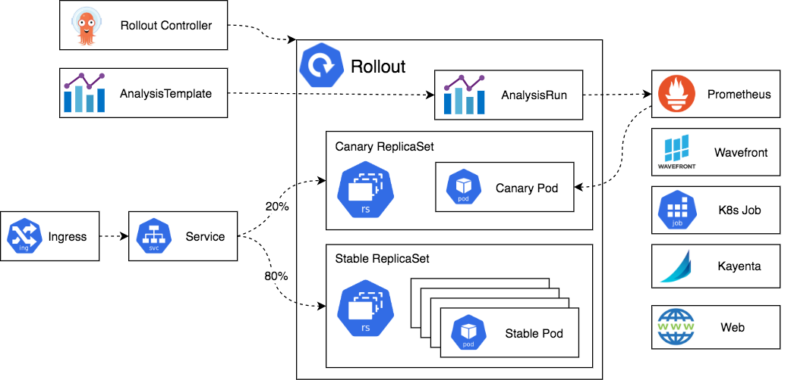

# Certified Argo Project Associate

_This exam is an online, proctored, multiple-choice exam._

## Resources

* <https://argo-workflows.readthedocs.io/en/stable/>
* <https://paulyu.dev/article/capa-study-guide/>

## Topics

<details>
  <summary>Argo Workflows (36%)</summary>

* Understand Argo Workflow Fundamentals
* Generating and Consuming Artifacts
* Understand Argo Workflow Templates
* Understand the Argo Workflow Spec
* Work with DAG (Directed-Acyclic Graphs)
* Run Data Processing Jobs with Argo Workflows

Argo Workflows is an open source container-native workflow engine for orchestrating parallel jobs on Kubernetes. It's implemented as a Kubernetes CRD.

Workflows are implemented as a Kubernetes CRD.

* Lightweight and easy to use.
* Designed from the ground up for containers without the overhead and limitations of legacy VM and server-based environments.

Components of Argo Workflows include:

* controller
* mainContainer
* executor
* server

## CLI summary

```bash
argo submit hello-world.yaml --watch # Submit a workflow. Use --watch flag to observe the workflow as it runs.
argo list # List current workflows.
argo get hello-world-xxx # Get info about a specific workflow @latest.
argo logs hello-world-xxx # Print the logs from a workflow.
argo delete hello-world-xxx # Delete workflow.
argo submit arguments-parameters.yaml -p message="goodbye world" # Override parameter or --parameter-file params.yaml
argo suspend WORKFLOW # Suspend a workflow
argo resume WORKFLOW # Resume a suspended workflow
argo template create template.yaml # Create a template
argo cluster-template create clustertemplates.yaml # Create a ClusterWorkflowTemplate
argo cron create cron.yaml # Create a cron
argo submit --serviceaccount <name> # Specify which ServiceAccount Argo uses using when submitting Workflows
```

## Core Concepts

The `Workflow`is the most important resourcein Argo and serves two functions:

1. The definition.
2. The state.

Should be treated as a "live" object. It's not just a static definition but it's also an "instance" of said definition.

In the `WorkflowSpec` the core structures are:

* `entrypoint` defines what the main function will be - that is, the first template to be executed.
* `templates` can be loosely thought of as functions, they define instructions to be executed.


The internals of a step `Pod` are:

* `main` container
  * Runs the Image that the user has indicated
  * The `argoexec` utility is volume mounted
  * Serves as the main command which calls **the configured Command as a sub-process**
* `init` container is an `InitContainer`
  * Fetch artifacts and parameters
  * Make them available to the `main` container
* `wait` container
  * Performs tasks that are needed for clean up, including saving of parameters and artifacts.

* Types of work that can be done:
  * **container** - The most common template type. The spec is the same as the one of a container spec in Kubernetes.
  * **script** - Convenience wrapper around a `container`. The spec is the same as for a container but adds the `source:` field for in-place scripts. The script will be saved in a file and executed for you. The result of the script will be automatically exported into an Argo variable:

    ```
    {{tasks.<NAME>.outputs.result}}
    {{steps.<NAME>.outputs.result}}
    ```

  * **resource** - Performs operations on cluster resources directly. It can be used to get, create, apply, delete replace or patch resouces on your cluster.
  * **suspend** - Suspend execution, either for a duration or until it is resumed manually.
  * **plugin** - Is a task that allows you to run an external plugin.
  * **containerSet** - Run multiple containers ina single Pod. Consolidate Pod spin-up time into one step in your workflow.
  * **data** - Get data from S3.
  * **http** - Is a task that allows you to make HTTP requests.
  * **steps** - A steps template you define your tasks in a series of steps. The structure of the template is a "list of lists". you can use synchronization to run the inner ones one by one. Control execution can be done with e.g. `when:`. Can include `container`, `scripts` or `dag`.
    * Outer lists will run sequentially
    * Inner lists will run in parallel

    In this example step1 runs first. Once it is completed, step2a and step2b will run in parallel:

    ```
    - name: hello-hello-hello
      steps:
      - - name: step1
          template: prepare-data
      - - name: step2a
          template: run-data-first-half
        - name: step2b
          template: run-data-second-half

    ```

  * **dag** - Define tasks as a graph of dependencies. In a DAG, you list all your tasks and set which other tasks must complete before a particular task can begin. Tasks without any dependencies will run in immediately.

DAG = specify dependencies and allow for maximum parallelism.

## Workflows

The structure of Workflow Specs:

* Kubernetes header including meta-data
* Spec body
  * Entrypoint
  * List of template definitions
* For each template
  * Name
  * Inputs
  * Outputs
  * Container Invocation or a list of steps
    * For each step, a template invocation

`ClusterWorkflowTemplates` are cluster-scoped `WorkflowTemplates` that can be created cluster scped like a `ClusterRole`.

```
clusterScope: true
```

Indicates that the template is cluster-scoped.

## Artifacts

Are packaged as tarballs and gzipped by default. Skip by specifying `archive.none=false`.

Artifact garbage collection for artifacts you dont need can be done with `OnWorkflowCompletion` or `OnWorkflowDeletion`.

Strategies:
`artifactGC.strategy=Never`, set the strategy in the spec to make it global.

```
...
  artifactGC:
    strategy: OnWorkflowDeletion
    forceFinalizerRemoval: true
...
```

Hardwired Artifacts are static explicitly defined artifacts.

Consider parameterizing your S3 keys by `workflow.uid` in case you have concurrent workflows of the same spec.

You can set a specific `serviceAccountName` for to override the service account used to access S3.

`artifactRepositoryRef` is used to specify the repository to use for the artifact. This is a reference to a `ConfigMap` or `Secret` that contains the configuration for the artifact repository.

```yaml
apiVersion: argoproj.io/v1alpha1
kind: Workflow
metadata:
  generateName: artifact-repository-ref-
spec:
  entrypoint: main
  artifactRepositoryRef:
    key: my-key
  templates:
    - name: main
      container:
        image: busybox
        command: [ sh, -c ]
        args: [ "echo hello world | tee /tmp/hello_world.txt" ]
      outputs:
        artifacts:
          - name: hello_world
            path: /tmp/hello_world.txt
```

## Service Accounts

In order for Argo to support features such as artifacts, outputs, access to secrets, etc. It needs to communicate with Kubernetes resources using the Kubernetes API.

```
argo submit --serviceaccount <name> <workflow.yaml>
```

All Pods in a workflow run with the service account specified in the `workflow.spec.serviceAccountName` field. If omitted the default service account of the namespace is used.

It depends on how much access a workflow needs in the cluster.

For a executor to function properly we'll need:

* create
* patch

on `workflowtaskresults`.

## Variables

Template Tag kinds:

* simple (default) e.g. `{{workflow.name}}`
* expression e.g. `{{=workflow.name}}`

## Retry policies

Set under `spec.templates.retryStrategy`:

* `Always` - always retry
* `OnFailure` - retry steps whose main container is marked as failed in Kubernetes
* `OnError` - retry steps that encounter Argo controller errors, or whose init or way containers fail
* `OnTransientError` - retry steps that encounter errors defined as transient.

## Lifecycle Hooks

Triggers an actions based on a conditional expression or on completion of a step or template. On workflow or template level.

## Step Level memoization

Workflows ofthen have outputs that are expensive to compute. Memoization reduces cost and mworkflow execution time by reading the results of previous executions of the same step.

It stores the output of a template into a specified cache.

## The WorkflowSpec

The `WorkflowSpec` is the main spec of a workflow. It defines the workflow to be executed and stores the state of the workflow.

* `activeDeadlineSeconds` - Duration in seconds relative to the workflow start time.
* `archiveLogs` - If the container logs should be archived.
* `arguments` - Contains the parameters and artifacts sent to the workflow entrypoint. Params are referencable globally using the `workdlow` variable
* `artifactGC` - The strategy to use when deleting artifacts from completed or deleted workflows.
* `artifactRepositoryRef` - Specifies the configMap name and key containing the artifact repo config.
* `entrypoint` - Is a template reference to the starting point of the workflow.
* `podGC` - Strategy to use when deleting compelted Pods.
* `parallelism`- Number of max total parallel Pods that execute at the same time.
* `serviceAccountName` - The service account to use for the workflow, used for all Pods of the workflow.
* `templates` - List of workflow templates used in a workflow.

## The DAG

As an alternative to specifying sequences of steps, you can define a workflow as a directed-acyclic graph (DAG) by specifying the dependencies of each task. DAGs can be simpler to maintain for complex workflows and allow for maximum parallelism when running tasks.

```yaml
apiVersion: argoproj.io/v1alpha1
kind: Workflow
metadata:
  generateName: dag-diamond-
spec:
  entrypoint: diamond
  templates:
  - name: echo
    inputs:
      parameters:
      - name: message
    container:
      image: alpine:3.7
      command: [echo, "{{inputs.parameters.message}}"]
  - name: diamond
    dag:
      tasks:
      - name: A
        template: echo
        arguments:
          parameters: [{name: message, value: A}]
      - name: B
        dependencies: [A]
        template: echo
        arguments:
          parameters: [{name: message, value: B}]
```

### Enhanced Depends

Enhanced `depends` improves on the `dependencies` field by specifying which _result_ of a task to depend on.

Use boolean logic with the operators: `&&`, `||` and `!` to create complex dependencies.

```yaml
depends: "(task-2.Succeeded || task-2.Skipped) && !task-3.Failed"
```

Use the `depends` field to specify dependent tasks, their results and boolean logic between them:

```yaml
<task-name>.<task-result>
```

### Fail Fast

By default,**DAGs fail fast**: when one task fails, **no new tasks will be scheduled**. Once all running tasks are completed, the DAG will be marked as failed.

If `failFast` is set to `false` for a DAG, all branches will run to completion, regardless of failures in other branches.

## Daemon Containers

Argo Workflows can start containers that run in the background while the workflow itself continues execution. They will be auto destroyed when the workflow exits the template scope.

```
...
spec:
  templates:
    - name: deamon-example
      steps: daemon-example
      - - name: influx
          template: influx
    - name: influx
      daemon: true
      container:
        image: influxdb:1.8
        command: ["/bin/sh", "-c"]
        args: ["influxd"]
```

</details>

<details>
  <summary>Argo CD (34%)</summary>

* Understand Argo CD Fundamentals
* Synchronize Applications Using Argo CD
* Use Argo CD Application
* Configure Argo CD with Helm and Kustomize
* Identify Common Reconciliation Patterns


## Core Concepts

* Application - A group of Kubernetes resources as defined by a manifest. CRD.
* Application source type - Which **tool** is used to build the application.
* Target state - Desired state
* Live state - Current state
* Sync status - Does the live state match the target state?
* Sync - Process of moving an app to the target state
* Refresh - Compare latest code in Git with the live state
* Health - Is it running correctly?
* Tool - Tool to create manifests from a directory of files e.g. Kustomize.

## Architectural Overview

Components:

* API server - is gRPC/REST service which exposes the API consumed by the web UI
  * Application management and status reporting
  * Invoke of application operations (sync, rollback, user defined actions)
  * Manage repo and cluster credentials
  * Auth and auth delegation to external identity providers
  * RBAC enforcement
  * listener/forwarder for Git webhook events

* Repository server - internal service which maintains a local cache of the Git repository holding the application manifests
  * Generating and returning Kubernetes manifests when provided with the following inputs:
    * Repo URL
    * Revision
    * App path
    * Template specifics, params and or helm values.yaml

* Application controller - A continoususly monitors running applications and compares the current, live state against the desired target state (from repo). It detects `OutOfSync` application state and takes action. Lifecycle events are handled by this controller also, presync, sync, postsync.

## Hooks

Use cases for hooks include:

* Using a PreSync hook to perform a database schema migration.
* Using a Sync hook to orchestrate a complex deployment.
* Using a PostSync hook to run integration and health checks after a deployment.
* Using a SyncFail hook to run clean-up or finalizer logic if a Sync operation fails.

## Tools

Argo CD supports the following tools:

* Kustomize applications
* Helm charts
* Directoy of YAML/JSON manifests including Jsonnet
* Custom config management tool

```yaml
apiVersion: argoproj.io/v1alpha1
kind: ConfigManagementPlugin
metadata:
  # The name of the plugin must be unique within a given Argo CD instance.
  name: my-plugin
spec:
  # The version of your plugin. Optional. If specified, the Application's spec.source.plugin.name field
  # must be <plugin name>-<plugin version>.
  version: v1.0
  # The init command runs in the Application source directory at the beginning of each manifest generation. The init
  # command can output anything. A non-zero status code will fail manifest generation.
  init:
    # Init always happens immediately before generate, but its output is not treated as manifests.
    # This is a good place to, for example, download chart dependencies.
    command: [sh]
    args: [-c, 'echo "Initializing..."']
  # The generate command runs in the Application source directory each time manifests are generated. Standard output
  # must be ONLY valid Kubernetes Objects in either YAML or JSON. A non-zero exit code will fail manifest generation.
  # To write log messages from the command, write them to stderr, it will always be displayed.
  # Error output will be sent to the UI, so avoid printing sensitive information (such as secrets).
  generate:
    command: [sh, -c]
    args:
      - |
        echo "{\"kind\": \"ConfigMap\", \"apiVersion\": \"v1\", \"metadata\": { \"name\": \"$ARGOCD_APP_NAME\", \"namespace\": \"$ARGOCD_APP_NAMESPACE\", \"annotations\": {\"Foo\": \"$ARGOCD_ENV_FOO\", \"KubeVersion\": \"$KUBE_VERSION\", \"KubeApiVersion\": \"$KUBE_API_VERSIONS\",\"Bar\": \"baz\"}}}"
  # The discovery config is applied to a repository. If every configured discovery tool matches, then the plugin may be
  # used to generate manifests for Applications using the repository. If the discovery config is omitted then the plugin 
  # will not match any application but can still be invoked explicitly by specifying the plugin name in the app spec. 
  # Only one of fileName, find.glob, or find.command should be specified. If multiple are specified then only the 
  # first (in that order) is evaluated.
```

## Projects

Porjects provide logical grouping of applications, which is useful when Argo CD is used by multiple teams. Projects provide the following features:

* Restrict what may be deployed
* Restrict where apps may be deployed
* Restrict which objects may or may not be deployed
* Defining project roles to provide application RBAC

All applications belongs to a single project. The default project is `default` and permits deployments from any source repo, to any cluster and all resource Kinds.

You cant delete the default project, but you can modify it.

You can create a project with the following command:

```bash
argocd proj create myproject -d https://kubernetes.default.svc,mynamespace -s https://github.com/argoproj/argocd-example-apps.git
```

You can use negations:

```
spec:
  sourceRepos:
    # Do not use the test repo in argoproj
    - '!ssh://git@GITHUB.com:argoproj/test'
    # Nor any Gitlab repo under group/ 
    - '!https://gitlab.com/group/**'
    # Any other repo is fine though
    - '*'
```

A source repository is considered valid if the following conditions hold:

1. Any allow source rule (i.e. a rule which isn't prefixed with !) permits the source
2. AND no deny source (i.e. a rule which is prefixed with !) rejects the source

```
argocd app set guestbook-default --project myproject
```

Key fields:

* `sourceRepos` - Repos that applicatiosn within the project can **pull manifests from**.
* `destinations` - Clusters and namespaces that applications within the project can deploy into.
* `roles` - Entities with definitions of their access to resources wihtin the project.

```yaml
spec:
  description: Example Project
  # Allow manifests to deploy from any Git repos
  sourceRepos:
  - '*'
  # Only permit applications to deploy to the guestbook namespace in the same cluster
  destinations:
  - namespace: guestbook
    server: https://kubernetes.default.svc
  # Deny all cluster-scoped resources from being created, except for Namespace
  clusterResourceWhitelist:
  - group: ''
    kind: Namespace
  # Allow all namespaced-scoped resources to be created, except for ResourceQuota, LimitRange, NetworkPolicy
  namespaceResourceBlacklist:
  - group: ''
    kind: ResourceQuota
  - group: ''
    kind: LimitRange
  - group: ''
    kind: NetworkPolicy
  # Deny all namespaced-scoped resources from being created, except for Deployment and StatefulSet
  namespaceResourceWhitelist:
  - group: 'apps'
    kind: Deployment
  - group: 'apps'
    kind: StatefulSet
  roles:
  # A role which provides read-only access to all applications in the project
  - name: read-only
    description: Read-only privileges to my-project
    policies:
    - p, proj:my-project:read-only, applications, get, my-project/*, allow
    groups:
    - my-oidc-group
  # A role which provides sync privileges to only the guestbook-dev application, e.g. to provide
  # sync privileges to a CI system
  - name: ci-role
    description: Sync privileges for guestbook-dev
    policies:
    - p, proj:my-project:ci-role, applications, sync, my-project/guestbook-dev, allow
    # NOTE: JWT tokens can only be generated by the API server and the token is not persisted
    # anywhere by Argo CD. It can be prematurely revoked by removing the entry from this list.
    jwtTokens:
    - iat: 1535390316
```

### Project roles

Projects inlclude a feature called roles that can be used to determine who and what can be done to the applications associated with the project.

`proj:<project-name>:<role-name>`

## Sync Options

Allows you to customize some aspects of how it syncs the desired state in the target cluster.

You can configure it in the `Application` resource and it can be set as annotation called `argocd.argoproj.io/sync-options`. Concatenate with a comma!

```yaml
metadata:
  annotations:
    argocd.argoproj.io/sync-options: Prune=false
```

Options:

* SkipDryRunOnMissingResource=true - skip the dry run for missing resource types.
* Delete=false - Retain resource after the application is deleted.
* Prune=false - Prevent object from being pruned.
* ApplyOutOfSyncOnly=true - Selective sync.
* PruneLast=true - Resource pruning to happen as a final, implicit wave of a sync operation.
* Replace=true - By default ArgoCD does a `kubectl apply`. With this option it will do a `kubectl replace` or `kubectl create`. Destructive!
* ServerSideApply=true - Resources are too big. Replace takes precedence over ServerSideApply.
* CreateNamespace=true

Namespace Metadata can be added to syncPolicy to add labels and annotations to the namespace being created.

Propagation policies:

* Background
* Foreground
* Orphan

When Argo CD starts a sync, it orders the resources in the following precedence:

* The sync phase
* The wave they are in (lower values first for creation and updates, higher values first for deletion)
* By kind (e.g. namespaces first and then other Kubernetes resources, followed by custom resources)
* By name

## Application Set

Provides:

* Ability to use a single Kubernetes manifest to target multiple Kubernetes clusters
* The ability to use a single Kubernetes manifest to deploy multipl applications from one or multiple Git repositories with ArgoCD
* Improved support for monorepos, multiple applications in one Git repository

## Reconcile Optimizations

Argo CD defaults to refreshing every time a resource that belongs to it changes.

Other Kubernetes controllers often update the resources they watch periodically, causing continuous reconcile operation on the Application and high CPU usage on the `argocd-application-controller`.

By default `resource.ignoreResourcesUpdatesEnabled` is set to `true`. ArgoCD ignores resource updates. This ensures ArgoCD maintaining sustainable performance by reducing the number of reconcile operations.

By default the metadata fiels `generation`, `resourceVersion` and `managedFields` are always ignored for all resources.

## Rate limiting

To prevent high controller resource usage, or sync loops caused either due to misbehaving apps or other environment specific factors, we can configure rate limits on workqueues.

Two types:

* Global - disabled by default. `WORKQUEUE_BUCKET_SIZE` and `WORKQUEUE_BUCKET_QPS` env vars.
* Per item - limiting the number of times a particular item can be queued.

`max(globalBackoff, perItemBackoff)`

## Other notes

In Argo CD i cannot see my application with `helm ls`. When deploying with ArgoCD and helm as the took it's only a template mechanism. After templating it does a `kubectl apply` basically.

The reason for this is that Argo CD shall be neutral to all manifest generators.

## Health

Argo CD provides built-in health assessment for several standard Kubernetes types, which is then surfaced to the overall Application health status as a whole. Following checks are made for specific types of Kubernetes resources:

* **Deployment**, **ReplicaSet**, **StatefulSet**, **DaemonSet**
  * Observed generation is equal to desired generation
  * Number of **updated** replicas equals the number of desired replicas
* **Service**
  * If the service type is of type `LoadBalancer` the `status.loadBalancer.ingress` list is non-empty and validate that there's at least one value for `hostname` or `IP`
* **Ingress**
  * Similar to the Service object
* **PVC**
  * If the PVC is bound, the `status.phase` is `Bound`

Health statuses:

The possible values of health status are:

* "Healthy" -> Resource is 100% healthy.
* "Progressing" -> Resource is not healthy but still has a chance to reach healthy state.
* "Suspended" -> Resource is suspended or paused. The typical example is a cron job.
* "Missing" -> Resource is not present in the cluster.
* "Degraded" -> Resource status indicates failure or resource could not reach healthy state in time.
* "Unknown" -> Health assessment failed, and actual health status is unknown.

</details>

<details>
  <summary>Argo Rollouts (18%)</summary>

* Understand Argo Rollouts Fundamentals
* Use Common Progressive Rollout Strategies
* Describe Analysis Template and AnalysisRun

Argo Rollouts is a tool that enables you to managed and automate the deployment of applications on Kubernetes. It takes the concept of Kubernetes Deployment to the next level by providing advanced deployment strategies.

Implemented as a Kubernetes controller with it's own CRDs.

## Core Concepts

CI, CD, and PD. Progressive Delivery.

Progressive Delivery is an evolution of CD that focuses on the gradual and controlled delivery of new features to users; which ultimately reduces the risk of deploying new features.

Implemented as Argo Rollouts Controller that manages Pods and ReplicaSets.



The rollout resource is the primary resource you will interact with. A drop in replacement of a Deployment.

The ReplicaSet is the same as the one used by the Deployment controller. Rollout controller will manage the ReplicaSet and its Pods.

It can integrate with Ingress, Service and or service meshes to managed traffic routing and direct traffic to new version of an application.

## Analysis and Progressive Delivery

* **Rollout** - drop in replacement for a Deployment resource, provides additional blue/green and canary update strategies. Can create AnalysisRuns and Experiments during the update.
* **AnalysisTemplate** - An AnalysisTemplate is a template spec which defines **how** to perform a canary analysis, such as the metrics which it should perform, its frequency and the values which are condiered successful or failed. Can be parametrized.
* **ClusterAnalysisTemplate** -  A ClusterAnalysisTemplate is like an AnalysisTemplate, but it is not limited to its namespace. It can be used by any Rollout throughout the cluster.
* **AnalysisRun** - An AnalysisRun is an instantiation of an AnalysisTemplate. AnalysisRuns are like Jobs in that they eventually complete. Completed runs are considered Successful, Failed, or Inconclusive.
* **Experiment** - Limited run of one or more ReplicaSets for the purposes of analysis.

### Remember

The AnalysisTemplate resource **defines the metrics and frequency that will be used to monitor the new version** of an application. It will also include success and failure thresholds that will be used to determine whether the new version is performing as expected.

The AnalysisRun resource **defines the actual analysis** that will be performed. Upon completion, it will return a status of Successful, Failed, or inconclusive and the Rollout controller will use this information to determine whether to continue with the rollout or rollback to the previous version.

### Background Analysis

* Background analysis of progressive delivery
* Use Prometheus query to perform a measurement
* Parametrize the analysis
* Delay starting the analysis

Rollout:

```
apiVersion: argoproj.io/v1alpha1
kind: Rollout
metadata:
  name: guestbook
spec:
...
  strategy:
    canary:
      analysis:
        templates:
        - templateName: success-rate
        startingStep: 2 # delay starting analysis run until setWeight: 40%
        args:
        - name: service-name
          value: guestbook-svc.default.svc.cluster.local
      steps:
      - setWeight: 20
      - pause: {duration: 10m}
      - setWeight: 40
      - pause: {duration: 10m}
      - setWeight: 60
      - pause: {duration: 10m}
      - setWeight: 80
      - pause: {duration: 10m}
```

References the AnalysisTemplate:

```
apiVersion: argoproj.io/v1alpha1
kind: AnalysisTemplate
metadata:
  name: success-rate
spec:
  args:
  - name: service-name
  metrics:
  - name: success-rate
    interval: 5m
    # NOTE: prometheus queries return results in the form of a vector.
    # So it is common to access the index 0 of the returned array to obtain the value
    successCondition: result[0] >= 0.95
    failureLimit: 3
    provider:
      prometheus:
        address: http://prometheus.example.com:9090
        query: |
          sum(irate(
            istio_requests_total{reporter="source",destination_service=~"{{args.service-name}}",response_code!~"5.*"}[5m]
          )) /
          sum(irate(
            istio_requests_total{reporter="source",destination_service=~"{{args.service-name}}"}[5m]
          ))
```

### Inline Analysis

Analysis can be perfomed as a rollout step as an inline "analysis" step. If no interval is specified the analysis will perform a single measurement and complete.

### Cluster Analysis Templates

A Rollout can reference a Cluster scoped AnalysisTemplate called a ClusterAnalysisTemplate. This can be useful when you want to share an AnalysisTemplate across multiple Rollouts

### Analysis with multiple templates

A Rollout can reference multiple AnalysisTemplates when constructing an AnalysisRun. This allows users to compose analysis from multiple AnalysisTemplates. If multiple templates are referenced, then the controller will merge the templates together.

## Deployment Strategies

* Rolling Update - slowly replaces the old version with the new version. Default for Deployments.
* Recreate - deletes the old version of the application before bring up the new version. Two versions never run at the same time.
* Blue-Green - runs both old and new versions of the application deployed at the same time. Only the old version of the application will receive production traffic. Allows testing the blue one and then switch it so it's the green one.
* Canary - Exposes a subset of the users to the new version of the application while serving the rest of the traffic to the old version.

Canary with Traffic manager one option.

## Best Practices

* Good for teams deploying in a continous manner. Rollouts for infra components e.g. cert-manager is NOT recommended.
* Argo Rollouts works with a single Kubernetes deployment and within a single cluster only. The controller need to be deployed in every cluster where a Rollout is running.
* It does need Argo CD or any other project to work
* There's no Argo Rollouts API

</details>

<details>
  <summary>Argo Events (12%)</summary>

* Understand Argo Events Fundamentals
* Understand Argo Event Components and Architecture

* **Event Source** - is the external system that generates events.
* **Sensor** - listens to event sources and triggers actions to respond to those events.
* **EventBus** - is backbone for managing delivery of events from event sources to sensors
* **Trigger** - responds to events by performing actions such as starting workflows, creating Kubernetes resources, or sending notifications.

</details>
