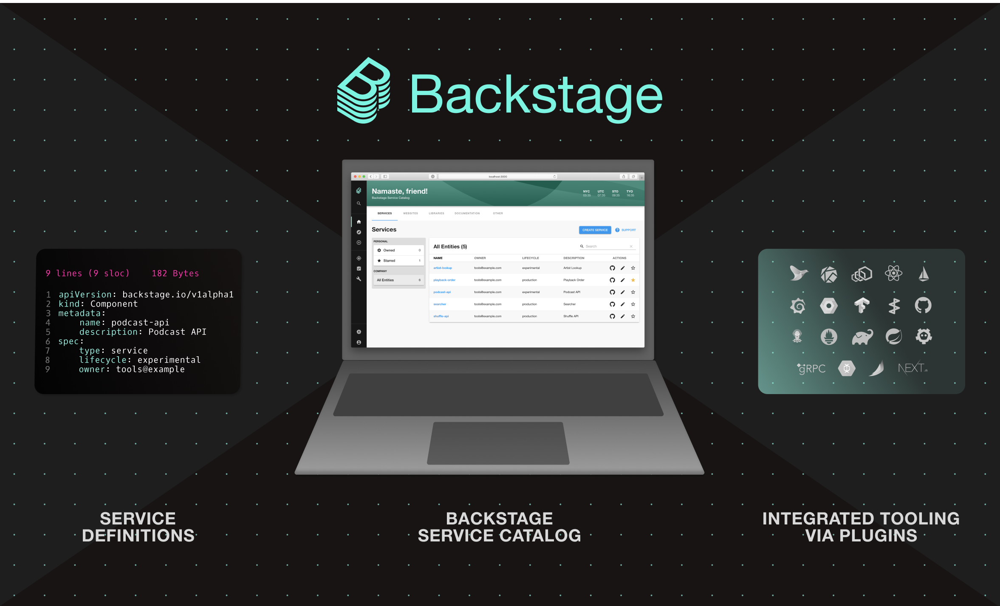

<details>
  <summary>Backstage Catalog</summary>

* Understand how/why to use Backstage Catalog
* Populate Backstage Catalog
* Using annotations
* Working with manually registered entity locations
* Troubleshooting entity ingestion
* Working with automated ingestion

The Backstage Software Catalog is a *centralized* system that keeps track of ownership and metadata for all the software in your ecosystem (services, websites, libraries, data pipelines etc).

It's built around the concept of **metadata YAML files** that is stored together with the code, and then *harvested*  and *visualized* in Backstage.



Backstage and the Backstage Software Catalog make it easy for one team to manage 10 services - and makes it possible for your company to manage thousands of them.

There's **two** main use-cases:

1. Helping teams manage and maintain the software **they own**. Gives the teams a **uniform** view of all their software, services, libraries, websites, ML models - you name it.
2. Makes all your software in your company, and who owns it, discoverable.

Browse the catalog at `/catalog`.

## The Life of an Entity

The catalog forms a **hub** of sorts, where **entities** are:

* ingested from various authoritative sources
* held in a database
* subject to automated processing
* presented through an API

The most common source is YAML files on a standard format.

Main extension points:

* **Entity** providers: that feed initial raw entity data into the catalog.
* **Policies**: that establish baseline rules about the shape of entities.
* **Processors**: that validate, analyze and mutate raw entity data into its final form.

High level processes involved are:

* **Ingestion** - fetch raw entity data from external sources
* **Processing** - where the policies and processors continually treat the ingested data and may emit both other raw entities
* **Stitching** - where all of the data emitted by various processes are assembled together into the finaly output entity

### Ingestion

Each catalog deployment has a number of **entity providers** installed. They are responsible for fetching data from external authoritative sources.

There are **two** providers installed by default:

* One that deals with user registered locations (e.g URLs and YAML files)
* One that deals with static locations in the app-config

*You can add third party providers by passing them to the catalog builder in your backend init code.*

And entity provider is a class that implements `EntityProvider` interface.

### Processing

Each catalog deployment has a number of **processors** installed. They are responsible for **receiving unprocessed entities that the catalog decided are due for processing**. To change the order of processors you can change this here:

```
catalog.processors.<processorName>.priority
```

Default priority is `20`.

### Stitching

Stitching finalizes the entity, by gathering all of the output from the previous steps and merging them into the final object which is what is visible from the catalog API.

### Errors

Errors during ingestion and proecssing of entities can happen in a variety of ways, and they may happen ata far later point in time than when they were registered.

There are two main ways that errors are surfaced:

1. Catalog backend will emit events using the **events backend plugin**. You can subscribe to the events since they're published to the **events** plugin.
2.

To add the events backend plugin to your backstage application:

```
yarn --cwd packages/backend add @backstage/plugin-events-backend
```

and then in `packages/backend/src/index.ts`:

```
backend.add(import('@backstage/plugin-events-backend'));
```

To log catalog errors:

```
yarn --cwd packages/backend add @backstage/plugin-catalog-backend-module-logs
```

and then in `packages/backend/src/index.ts`:

```
backend.add(import('@backstage/plugin-catalog-backend-module-logs'));
```

This will of errors with a level of `warn`.

## YAML file format

The `metadata`:

* `name`
* `namespace`
* `uid` - auto generated globally unique ID
* `title`
* `description`
* `labels`
* `tags`
* `links`

Common to all kinds:

* `relations` - read-only list of relations, between the current entity and other entities. Commonly two-way.

```json
{
  // ...
  "relations": [
    {
      "type": "ownedBy",
      "targetRef": "group:default/dev.infra"
    }
  ],
  "spec": {
    "owner": "dev.infra",
    // ...
  }
}
```

Catalog processors analyze the entity descriptor data and it's surroundings.

* `statuses` - read-only set of statuses, pertaining to the current health of the entity.

```json
{
  // ...
  "status": {
    "items": [
      {
        "type": "backstage.io/catalog-processing",
        "level": "error",
        "message": "NotFoundError: File not found",
        "error": {
          "name": "NotFoundError",
          "message": "File not found",
          "stack": "..."
        }
      }
    ]
  },
  "spec": {
    // ...
  }
}
```

## Annotations

Is an object with arbitrary non-identfying metadata attached to the entity, identical in use to **Kubernetes** object annotations.

Purpose: **Reference into external systems**, example could be to the git ref the entity was **ingested** from.

Users may add these to descriptor YAML files.

Both key and value are **strings**.

List of annotations:

| Name | Usage |
| ---- | ----- |
| `backstage.io/managed-by-location` | Points to the source from which the entity was originally fetched. |
| `backstage.io/managed-by-origin-location` | Most of the time equal to the above annotation. |
| `backstage.io/orphan` | The entity that are found to have no registered locations or config location that keep them "active". |
| `backstage.io/techdocs-ref` | Where the TechDocs source content is stored. |
| `backstage.io/source-location` | Points to the source code of the entity. |
| `backstage.io/source-template` | Ref to the Scaffolder template. |
| | |

## Adding components to the catalog

The **source of truth** for the components in your software catalog are the **metadata YAML files** stored in Source Control. Repos can include **one or more** metadata files. Usually in the **repository root**, this is not a formal requirement and the metadata files can be placed anywhere in the repository.

There are three ways to add components to the catalog:

1. Manually register components
2. Creating new components via Backstage
3. Integrating with a **external source**

### Manually

Go to the `/create` and click the register existing component button. You can then specify either a GitHub repository or and URL to a entity file.

Even though you're not owning the software you use it still makes sense to register it in Backstage.

### Via Backstage

Use Backstage Software Templates is a tool that can help you create components inside Backstage. It has the ability to:

* load skeletons of code
* tempalte in some variables
* publish the template to locations like GitHub

*Use `camelCase` for actions IDs instead of `kebab-case`. Action IDs with dashes will cause expressions to return `NaN` since the dashes are evaluated as substractions.*

*Use the `--no-node-snapshot` flag to use the templates features in Node >20 or later.*

To disable the functionality to register existing component button for your users you can:

In `app-config.yaml`:

```yaml
app:
  routes:
    bindings:
      scaffolder.registerComponent: false
```

#### Via a static configuration

The catalog has a concept of **processors** to perform **ingestion** tasks, such as reading raw entity data from:

* remote source
* parsing it
* transforming it
* validating it

These processors are configured under the `catalog.processors` configuration key.

Locations can be added declaratively in the `app-config.yaml` file, example:

```yaml
catalog:
  locations:
    - type: url
      target: https://github.com/backstage/backstage/blob/master/packages/catalog-model/examples/components/artist-lookup-component.yaml
```

The `url` type is handled by a standard processor included with the catalog `UrlReaderProcessor`, so no config for that processor is needed. It do *need* a integration to understand **how** to retrieve a given URL. E.g. you need the GitHub integration to read the above YAML file.

You cannot remove these locations from the API, you need to remove them from the configuration.

Use the `file` type location only for local development. This config will pull in the `all.yaml` file from the examples folder, not the use of relative file paths. Within a Docker container the path is different and instead it's in the root so `../../examples/all.yaml` would be `./examples/all.yaml`.

```yaml
catalog:
  locations:
    - type: file
      target: ../../examples/all.yaml
```

### Catalog rules

By default, the catalog will only allow the ingestion of entities with the `kind`:

* `Component`
* `API`
* `Location`

```yaml
catalog:
  rules:
    - allow: [Component, API, Location, Template]

  locations:
    - type: url
      target: <https://github.com/org/example/blob/master/org-data.yaml>
      rules:
        - allow: [Group]
```

This allows all five kinds!

This rejects any kuind of entites from being added:

```yaml
catalog:
  rules: []
```

To configure the catalog to be Read Only, this configuration disables registering and deleting `locations` with the catalog APIs:

```yaml
catalog:
  readonly: true
```

## Integrations

Integrations allow Backstage to read or publish data using external providers such as GitHub, GitLab, Bitbucket etc.

```yaml
integrations:
  github:
    - host: github.com
      token: ${GITHUB_TOKEN}
```

The GitHub integration has a discovery provider for discovering catalog entities within a GitHub organization or App.

To install the backend package:

```
yarn --cwd packages/backend add @backstage/plugin-catalog-backend-module-github
```

and then in `packages/backend/src/index.ts`:

```typescript
backend.add(import('@backstage/plugin-catalog-backend'));
backend.add(import('@backstage/plugin-catalog-backend-module-github'));
```

There's also support for events, so you can subscribe to its relevant topics `github.push` and `github.repository`. To add this you need to create a webhook in GitHub and then installing and configuring the `@backstage/plugin-events-backend-module-github`.

## YAML file format

</details>
