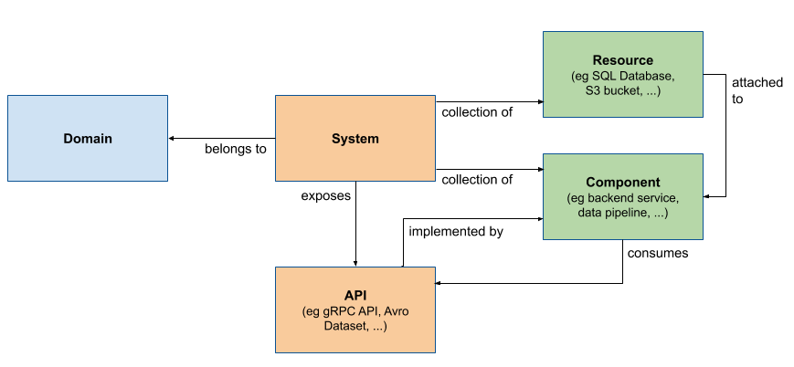

# Certified Backstage Associate

_This exam is an online, proctored, multiple-choice exam._

## Resources

* Make sure you perform at least [this](https://backstage.io/docs/tutorials/quickstart-app-plugin) technical tutorial!

## Topics

<details>
  <summary>Backstage Development Workflow</summary>

* Build and run Backstage projects locally
* Understand local development workflows
* Compile a Backstage project with TypeScript
* Download and install dependencies for a Backstage project with NPM/Yarn
* Use Docker to build a container image of a Backstage project



## System model

* **Domain** - a bounded context
* **System** - Collection of resources and coimponents that exposes one or several APIs.
* **Component** - Piece of software, can be tracked in source control.
* **API** - Implemented by components and form boundaries between components and systems.
* **Resource** - Infrastructure a system needs to operate.

What is Backstage? It's an open source _framework_ for building developer _portals_. Powered by a centralized software catalog. Backstage unifies all your infrastructure tooling, services and documentation to create a streamlined development environment from end to end.

Backstage includes:

* Software catalog - for managing all your software
* Software templates - for spinning up new projects and standardizing your tooling
* TechDocs - making it easy to create, maintain and find and use technical documentation.

## Build and run Backstage projects locally

To run and build Backstage projects locally you need:

* Node.js
  * Using `nvm`
* `yarn`:

  ```
  corepack enable
  yarn set version 4.4.1
  ```

* Docker
* `git`

1. Run `npx @backstage/create-app@latest` to bootstrap and create your first backstage app.
2. `cd my-backstage-app` and run `yarn start`

Then it's time to use the Backstage app:

* Login
* Register a component
* Create a new component

Dictionary:

* `yarn` is a dependency mangament tool for JavaScript. Acts as an alternative for `npm` - Node Package Manager.
* `npm` is the node package manager.
* `npx` is a tool for executing Node.js package executables without having to install them globally.

## `yarn` commands

`yarn backstage-cli versions:bump` bump all @backstage packages and dependencies you're using to the latest versions.

`yarn backstage-cli versions:bump --release next` the above command upgrade @backstage packages to the latest `main` release, for even later version (next release), add the `--release next` flag.

`yarn backstage-cli versions:bump --pattern '@{backstage,roadiehq}/*'` bump

`yarn backstage-cli` summary:

```
  package [command]  package
  repo [command]     repo
  build-workspace    Builds a temporary dist workspace from the provided packages
  config:docs        Browse the configuration reference documentation
  config [command]   config
  config:print       Print the app configuration for the current package
  config:check       Validate that the given configuration loads and matches schema
  config:schema      Print the JSON schema for the given configuration
  create-github-app  Create new GitHub App in your organization.
  info               Show helpful information for debugging and reporting bugs
  versions:migrate   Migrate any plugins that have been moved to the @backstage-community namespace
                     automatically
  versions:bump      Bump Backstage packages to the latest versions
  migrate [command]  migrate
  new                Open up an interactive guide to creating new things in your app
  help [command]     display help for command
```

## Start Backstage locally

_Note that i started of this exam prep on Arch Linux._

```
yay -S yarn npm nodejs-lts-jod (v22 as recommended by Backstage)
npx @backstage/create-app@latest
yarn start # in your app directory
```

## Configure authentication using GitHub OAuth

The default `guest` auth provider is not very useful.

1. Create an [OAuth App](https://backstage.io/docs/getting-started/config/authentication#setting-up-authentication) over at GitHub.
2. In your app-config add:

```
auth
  environment: development
  # see https://backstage.io/docs/auth/ to learn about auth providers
  providers:
    # See https://backstage.io/docs/auth/guest/provider
    github:
      development:
        clientId: ${AUTH_GITHUB_CLIENT_ID}
        clientSecret: ${AUTH_GITHUB_CLIENT_SECRET}
        signIn:
          resolvers:
          - resolver: usernameMatchingUserEntityName
```

_The `AUTH_*` env vars will be resolved for you when Backstage start, you just have to provide them, either via CLI or Kubernetes._

3. In `packages/app/src/App.tsx` add:

```
import { githubAuthApiRef } from '@backstage/core-plugin-api';
```

and replace:

```
components: {
  SignInPage: props => <SignInPage {...props} auto providers={['guest']} />,
},
```

with:

```
components: {
  SignInPage: props => (
    <SignInPage
      {...props}
      auto
      provider={{
        id: 'github-auth-provider',
        title: 'GitHub',
        message: 'Sign in using GitHub',
        apiRef: githubAuthApiRef,
      }}
    />
  ),
},
```

The `App.tsx` is where the Backend application is initialized and wiring everything together. Here you can customize:

* Routes
* Theming
* API configuration
* Sidebar
* Feature flags

Back to the `app-config.yaml` and the `auth`config, add:

```
...
        signIn:
          resolvers:
            # Matches the GitHub username with the Backstage user entity name.
            # See https://backstage.io/docs/auth/github/provider#resolvers for more resolvers.
            - resolver: usernameMatchingUserEntityName
...
```

This takes the user details provided by the auth provider and match that against a User in the Catalog - this will **match** the GitHub user name with the `metadata.name`value of a User in the Catalog.

### Sign-in resolvers

These are mappings of user identity from the third-party auth provider to a Backstage user identity.

## Use Docker to build a container image of a Backstage project

### Host build

1. Install dependencies with `yarn install`
2. Generate type definitions with `yarn tsc`, complies the current project. `tsc` stands for TypeScript compiler. Compiles all your TypeScript files into JavaScript files. Standard way to type-check and compile your TypeScript code as part of adevelopment or build process.
3. `yarn build:backend`, actually a script defined in `package.json` and executes: `yarn workspace backend build`. Packages everything up and bundles it into the `packages/backend/dist` directory.

From the root of the repo execute:

```
docker image build . -f packages/backend/Dockerfile --tag mikejoh/my-backstage:latest --progress=plain
```

```
docker push mikejoh/my-backstage:latest
```

If you're running in Kubernetes make sure you rollout restart your Deployment or simply delete the Backstage Pod.

## Deploy Backstage to Kubernetes for local testing and development

1. Create a `kind` cluster:

```
kind create cluster --config files/backstage-cluster.yaml
```

2. Follow this guide to install an ingress controller: <https://kind.sigs.k8s.io/docs/user/ingress>.

3. Install Backstage using `helm`:

```
helm repo add backstage https://backstage.github.io/charts
```

4. Install Backstage using `helm`:

```
helm upgrade --install \
  backstage backstage/backstage \
  --create-namespace \
  --namespace backstage \
  -f files/backstage-values.yaml \
  --version 2.6.1
```

</details>

<details>
  <summary>Backstage Infrastructure</summary>

* Understand the Backstage framework
* Configure Backstage
* Deploy Backstage to production
* Understand Backstage client-server architecture

## Static configuration in Backstage

Backstage provides a simple way to configure Backstage apps and plugins for both local development and production deployments.

Configuration is stored in YAML files where the defaults are `app-config.yaml`, and `app-config.local.yaml` for local overrides.

Setting the `BACKSTAGE_ENV` will load a configuration following this naming scheme: `app-config.<BACKSTAGE_ENV>.yaml`.

Order of files are:

1. `app-config.yaml`
2. `app-config.<BACKSTAGE_ENV>.yaml`
3. `app-config.local.yaml`
4. `app-config.<BACKSTAGE_ENV>.local.yaml`

other config files are loaded by passing `--config <path>` to the CLI. It's possible to point at a URL to fetch the configuration file.

Special includes:

* Env includes: `$env: MY_SECRET`
* File includes: `$file: ./my-secret.txt`
* Include external files: `$include: ./my-secrets.json#deployment.key`

</details>

<details>
  <summary>Backstage Catalog</summary>

* Understand how/why to use Backstage Catalog
* Populate Backstage Catalog
* Using annotations
* Working with manually registered entity locations
* Troubleshooting entity ingestion
* Working with automated ingestion

The Backstage Software Catalog is a _centralized_ system that keeps track of ownership and metadata for all the software in your ecosystem (services, websites, libraries, data pipelines etc).

It's built around the concept of **metadata YAML files** that is stored together with the code, and then _harvested_  and _visualized_ in Backstage.


Backstage and the Backstage Software Catalog make it easy for one team to manage 10 services - and makes it possible for your company to manage thousands of them.

There's **two** main use-cases:

1. Helping teams manage and maintain the software **they own**. Gives the teams a **uniform** view of all their software, services, libraries, websites, ML models - you name it.
2. Makes all your software in your company, and who owns it, discoverable.

Browse the catalog at `/catalog`.

## The Life of an Entity

The catalog forms a **hub** of sorts, where **entities** are:

* ingested from various authoritative sources
* held in a database
* subject to automated processing
* presented through an API

The most common source is YAML files on a standard format.

Main extension points:

* **Entity** providers: that feed initial raw entity data into the catalog.
* **Policies**: that establish baseline rules about the shape of entities.
* **Processors**: that validate, analyze and mutate raw entity data into its final form.

High level processes involved are:

* **Ingestion** - fetch raw entity data from external sources
* **Processing** - where the policies and processors continually treat the ingested data and may emit both other raw entities
* **Stitching** - where all of the data emitted by various processes are assembled together into the finaly output entity

### Ingestion

Each catalog deployment has a number of **entity providers** installed. They are responsible for fetching data from external authoritative sources.

There are **two** providers installed by default:

* One that deals with user registered locations (e.g URLs and YAML files)
* One that deals with static locations in the app-config

_You can add third party providers by passing them to the catalog builder in your backend init code._

And entity provider is a class that implements `EntityProvider` interface.

### Processing

Each catalog deployment has a number of **processors** installed. They are responsible for **receiving unprocessed entities that the catalog decided are due for processing**. To change the order of processors you can change this here:

```
catalog.processors.<processorName>.priority
```

Default priority is `20`.

### Stitching

Stitching finalizes the entity, by gathering all of the output from the previous steps and merging them into the final object which is what is visible from the catalog API.

### Errors

Errors during ingestion and proecssing of entities can happen in a variety of ways, and they may happen ata far later point in time than when they were registered.

There are two main ways that errors are surfaced:

1. Catalog backend will emit events using the **events backend plugin**. You can subscribe to the events since they're published to the **events** plugin.
2.

To add the events backend plugin to your backstage application:

```
yarn --cwd packages/backend add @backstage/plugin-events-backend
```

and then in `packages/backend/src/index.ts`:

```
backend.add(import('@backstage/plugin-events-backend'));
```

To log catalog errors:

```
yarn --cwd packages/backend add @backstage/plugin-catalog-backend-module-logs
```

and then in `packages/backend/src/index.ts`:

```
backend.add(import('@backstage/plugin-catalog-backend-module-logs'));
```

This will of errors with a level of `warn`.

## YAML file format

The envelope:

* `apiVersion` - required
* `kind` - required
* `metadata` - required
* `spec` - varies

The `metadata`:

* `name`
* `namespace`
* `uid` - auto generated globally unique ID
* `title`
* `description`
* `labels`
* `tags`
* `links`

Common to all kinds:

* `relations` - read-only list of relations, between the current entity and other entities. Commonly two-way.

```json
{
  // ...
  "relations": [
    {
      "type": "ownedBy",
      "targetRef": "group:default/dev.infra"
    }
  ],
  "spec": {
    "owner": "dev.infra",
    // ...
  }
}
```

Catalog processors analyze the entity descriptor data and it's surroundings.

* `statuses` - read-only set of statuses, pertaining to the current health of the entity.

```json
{
  // ...
  "status": {
    "items": [
      {
        "type": "backstage.io/catalog-processing",
        "level": "error",
        "message": "NotFoundError: File not found",
        "error": {
          "name": "NotFoundError",
          "message": "File not found",
          "stack": "..."
        }
      }
    ]
  },
  "spec": {
    // ...
  }
}
```

### The Kinds

`Component`: Describes a software component, unit of software.

`API`: Describes an interface that can be exposed by a component.

`Group`: Organizational entity, such as for example a team, business unit.

`User`: Describes a person, employee or contractor, belongs to a Group.

`Resource`: Describes the infrastructure a system needs to operate.

`System`: Collection of resources and components. That may expose or consume one or several APIs.

`Location`: A marker that references other place to look for catalog data.

## Annotations

Is an object with arbitrary non-identfying metadata attached to the entity, identical in use to **Kubernetes** object annotations.

Purpose: **Reference into external systems**, example could be to the git ref the entity was **ingested** from.

Users may add these to descriptor YAML files.

Both key and value are **strings**.

List of annotations:

| Name | Usage |
| ---- | ----- |
| `backstage.io/managed-by-location` | Points to the source from which the entity was originally fetched. |
| `backstage.io/managed-by-origin-location` | Most of the time equal to the above annotation. |
| `backstage.io/orphan` | The entity that are found to have no registered locations or config location that keep them "active". |
| `backstage.io/techdocs-ref` | Where the TechDocs source content is stored. |
| `backstage.io/source-location` | Points to the source code of the entity. |
| `backstage.io/source-template` | Ref to the Scaffolder template. |
| | |

## Adding components to the catalog

The **source of truth** for the components in your software catalog are the **metadata YAML files** stored in Source Control. Repos can include **one or more** metadata files. Usually in the **repository root**, this is not a formal requirement and the metadata files can be placed anywhere in the repository.

There are three ways to add components to the catalog:

1. Manually register components
2. Creating new components via Backstage
3. Integrating with a **external source**

### Manually

Go to the `/create` and click the register existing component button. You can then specify either a GitHub repository or and URL to a entity file.

Even though you're not owning the software you use it still makes sense to register it in Backstage.

### Via Backstage

Use Backstage Software Templates is a tool that can help you create components inside Backstage. It has the ability to:

* load skeletons of code
* tempalte in some variables
* publish the template to locations like GitHub

_Use `camelCase` for actions IDs instead of `kebab-case`. Action IDs with dashes will cause expressions to return `NaN` since the dashes are evaluated as substractions._

_Use the `--no-node-snapshot` flag to use the templates features in Node >20 or later._

To disable the functionality to register existing component button for your users you can:

In `app-config.yaml`:

```yaml
app:
  routes:
    bindings:
      scaffolder.registerComponent: false
```

#### Via a static configuration

The catalog has a concept of **processors** to perform **ingestion** tasks, such as reading raw entity data from:

* remote source
* parsing it
* transforming it
* validating it

These processors are configured under the `catalog.processors` configuration key.

Locations can be added declaratively in the `app-config.yaml` file, example:

```yaml
catalog:
  locations:
    - type: url
      target: https://github.com/backstage/backstage/blob/master/packages/catalog-model/examples/components/artist-lookup-component.yaml
```

The `url` type is handled by a standard processor included with the catalog `UrlReaderProcessor`, so no config for that processor is needed. It do _need_ a integration to understand **how** to retrieve a given URL. E.g. you need the GitHub integration to read the above YAML file.

You cannot remove these locations from the API, you need to remove them from the configuration.

Use the `file` type location only for local development. This config will pull in the `all.yaml` file from the examples folder, not the use of relative file paths. Within a Docker container the path is different and instead it's in the root so `../../examples/all.yaml` would be `./examples/all.yaml`.

```yaml
catalog:
  locations:
    - type: file
      target: ../../examples/all.yaml
```

### Catalog rules

By default, the catalog will only allow the ingestion of entities with the `kind`:

* `Component`
* `API`
* `Location`

```yaml
catalog:
  rules:
    - allow: [Component, API, Location, Template]

  locations:
    - type: url
      target: <https://github.com/org/example/blob/master/org-data.yaml>
      rules:
        - allow: [Group]
```

This allows all five kinds!

This rejects any kuind of entites from being added:

```yaml
catalog:
  rules: []
```

To configure the catalog to be Read Only, this configuration disables registering and deleting `locations` with the catalog APIs:

```yaml
catalog:
  readonly: true
```

## Integrations

Integrations allow Backstage to read or publish data using external providers such as GitHub, GitLab, Bitbucket etc.

```yaml
integrations:
  github:
    - host: github.com
      token: ${GITHUB_TOKEN}
```

The GitHub integration has a discovery provider for discovering catalog entities within a GitHub organization or App.

To install the backend package:

```
yarn --cwd packages/backend add @backstage/plugin-catalog-backend-module-github
```

and then in `packages/backend/src/index.ts`:

```typescript
backend.add(import('@backstage/plugin-catalog-backend'));
backend.add(import('@backstage/plugin-catalog-backend-module-github'));
```

There's also support for events, so you can subscribe to its relevant topics `github.push` and `github.repository`. To add this you need to create a webhook in GitHub and then installing and configuring the `@backstage/plugin-events-backend-module-github`.

## Good-to-know

* **Component**:

1. A modular independent reuseable software-based unit that encapsulates specific functionality.
2. A software product that Backstage manages in the Software Catalog. Can be a service, website, library, data pipeline or any other software.

</details>

<details>
  <summary>Customizing Backstage</summary>

* Understand frontend versus backend plugins
* Customizing Backstage plugins
* Make changes to React code in Backstage App
* Using Material UI components

Backstage orchestrates a cohesive single-page application by seamlessly integration various plugins.

## Structure of a plugin

## Integrate plugin into the Coftware Catalog

To create a plugin:

```
yarn new
```

and choose `frontend-plugin`.

## Customizethe look-and-feel of your App

Creating a Custom Theme is as easy as use the `createUnifiedTheme` function exported by `@backstage/theme` package.

Use it to override some basic parameters of the default theme such as the color palette and font.


</details>
