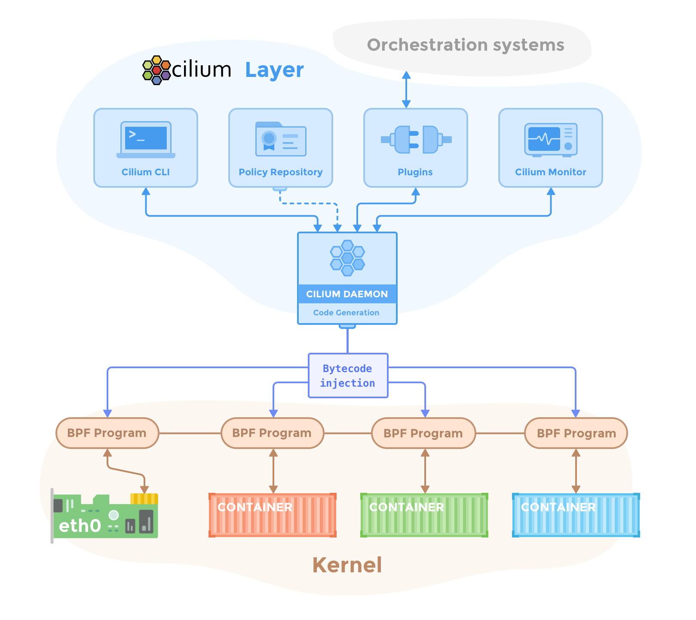
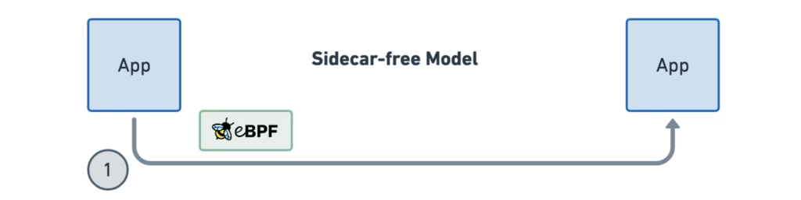
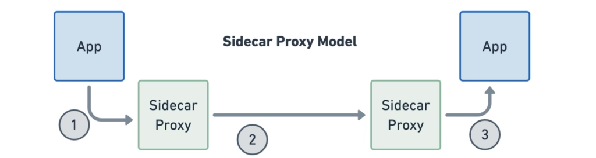
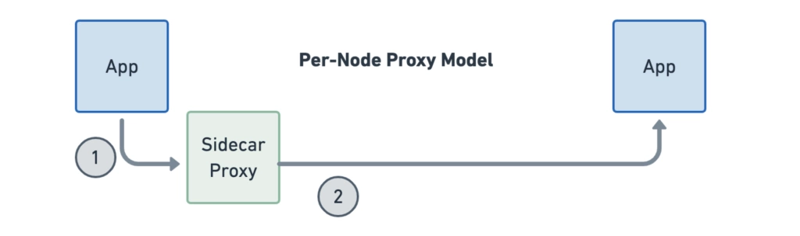
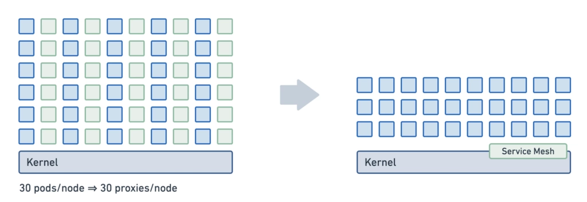
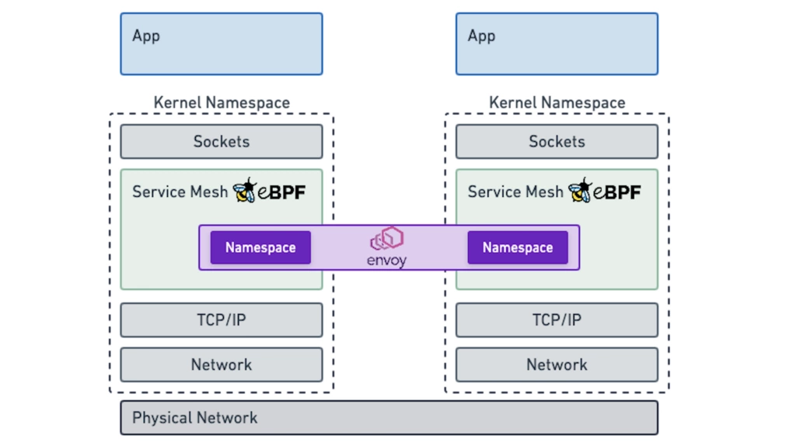
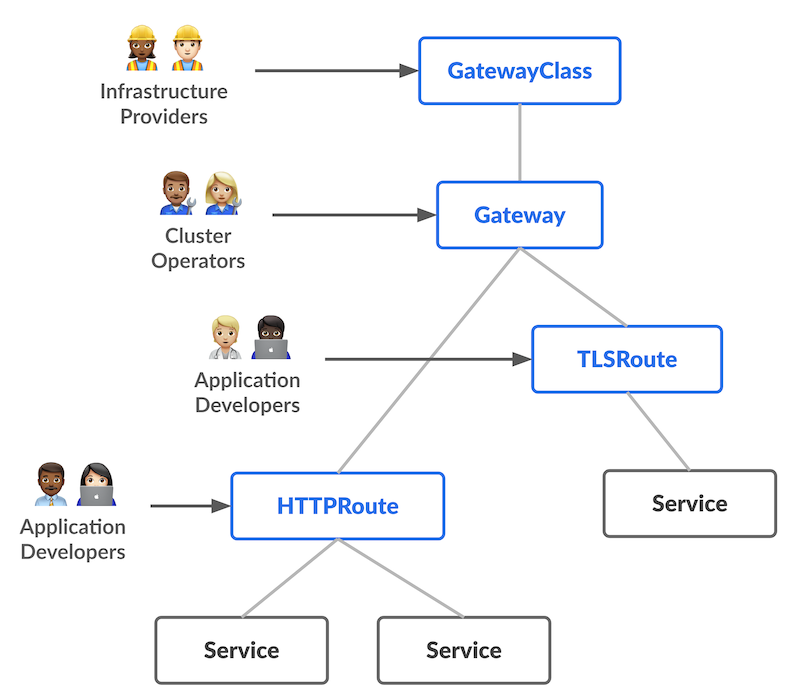
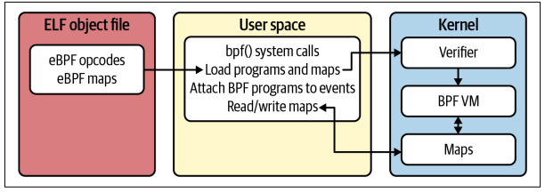
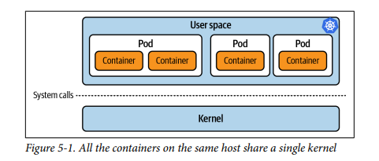

# Cilium Certified Associate

_This exam is an online, proctored, multiple-choice exam._

## Resources

* <https://github.com/isovalent/CCA-Study-Guide>
* <https://cilium.io/blog/2018/04/24/cilium-security-for-age-of-microservices/>

## Topics

<details>
  <summary>Architecture (20%)</summary>

Cilium is an open source CNI compatible networking and scurity layer for Kubernetes. Thanks to BGP, a powerful kernel extensibility mechanism inside of Linux, Cilium rethinks the Linux networking.

In-kernel networking brings:

* Performance - workload is already traversing local kernel.
* Transparency - data are sent using TCP/IP, no need to change applications
* Security

BPF: Framework for running custom logic at various hook points in the kernel.

BPF programs: The logic, JIT compiled.

Service centric identity and API awareness, with Cilium identity is extracted from the contianer orchestrator and embedded in each network request.

Cilium removes the need of a sidecar proxy, per Pod proxy between microservices, the Istio or Envoy way of doing this suboptimally by traversing the TCP/IP stack. BPF brings "sockmap".

## Components



### Cilium

* Agent, runs on each node. Accepts config via Kubernetes. Listens on events from orchestration systems _such as_ Kubernetes. Manages eBPG programs which the Linux kernel uses to control all network access.
* Debug Client, `cilium-dbg`. Interacts with the REST API of the Cilium agent running on the same node. Inspects state and status of the local agent.
* Operator, responsible for managing duries in the cluster which should logically be handled once for the entire cluster, rather than once for each node. _Not in the critical path for functionality on the network layer._. If there's a failure in the Operator this might happen:
  * Delays in IPAM and thus scheduling of new workloads.
  * Failure to update **kvstore** heartbeat key.
* CNI Plugin, invoked when a pod is scheduled or terminated on a node. Interacts with the Cilium API of the node.

### Hubble

* Server, runs on each node at retrieves the eBPF visibility from Cilium.
* Relay, standalone component which is aware of all running Hubble servers and offers cluster-wide visibility.
* Client CLI, retrieve flow events via the gRPC API of the relay.
* GUI

### eBPF

eBPF is a Linux kernel bytecode interpreter. In-kernel verifier ensures that eBPF programs are safe to run and a JIT compiler converts the bytecode to CPU architecture.

### Data Store

State propagation between agents are done via:

* CRD, the default
* Key-Value store, an optimization. etcd as the only supported one. Imagine having a seperate etcd for this and not use the same as the cluster.

### eBPF Data Path

The Linux kernel supports a set of BPF hooks in the networking stack that can be used to run BPF programs. The Cilium **datapath** uses these hooks to load BPF programs to create _higher level networking contructs_.

* XDP is at the earliest point possible in the networking driver. Ideal for running filtering programs that drop malicious or unexpected traffic, DDOS protection mechanism!
* Traffic Control, TC, ingress/egress. Runs **after** the networking stack has done initial processing of the packet. Runs before L3. Containers typically use a virtual device called a veth pair which acts like a virtual wire connecting the container to the host. TC ingress hook is added on the host side.
* Socket Operations, this hook is attached to a specific cgroup and runs on TCP events.
* Socket send/recv runs on every send operation performed by a TCP socket

The combination of the hooks above and virtual interfaces, `cilium_host` and `cilium_net`, an optional overlay interface `cilium_vxlan`, Linux user space crypto support and a userspace proxy (Envoy) Cilium creates the following networking objects:

* Prefilter
* Endpoint Policy, this is the primary object in the Cilium datapath responsible for mapping packets to identities and enforcing L3 and L5 policies
* Service
* L3 Encryption
* Socket Layer Enforcement
* L7 Policy

#### The life of a packet

There's three different scenarios:

* Endpoint to Endpoint
* Egress from Endpoint
* Ingress to Endpoint

#### eBPF Maps

All BPF maps are created with a upper capacity limits.

#### IPtables usage

Depending on the Linux kernel version used, the eBPF datapath can implrement a varying feature set fully in eBPF. If required capabilities are not available the functionality provided using a leagacy iptables implementation.

### IPAM

Responsible for the allocation and management of IP addresses used by network endpoints (containers and others). Dont change the IPAM mode of an existing cluster, this may cause persistent disruption of connectivity for existing workloads.

There's different modes:

* Cluster Scope (default) - assigns per-node PodCIDRs to each node and allocates IPs using a host-scope allocator on each node. Similar to Kubernetes Host Scope mode. Cluster scope uses the `CiliumNode` instead of the `v1.Node`.
* Kubernetes Host Scope - `ipam: kubernetes` flag.
* Multi-Pool
* Azure IPAM
* Azure Delegated IPAM
* AWS ENI
* GKE
* CRD-backed - extendable interface to control the IP address management via a Kubernetes CRD. Allows to delegate IPAM to external operators. Operator watches `ciliumnodes.cilium.io`.

### Labels

Whenever something needs to be described, addressed or selected, it is done based on labels:

* Endpoint are assinged labels

A label is a pair of strings consisting of a `key` and `value`.

A label can be derived from various sources, for example an endpoint will derive the labels associated to the container by the local container **runtime** as well as the labels associated with **pod** as provided by Kubernetes.

Example of a `CiliumEndpoint`:

```
apiVersion: cilium.io/v2
kind: CiliumEndpoint
status:
  encryption: {}
  external-identifiers:
    cni-attachment-id: e2ca9c7df3e13300b82ec641463736ef91daa50dba96a40477bdb688d46c0e81:eth0
    container-id: e2ca9c7df3e13300b82ec641463736ef91daa50dba96a40477bdb688d46c0e81
    k8s-namespace: default
    k8s-pod-name: andqvi-temp-shell
    pod-name: default/andqvi-temp-shell
  id: 2473
  identity:
    id: 80868
    labels:
    - k8s:io.cilium.k8s.namespace.labels.field.cattle.io/projectId=p-l2b4c
    - k8s:io.cilium.k8s.namespace.labels.kubernetes.io/metadata.name=default
    - k8s:io.cilium.k8s.policy.cluster=k8s-devstage01
    - k8s:io.cilium.k8s.policy.serviceaccount=default
    - k8s:io.kubernetes.pod.namespace=default
    - k8s:run=andqvi-temp-shell
    - k8s:topology.kubernetes.io/region=DC07
    - k8s:topology.kubernetes.io/zone=dc07
  networking:
    addressing:
    - ipv4: 10.169.3.73
    node: 10.171.13.142
  state: ready
```

Supported label sources:

* `container:` from the local container runtime
* `k8s` derived from Kubernetes
* `reserved` for special reserved labels
* `unspec` with an unspecified source

The endpoint ID is an internal id that Cilium assigns to all endpoints on a cluster node. The endpoint ID is unique within the context of an individual cluster node.

All endpoints are assigned an identity, the identity is what is used **to enforce basic connectivity between endpoints**. Equvialent to L3 enforcement. An identity is **identified by Labels and is given a cluster wide unique identifier**.

Examples on special identities:

* `reserved:unknown` - identity could not be derived.
* `reserved:host` - Local host.
* `reserved:world` - Any network endpoint **outside** of the cluster.

Well known identities are a set of identities that Cilium is aware of automatically. E.g. `kube-dns`, `core-dns` etc.

</details>

<details>
  <summary>Network Policy (18%)</summary>

* Interpret Cilium Network Polices and Intent
* Understand Cilium's Identity-based Network Security Model
* Policy Enforcement Modes
* Policy Rule Structure
* Kubernetes Network Policies versus Cilium Network Policies

## Identity Based security

Security is based on the identity of a pod, which is derived through labels. This identity can be shared between pods. Subsequent starts of additional Pods with `role=frontend` only requires resolving the identity via a key-value store. Nothing needs to be done on cluster nodes.

## Policy Enforcement

All security policies are described assuming **stateful policy enforcements for session based protocols**. The intent of the policy is to **describe allowed direction** of connection establishment.

If policy shows `A=>B` then reply packets from B to A are automatically allowed.

Policies can be enforced at _ingress_ or _egress_.

For ingress this means that each cluster node verifies all incoming packets and determines wheter the packet is allowed or to be transmitted to the intended endpoint. Same with egress.

In order to **enforce** identity based security in a multi host cluster the identity of the transmitting endpoint is embedded into every network packet. The receiving node can then extract the identity

If no policy is loaded, the default behavior is to **allow all communication** unless policy enforcement has been explicitly enabled. As soon as the first policy rule is loaded then policy enforcement is enabled and any communication must then be white listed or the relevant packets will be dropped.

### Modes

`default`- endpoints have unrestricted network access until selected by policy.

`always` - policy enforcement is always on even if no rules select endpoints.

`never` - policy enforcement disabled on all endpoints.

When an endpoint is selected by a network policy, it transitions to a default-deny state where only **explicitly allowed** traffic is permitted.

## Network Policies

Standard `NetworkPolicy` supports L3 and L4 at ingress or egress of the Pod.

The extended `CiliumNetworkPolicy` supports policies at L3-7 for both ingress and egress.

The `CiliumClusterWideNetworkPolicy` is a cluster-scoped CRD, same as `CuliumNetworkPolicy` but no `namespace` specified.

`ipBlock` feature is missing in Kubernetes Network Policy.

`CiliumNetworkPolicy` allows for extended functionality, if this functionality get into the `NetworkPolicy` the Cilium one may not be needed.

All policy rules are based upon a **whitelist** model, that is, each rule in the policy allows traffic that matches the rule. If **two rules** exists the broades traffic match will be the one that is used.

If both **ingress** and **egress** are omitted, the rule has no effect!

Layer 3 policies can be specified using the following **methods**:

* Endpoints based - an empty Endpoint Selector will select all endpoints.
* Services based - `toServices`
* Entity based - `toEntities` and `fromEntities`
  * `host` - Includes the local host, also containers running in network mode host.
  * `remote-node` - Any node in any of the connect clusters **other** than the local host.
  * `kube-apiserver`
  * `ingress` - Cilium Envoy instance that handles L7 traffc.
  * `cluster` - All network endpoints inside of the local cluster.
  * `init` - All endpoints in bootstrap phase which the security identiy has not been resolved yet.
  * `health` - Health endpoints, used to check cluster connectivity.
  * `unmanaged` - Not managed by Cilium.
  * `world` - All endpoints outside of the cluster.
  * `all` - All known clusters as well world and whitelists all communication.
* Node based
* IP/CIDR based
* DNS based

</details>

<details>
  <summary>Service Mesh (16%)</summary>

* Know How to use Ingress or Gateway API for Ingress Routing
* Service Mesh Use Cases
* Understand the Benefits of Gateway API over Ingress
* Encrypting Traffic in Transit with Cilium
* Sidecar-based versus Sidecarless Architectures

## Service Mesh

The requirements has not changed since way back:

* Application should be able to (safely) communicate over untrusted networks
* Load-balancing
* Resiliency
* Authenticate each other's identity

A service mesh extract these features out of the application an offers them as part of the infrastructure.

All in all a Service Mesh is:

* Observability
* Ingress
  * Load Balancing (North-South)
* L7 traffic management - East-West, service load balancing
  * Rules (canary rollouts)
* Identity based security

Why are you interested in Cilium Service Mesh?

* Reducing operational complexity
* Reduced resource usage
* Better performance
* Avoid sidecar start-up/shut-down race conditions

eBPF can **inject the proxy directly at the socket level**, keeping paths short. In the case of Cilium, Envoy is used although from an architecture perspective any proxy could be integrated into this model.

### Sidecar vs per-Node proxy





Running a sidecar in each workload can result in a large number of proxies. Each proxy maintains data structures such as routing and endpoint tables:



Multi-tenancy is solved in a per-Node proxy model, the proxy will serve connections for multiple applications:



## Ingress

Cilium usses the standard Kubernetes Ingress resource definition with an `ingressClassName` of `cilium`. Can be used for path-routing and for TLS termination.

_The ingress controller creates a Service of `LoadBalancer` type, so your environment will need to support this._

Cilium allows you to create a load balancer in two modes: `dedicated` and `shared`.

Requirements:

* Cilium to be configured with NodePort enabled OR by enabling kube-proxy replacement
* Cilium must be configured with the L7 proxy enabled using `l7Proxy=true`
* Ingress controller creates a Service of type `LoadBalancer`

Install the `hubble` CLI to get som more insights in the traffic.

### Cilium Ingress and Gateway API vs other Ingress controllers

* For Cilium, Ingress and Gateway API are part of the networking stack, and so behaves in a different way to other Ingress or Gateway API controllers.
* Other Ingress or Gateway API controllers are generally installed as a Deployment or DaemonSet
* Ciliums Ingress and Gateway API config is exposed witha a Loadbalancer or NodePort service, or the host network. When traffic **arrives at the Service's port, eBPF forwards this to Enviy (using TPROXY kernel facility)**. This changes the *_visbility_ of headers etc. from how other controllers does this.

Ingress and Gateway API traffic bound to backend services via Cilium passes through a per-node Envoy proxy, the per-node proxy has special code to allow it to interact with eBPF policy engine making Envoy a network policy enforcer point.

After ingress traffic arrives at the Envoy the traffic are assigned the special `ingress` identity, there's two logical policy enforcement points in Cilium ingress: `world` and `ingress`.

### Source IP visibility

By default Envoy adds the visible source address of incoming HTTP connection to the `X-Forwarded-For` header. There's also the `X-Envoy-External-Address`.

### `externalTrafficPolicy` for LoadBalancer or NodePort services

Relevant for Client IP visibility.

There's two settings:

* `Local` - Only route traffic to Pods running on the local node, **without masquerading the source IP**.
* `Cluster` - Node will route to all endpoints across the cluster evenly. This may mean that the backend Pod does **not** see the source IP.

In Cilium this works a bit differently: In both `externalTrafficPolicy` cases, traffic will arrive at any node in the cluster, and be forwarded to Envoy while keeping the source IP intact.

### Ingress Path Types and precedence

There's three types of paths:

* **Exact** - match the given path exactly
* **Prefix** - match the URL path prefix split by `/`
* **ImplementationSpecific** - Up to the IngressClass. In the Cilium case they've defined that as `Regex`.

When multiple path types are configured on an Ingress object, Cilium will configure Envoy with matches in the following order:

1. Exact
2. ImplementationSpecific
3. Prefix
4. The `/` Prefix match has special handling and always goes last.

## Gateway API

Gateway API is a Kubernetes **SIG-Network subproject to design a successor for the Ingress object.**.

It's designed to be:

* Role-oriented
* Portable
* Expressive
* Extensible



Cilium are Gateway API compatible since all core conformance tests are passed.

Requirements:

* Cilium must be configured with NodePort enabled OR by enabling the kube-proxy replacement
* L7 proxy enabled
* Install Gateway API CRDs

### GAMMA (Gateway API for Mesh Management and Administration)

Is for the east/west inter-service traffic in the same cluster.

</details>

<details>
  <summary>Network Observability (10%)</summary>

* Understand the Observability Capabilities of Hubble
* Enabling Layer 7 Protocol Visibility
* Know How to Use Hubble from the Command Line or the Hubble UI

Hubble is the observability layer of Cilium.

Hubble is able to provide visibility at the node level, cluster level or even across clusters in Cluster Mesh.

Hubble operates at the scope of the individual node on which the Cilium agent runs.

Hubble relay adds network visibility for the entire cluster or even multiple clusters (Cluster Mesh).

Hubble UI is a web interface.

## Layer 7 visibility

To monitor the datapath state you can use `cilium-dbg monitor --type drop`. By default the inspection only works on L3/L4 packets. If you want L7 protocol visibility you can use L7 network policies.

Monitoring L7 traffic involves security considerations for handling potentially sensitive information.

To harde security Cilium provides the `--hubble-redact-enabled` option to handle sensitive information present in L7 flows.

DNS visibility is only available on egress only.

CLI examples using `hubble`:

```
hubble observe --pod deathstar --protocol http
hubble observe --pod deathstar --verdict DROPPED
```

</details>

<details>
  <summary>Installation and Configuration (10%)</summary>

* Know How to Use Cilium CLI to Query and Modify the Configuration
* Using Cilium CLI to Install Cilium, Run Connectivity Tests, and Monitor its Status

For clusters with more than 500 nodes you might want to run specific datapath nodes!

Install the `cilium` CLI:

* Download directly with util script
* git clone

`cilium status` gives us the current overall status.

`cilium status --wait`

`cilium connectivity test` - run network connectivity test

</details>

<details>
  <summary>Cluster Mesh (10%)</summary>

* Understand the Benefits of Cluster Mesh for Multi-cluster Connectivity
* Achieve Service Discovery and Load Balancing Across Clusters with Cluster Mesh

Multi-cluster or Cluster Mesh extends the networking datapath across multiple clusters. It allows endpoints in all connected clusters to communicate while providing full policy enforcement.

Pre-req:

* All clusters must be running the same datapath mode, `encapsulation` or `native-routing`.
* PodCIDR ranges in all cluster must be non-conflicting.
* IP connectivity between eachother using InternalIP for each node is needed.
* The network between clusters must allow the inter-cluster communication via FWs.

Max 255 clusters!

Changing the cluster ID can be done in a running cluster with live workload, but all workloads needs to e restarted since the security identity is created using the id.

to get Hubble Relay to work you'll need to move the CA certificate around.

```
cilium clustermesh enable --context $CLUSTER1
cilium clustermesh enable --context $CLUSTER2
```

```
cilium clustermesh connect --context $CLUSTER1 --destination-context $CLUSTER2
```

Test connectivity:

```
cilium connectivity test --context $CLUSTER1 --multi-cluster $CLUSTER2
```

### KVStoreMesh

KVStoreMesh is an extenstion of Cluster Mesh, it caches the information obtained from the remote cluster in a local kvstore, such as etcd.

This is different from vanilla Cluster Mesh where each agent directly pulls the information from the remote clusters.

Since 1.16 this is enabled by default.

### Load balancing

Use the annotation `service.cilium.io/global: "true"` to declare a identical service in identical namespaces across multiple clusters as global.

Loadbalancing will automatically be performed across clusters.

### Exporting a Service

To export a service you should create a `ServiceExport` resource. As a result your Service will be exported to all clusters, provided that the Service Namespace is present on those clusters.

</details>

<details>
  <summary>eBPF (10%)</summary>

* Understand the Role of eBPF in Cilium
* eBPF Key Benefits
* eBPF-based Platforms versus IPtables-based Platforms

The Extended Berkely Packet Filter, filtering network packets, the extended part of the name also means that it can be used to so much more than just packet filtering.

It's primarily a _framework_ that allows users to load and run custom programs within the kernel. Which means it can _extend_ or even _modify_ the way the kernel behaves.

eBPF enables us to collect customized information about an app without having to change the app itself.

Watching or observing an application from the kernel perspective is not new, we've had `perf` for a while.

eBPF programming is powerful but complex.

## The Kernel and eBPF

The kernel is a software layer between your applications and the hardware they're running on. Applications run in an unprivileged layer called user space. Apps cannot access hardware directly. This is done through syscalls.

It's hard to get changes into the kernel.

You can always write your own module, these can be loaded and unloaded on demand. The challenge here is that this is still full-on kernel programming.

eBPF allows us to run arbitrary code in the kernel, the _verifier_ analyzes an eBPF program to ensure that regardless of input it will always terminate safely.

eBPF programs can be loaded into the kernel dynamically. The kernel accepts eBPF programs in _bytecode_ form. The program itself is typically written in C or Rust and compiled into an object file.



## Network Interfaces

XDP allows attaching an eBPF program to a network interface, so that it is triggered whenever a packet is received on that interface. It can inspect the packet and the exit code can tell the kernel what to do with that packet.

eBPF Maps, maps are datastructures that are defined alongside eBPF programs. key-value stores. Common uses for maps include:
* eBPF program writing metrics
* User space code writing configuration information
* An eBPF program writing data into a map for later retreival by another eBPF program



## Tuning

### eBPF host routing

Even when network routing is performed by Cilium using eBPF, by default network packets still traverse some parts of the regular network stack of the node. To ensure packets traverses all of the iptables hooks in case you depend on them.

With `cilium status` you should see Host Routing set to `BPF`.

### IPv4 BIG TCP

Allows the network stack to prepare larger GSO (tx) and GRO (rx) packets to reduce the number of time the stack is traversed which improves performance!

### Bandwidth Manager

Responsible for managing network traffic more efficiently.

</details>

<details>
  <summary>BGP and External Networking (6%)</summary>

* Egress Connectivity Requirements
* Understand Options to Connect Cilium-managed Clusters with External Networks

</details>
