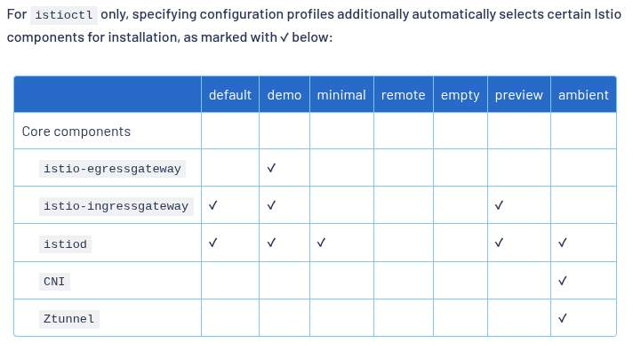
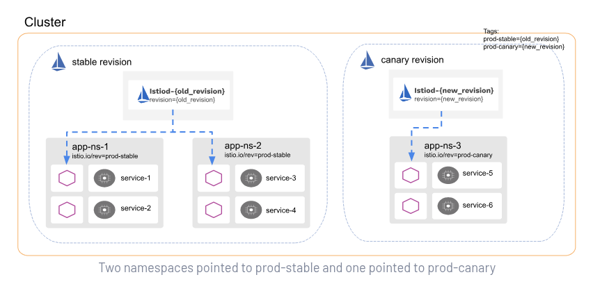
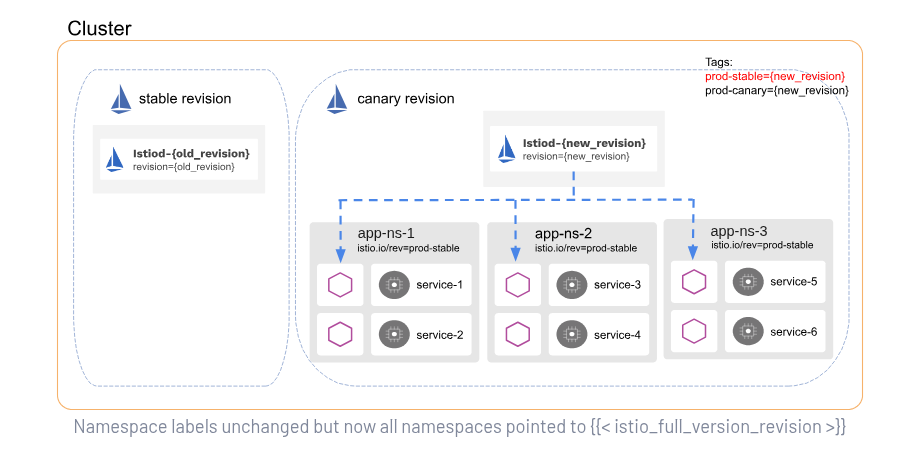
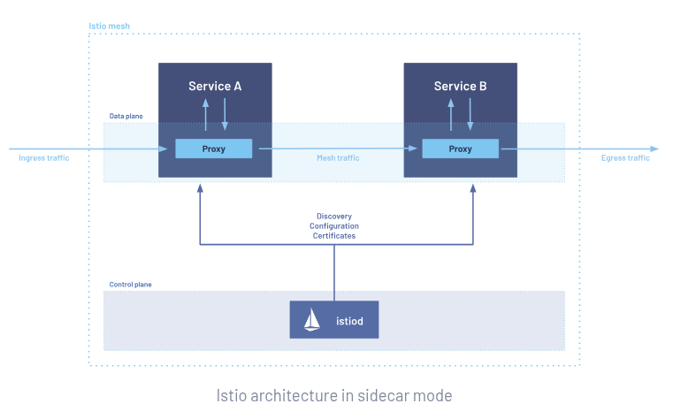

# Istio Certified Administrator

_This exam is an online, proctored, performance-based AND multiple-choice exam._

## Exam details

The exam is delivered online and consists of performance-based tasks (problems) to be solved on the command line running Linux.

* The exam consists of 15-20 performance-based tasks.
* Candidates have 2hrs to complete the ICA exam.

## Exam technical instructions

1. You MUST not reboot the base node, hostname `base`.
2. Copy = Ctrl+Shift+C and Paste = Ctrl+Shift+V
3. In webbrowser Ctrl+C and Ctrl+V works

### ICA Exam Environment

* You must complete each task in this exam on a designated `host`.
* `exit` will return you to the base system.
* The environment is currently configured with Istio v1.26
* Pre-installed tools:
  * `kubectl`
  * `istioctl`
  * `yq`
  * `curl`
  * `wget`

## Resources

* <https://istio.io/latest/docs/>
* <https://killercoda.com/ica>
* <https://killercoda.com/istio>
* Mock exam: <https://docs.google.com/forms/d/e/1FAIpQLSfD4BLLQfdUwnIyiTBSGC_OzmSbiyrIlNp5Am61fTOhRbfiLw/viewform>

## Topics

<details>
  <summary>About Istio</summary>

Istio is an open source **service mesh** that **layers** transparently onto existing distributed applications. It provides a uinitform and more efficient way to secure, connect and monitor services.

Istio is the path to:

* load balancing
* service-to-servuice authentication
* monitoring

With a few code changes it gives you:

* Mutual TLS encryption, strong identity-based authentication and authorization
* Automatic load balancing for HTTP, gRPC, WebSoclet and TCP traffic
* Fine-grained control of traffic behavior with rich routing rules, retries, failovers and fault injection
* A pluggable policy layer and configuration API supporting access controls, rate limits and quotas
* Automatic metrics, logs and traces for all traffic within a cluster

Istio uses a proxy to intercept all your network traffic, allowing a broad set of application-aware features based on configuration you set.

The **control plane** ingests your configuration and it's view of services and dynamically programs the proxy servers and updates them as your environment changes.

The **data plane** is the communication between services. Without a service mesh, the network doesn't understand the traffic being sent over, and cant make any decisions based on what type of traffic it is. Or who it is from or to.

Istio supports two data plane modes:

* Sidecar Mode, deploys Envoy proxy along with **each Pod** that you start in your cluster.
* Ambient Mode, uses a per-node Layer 4 proxy and optionally a per-namespace Envoy proxy for Layer 7 features.

## The requirements

For a Pod to be part of a mesh, the Pod must satisfy the following requirements:

* Application UID should not be `1337`
* `NET_ADMIN` and `NET_RAW` capabilities is needed!

</details>

<details>
  <summary>Setting up a local test environment for Istio</summary>

_I'll be using `minikube` throughout this exam prep._

1. Create the cluster.

```bash
minikube start -p istio-test
```

2. Install Istio CLI, version `1.26` since this is the version installed in the exam environment.

```bash
curl -L https://istio.io/downloadIstio | ISTIO_VERSION=1.26.0 sh -
mv ~/istio-1.26.0/bin/istioctl ~/.local/bin/
```

</details>

<details>
  <summary>Installation, Upgrade & Configuration (20%)</summary>

* Installing Istio with istioctl or Helm
* Installing Istio in Sidecar or Ambient Mode
* Customizing your Istio Installation
* Upgrading Istio (Canary, In-Place)

## Installing Istio with istioctl or Helm

You can use built-in configuration profiles to install Istio, they are named groups of Helm chart value overrides that are built into the charts, and can be used when installing either via `helm` or `istioctl`.

The **key difference** between `helm` and `istioctl` install mechanisms is that the `istioctl` configuration profiles **ALSO INCLUDE** a list of Istio components that will be installed automatically by `istioctl`. With `helm` you need to specify the components to install manually.

`istioctl` install == one command.



Platform profiles that you can use with `istioctl` and `helm`:

* `gke`
* `eks`
* `openshift`
* `k3d`
* `k3s`
* `microk8s`
* `minikube`

We're using the `demo` profile when installing Istio in the exam environment.

Using Helm:

```bash
helm repo add istio https://istio-release.storage.googleapis.com/charts
helm repo update
helm install istiod istio/istiod -n istio-system --create-namespace --version 1.26.0 --set profile=demo --set global.platform=minikube --wait
```

Using `istioctl`:

_Note that version of Istio are set to the version of `istioctl` binary installed._

```
istioctl install --set profile=demo --set values.global.platform=minikube
```

Add namespace label to instruct Istio to automatically inject Envoy sidecar proxies when you deploy your application later:

```bash
kubectl label namespace default istio-injection=enabled
```

## Sidecar

### Install using istioctl

To install the sidecar mode using `istioctl` use the default installation method, example:

```bash
istioctl install --set profile=demo
```

### Install using Helm

With `helm` you install the components separately. This allows for more granular control over the installation process.

1. Install the base chart first, this contains the CRDs needed by Istio:

```bash
helm install istio-base istio/base -n istio-system --set defaultRevision=default --create-namespace
```

2. Optionally install the Istio CNI chart.

3. Install the discovery chart:

```bash
helm install istiod istio/istiod -n istio-system --wait
```

4. Optionally install an ingress gateway:

```bash
helm install istio-ingress istio/gateway -n istio-ingress --wait
```

_Note that the namespace the gateway is installed to _shall not_ have the `istio-injection=enabled` label._

### Upgrades using istioctl

#### Canary

Upgrading Istio can be done by first running a **canary** deployment of the new control plane, allowing you to monitor the effect of the upgrade with a small percentage of the workloads.

This is a much safer than doing an in-place upgrade.

Before upgrade run: `istioctl x precheck`.

During revision based upgrades you can **jump between minor versions**, but this is not the case in in-place upgrades where you need to upgrade to each intermediate minor release.

To install a new **revision** you can set the revision field as follows:

```bash
istioctl install --set revision=canary
```

To test the canary one you can do the following, basically upgrading a single namespace to use the new revision:

1. Create a new namespace
2. Label it with the `istio-injection=enabled` label
3. Start a new Pod, still injected with the old version.
4. Remove that label and add the `istio.io/rev=canary` label, the injection label needs to be removed since it takes precedence!
5. Restart the Pod, or Deployment to trigger re-injection
6. Verify that the Pod is pointing to the `istiod-canary` control-plane: `istioctl proxy-status | grep "\.test-ns "`

Status after upgrade:

```
istioctl proxy-status --namespace test-ns
NAME                              CLUSTER        CDS               LDS               EDS               RDS               ECDS        ISTIOD                             VERSION
curl-5946dc98d7-95ndm.test-ns     Kubernetes     SYNCED (106s)     SYNCED (106s)     SYNCED (106s)     SYNCED (106s)     IGNORED     istiod-canary-7bf647c6cb-s9qh8     1.26.0
```

Manually changing labels on namespaces can be tedious and error-prone. **Revision tags** solves this problem. Revision tags are **stable** identifiers that point to revisions and can be used to avoid relabeling namespaces.



```bash
istioctl tag set prod-stable --revision 1-27-1
istioctl tag set prod-canary --revision 1-28-1
```

```bash
istioctl tag list
TAG         REVISION NAMESPACES
default     1-27-1   ...
prod-canary 1-28-1   ...
prod-stable 1-27-1   ...
```

When everything is stable in the control plane tagged with `prod-canary` you can update all namespaces labeled with `prod-stable` with:

```bash
istioctl tag set prod-stable --revision 1-28-1 --overwrite
```



to make the `1-28-1` revision `default` use the following command:

```bash
istioctl tag set default --revision 1-28-1
```

and the uninstall the old control plane:

```bash
istioctl uninstall --revision 1-27-1 -y
```

if the old control plane doesn't have a revision label uninstall it with the original install options!

#### In-place upgrades

Traffic disruption may occur during the upgrade process!

```bash
istioctl x precheck
istioctl upgrade
```

If you have used `-f` flag when installing Istio you need to provide that during `upgrade` also. This also goes for the `--set` flag(s).

After the upgrade you need to restart anypods with Istio sidecars by running `kubectl rollout restart deployment <deployment>`.

#### Helm and canary upgrade

1. `istioctl x precheck`
2. Upgrade the base chart: `helm upgrade istio-base istio/base -n istio-system`
3. Install a canary version of the Istio discovery chart:

```
helm install istiod-canary istio/istiod \
    --set revision=canary \
    -n istio-system
```

4. Verify:

```
kubectl get pods -l app=istiod -L istio.io/rev -n istio-system
```

5. If you're using Istio gateways, install a canary revision of the Gateway chart:

```
helm install istio-ingress-canary istio/gateway \
    --set revision=canary \
    -n istio-ingress
```

6. Stable revision labels:

```
helm template istiod istio/istiod -s templates/revision-tags-mwc.yaml --set revisionTags="{prod-stable}" --set revision=1-27-1 -n istio-system | kubectl apply -f -
helm template istiod istio/istiod -s templates/revision-tags-mwc.yaml --set revisionTags="{prod-canary}" --set revision=1-28-1 -n istio-system | kubectl apply -f -
```

7. Change the `prod-stable` tag to point to the canary revision when you're ready:

```
helm template istiod istio/istiod -s templates/revision-tags-mwc.yaml --set revisionTags="{prod-stable}" --set revision=1-28-1 -n istio-system | kubectl apply -f -
```

8. Set the default tag to point to the new revision:

```
helm template istiod istio/istiod -s templates/revision-tags-mwc.yaml --set revisionTags="{default}" --set revision=1-28-1 -n istio-system | kubectl apply -f -
```

#### Helm and in-place upgrade

1. Upgrade the Istio base chart:

```
helm upgrade istio-base istio/base -n istio-system
```

2. Upgrade the Istio discovery chart:

```
helm upgrade istiod istio/istiod -n istio-system
```

3. (Optional) Upgrade any gateway charts installed in your cluster:

```
helm upgrade istio-ingress istio/gateway -n istio-ingress
```

## Ambient

### Install using istioctl

1. Install Gateway API CRDs if not already installed:

```bash
kubectl get crd gateways.gateway.networking.k8s.io &> /dev/null || \
kubectl apply --server-side -f https://github.com/kubernetes-sigs/gateway-api/releases/download/v1.4.0/experimental-install.yaml
```

2. Install Istio in ambient mode:

```bash
istioctl install --set profile=ambient --skip-confirmation
```

To see what's actually being installed:

```bash
istioctl manifest generate > $HOME/generated-manifest.yaml
```

### Install using Helm

1. Install Gateway API CRDs if not already installed:

```bash
kubectl get crd gateways.gateway.networking.k8s.io &> /dev/null || \
kubectl apply --server-side -f https://github.com/kubernetes-sigs/gateway-api/releases/download/v1.4.0/experimental-install.yaml
```

2. Install control plane:

```bash
helm install istiod istio/istiod --namespace istio-system --set profile=ambient --wait
```

3
. Install `ztunnel` DaemonSet which is the data plane in this mode:

```bash
helm install ztunnel istio/ztunnel -n istio-system --wait
```

### Upgrade using helm

In contrast to sidecar mode, ambient mode supports moving application pods to an upgraded ztunnel proxy without mandatory restart or reschedule of running application pods. Istio does not support canary upgrades of ztunnel.

Use blue/green node pools instead to limimt blast radius.

Ambient mode are split into two components that needs to be upgraded:

* ztunnel
* gateways

#### Upgrade control plane

1. `istiod` upgrade:

```bash
helm install istiod-"$REVISION" istio/istiod -n istio-system --set revision="$REVISION" --set profile=ambient --wait
```

#### Upgrade data plane

1. Upgrade `ztunnel`:

```
helm upgrade ztunnel istio/ztunnel -n istio-system --set revision="$REVISION" --wait
```

2. Upgrade gateways and waypoints:

```
helm template istiod istio/istiod -s templates/revision-tags-mwc.yaml --set revisionTags="{$MYTAG}" --set revision="$REVISION" -n istio-system | kubectl apply -f -
```

### Deployment Models

Before we deploy Istio to production we need to answer a number of questions:

* Will the mesh be confined to a single cluster, or distributed across multiple clusters?
* Will all the services be located in a single fully connected network, or will gateways be required to connect services across multiple networks.
* Is there a single control-plane, potentially shared across clusters or are there multiple control planes deployed to ensure HA?
* Single mesh or multi-mesh federated deployment?

Dimensions:

1. Single or Multiple Cluster
2. Single or Multiple Network
3. Single or Multiple Control Plane
4. Single or Multiple Mesh

You can miz deployment models. Having more than one control-plane is recommended for production environments for HA. Choosing deployment models depends on the following requirements:

* Performance
* Isolation
* HA

A cluster represent boundaries for configuration and endpoint discovery. A single mesh can span multiple clusters.

### Uninstalling Istio

#### Using `istioctl`

```bash
istioctl uninstall -y --purge
kubectl delete namespace istio-system
```

or:

```bash
istioctl manifest generate <your original installation options> | kubectl delete --ignore-not-found=true -f -
```

And finally remove label from namespace:

```bash
kubectl label namespace <namespace> istio-injection-
```

#### Using `helm`

</details>

<details>
  <summary>Traffic Management (35%)</summary>

* Configuring Ingress and Egress Traffic
* Configuring Routing within a Service Mesh
* Defining Traffic Policies with Destination Rules
* Configuring Traffic Shifting
* Connecting In-Mesh Workloads to External Workloads and Services
* Using Resilience Features (circuit breaking, failover, outlier detection, timeouts, retries)
* Using Fault Injection

## Istios Architecture

An Istio service mesh consists of the following components:

* **data plane** - a set of intelligent proxies (Envoy) that are deployed as sidecars to the services in the mesh. Mediates and controls all network communication between microservices.
* **control plane** - manages and configures the proxies to route traffic.



## Traffic Managment Overview

Istios traffic routing rules let you easily control the flow of traffic and API calls between services. Istio simplifies configuration of service-level properties like circuit breakers, timeouts and retries. This makes it easy to set up tasks like:

* A/B testing
* Canary rollouts
* Staged rollouts
* Percentage-based traffic split

The traffic management model **relies** on the Envoy proxies that are deployed along with your services. By **default** Envoy proxies distribute the traffic across each service load balancing pool using a **least requests model**, where each request is routed to the host with fewer active requests.

Istio are using Kubernetes CRDs to configure traffic management:

* `VirtualService`
* `DestinationRule`
* `Gateway`
* `ServiceEntry`
* `SideCar`

### Virtual services

Virtual service along with destination rules are the key **building blocks** of Istio's traffic routing functionality. A virtual service lets you **configure how requests are routed to a service** within an Istio service mesh. You can specify traffic behavior for one or more hostnames.

Different versions of a service are specified as subsets.

They also lets you:

* Address multiple services through a single virtual service.
* Configure traffic rules in combination with gateways.

```yaml
apiVersion: networking.istio.io/v1
kind: VirtualService
metadata:
  name: reviews
spec:
  hosts:
  # short name resolvable by Kubernetes or FQDN, use '*' for a single routing rule matching all services.
  # Can be used to model traffic for virtual hosts that dont have routable entries inside the mesh.
  # Istio adds a domain suffix to the hostnames when resolving them. This below only works in the same namespace.
  - reviews 
  http: # routing rules, match conditions and actions for routing HTTP/1.1, HTTP2 and gRPC traffic.
  - match:
    - headers:
        end-user: # all requests from user 'jason'
          exact: jason
    route:
    - destination: # must be a real destination that exists in Istios service registry.
        host: reviews
        subset: v2
  - route:
    - destination: # must be a real destination that exists in Istios service registry.
        host: reviews
        subset: v3
```

The second rule above dont have any matches, this means it will be a catch-all rule that matches all requests not matched by previous rules. The precedence is top-down.

Remember that:

* If you have **multiple** match conditions to the same `match` block the conditions are ANDed together.
* If you have **multiple** `match` blocks in the same rule they are ORed together.

Example:

```yaml
  http:
  # rules
  - match: # the matches are ORed together
    - uri:
        prefix: /ratings
    match:
    # these conditions of a match are ANDed together
    - uri:
        prefix: /reviews
    - headers:
        end-user: # all requests from user 'jason'
          exact: jason
    route:
    - destination:
        host: reviews
```

### Destination rules

Subsets are defined based on labels that are attached to objects such as Pods.

Destination rule example with stting different load balancing policies:

```yaml
apiVersion: networking.istio.io/v1
kind: DestinationRule
metadata:
  name: my-destination-rule
spec:
  host: my-svc
  trafficPolicy:
    loadBalancer:
      simple: RANDOM
  subsets:
  - name: v1
    labels:
      version: v1
  - name: v2
    labels:
      version: v2
    trafficPolicy:
      loadBalancer:
        simple: ROUND_ROBIN
  - name: v3
    labels:
      version: v3
```

### Service Entries

You use a Service Entry to add an entry to the service registry that Istio maintains internally. After you add the service entry, the Envoy proxies can send traffic to the services as if it was a service in your mesh. Configuring service entries allows you to manage traffic for serivces running outside of the mesh.

Here you can define:

* Redirects
* Retries, timeouts and fault injection policies for external destinations.
* Run a mesh service in a VM

Example that adds ext-svc.example.com external dependency to Istios service registry:

```yaml
apiVersion: networking.istio.io/v1
kind: ServiceEntry
metadata:
  name: svc-entry
spec:
  hosts:
  - ext-svc.example.com
  ports:
  - number: 443
    name: https
    protocol: HTTPS
  location: MESH_EXTERNAL
  resolution: DNS
```

### Gateways

Use a Gatway to manage inbound and outbound traffic for your mesh, specify which traffic you want to enter or leave the mesh.

Instead of having all L4-7 traffic the Gateway does not handle the Layer 7 configuration. Instead this is done in the Virtual Service which is bound to the Gateway.

Gateways are primarily used to handle ingress traffic, but can also be used for egress traffic.

Gateway example:

```yaml
apiVersion: networking.istio.io/v1
kind: Gateway
metadata:
  name: ext-host-gwy
spec:
  selector:
    app: my-gateway-controller
  servers:
  - port:
      number: 443
      name: https
      protocol: HTTPS
    hosts:
    - ext-host.example.com
    tls:
      mode: SIMPLE
      credentialName: ext-host-cert
```

Stich the Gateway to a Virtual Service:

```yaml
apiVersion: networking.istio.io/v1
kind: VirtualService
metadata:
  name: virtual-svc
spec:
  hosts:
  - ext-host.example.com
  gateways:
  - ext-host-gwy
```

### Sidecars

By default Istio configures every Envoy proxy to accept traffic on all the ports of its associated workload.

* Fine-tune the set of ports and protocols that an Envoy proxy accepts
* Limit the set of services that the Envoy proxy can reach.

### Network resilience

As well as helping you direct traffic around the mesh Istio provides opt-in failure recovery and fault injection features.

#### Timeouts

The amount of time that an Envoy proxy should wait for replies from a given service. Envoy timeout for HTTP requests are disabled in Istio by default. You can se a per-service timeout setting:

```yaml
apiVersion: networking.istio.io/v1
kind: VirtualService
metadata:
  name: ratings
spec:
  hosts:
  - ratings
  http:
  - route:
    - destination:
        host: ratings
        subset: v1
    timeout: 10s
```

#### Retries

```yaml
apiVersion: networking.istio.io/v1
kind: VirtualService
metadata:
  name: ratings
spec:
  hosts:
  - ratings
  http:
  - route:
    - destination:
        host: ratings
        subset: v1
    retries:
      attempts: 3
      perTryTimeout: 2s
```

#### Circuit breakers

Another useful mechanism Istio provides for creating resilient microservice-based applications. When the threshold is reached the circuit breaker trips and all requests to the service will fail immediately for a specified period of time. Configured in `DestinationRule`:

```yaml
apiVersion: networking.istio.io/v1
kind: DestinationRule
metadata:
  name: reviews
spec:
  host: reviews
  subsets:
  - name: v1
    labels:
      version: v1
    trafficPolicy:
      connectionPool:
        tcp:
          maxConnections: 100
```

#### Fault injection

Introduces errors into a system to ensure that it can withstand and recover from error conditions. Useful to ensure that your failure recovery policies arent incompatible or too restrictive.

_Cannot be combined with retry or timeout configuration!_

Two types of faults are supported:

* Delays
* Aborts

```yaml
apiVersion: networking.istio.io/v1
kind: VirtualService
metadata:
  name: ratings
spec:
  hosts:
  - ratings
  http:
  - fault:
      delay:
        percentage:
          value: 0.1
        fixedDelay: 5s
    route:
    - destination:
        host: ratings
        subset: v1
```

## Configuring Ingress and Egress traffic

To configure egress gateway for HTTP traffic you need to start with creating a `ServiceEntry` to allow direct traffic to an external service.

1. Defina a `ServiceEntry` to allow traffic to the external service.

```yaml
apiVersion: networking.istio.io/v1
kind: ServiceEntry
metadata:
  name: cnn
spec:
  hosts:
  - edition.cnn.com
  ports:
  - number: 80
    name: http-port
    protocol: HTTP
  - number: 443
    name: https
    protocol: HTTPS
  resolution: DNS
```

2. Verify that your `ServiceEntry` was applied correctly by sending an HTTP request to it.

3. Create a `Gateway` resource to configure the egress gateway.

```yaml
apiVersion: networking.istio.io/v1
kind: Gateway 
metadata:
  name: istio-egressgateway
spec:
  selector:
    istio: egressgateway
  servers:
  - port:
      number: 80
      name: http
      protocol: HTTP
    hosts:
    - edition.cnn.com
---
apiVersion: networking.istio.io/v1
kind: DestinationRule
metadata:
  name: egressgateway-for-cnn
spec:
  host: istio-egressgateway.istio-system.svc.cluster.local
  subsets:
  - name: cnn
```

</details>

<details>
  <summary>Securing Workloads (25%)</summary>

* Configuring Authorization
* Configuring Authentication (mTLS, JWT)
* Securing Edge Traffic with TLS

</details>

<details>
  <summary>Troubleshooting (20%)</summary>

* Troubleshooting Configuration
* Troubleshooting the Mesh Control Plane
* Troubleshooting the Mesh Data Plane

Istio provides two very valuable commands to help diagnose traffic managment configuration pleoblems, the `proxy-status` and `proxy-config` commands.

* `proxy-status` command allows you to get an overview of your mesh and identify the proxy causing the problem.
* `proxy-config` command can be used to inspect Envoy configuration

## Troubleshooting Configuration

## Troubleshooting the Mesh Control Plane

`istioctl proxy-status`, gives you an overview of your mesh. If one of your sidecars isn't receiving configuration or is out of sync then `proxy-status` will tell you this:

```

istioctl proxy-status
NAME                                                   CLUSTER        CDS                LDS                EDS                RDS                ECDS        ISTIOD                             VERSION
bookinfo-gateway-istio-596c696f5-htrsh.default         Kubernetes     SYNCED (15m)       SYNCED (15m)       SYNCED (9m21s)     SYNCED (15m)       IGNORED     istiod-6b7f596479-l4k9h            1.26.0
curl-5946dc98d7-95ndm.test-ns                          Kubernetes     SYNCED (9m21s)     SYNCED (9m21s)     SYNCED (9m21s)     SYNCED (9m21s)     IGNORED     istiod-canary-7bf647c6cb-s9qh8     1.26.0

```

To explain the output please see: <https://www.envoyproxy.io/docs/envoy/latest/intro/arch_overview/operations/dynamic_configuration>.

* `CLUSTER` - a cluster in Envoy is a term that represents where to send traffic.
* `CDS` - cluster discovery service, a mechanism by which Envoy can discover upstream clusters and gracefully add, update or remove clusters.
* `LDS` - listener discovery service, a mechanism by which Envoy can discover entire listeners at runtime.
* `EDS` - endpoint discovery service, provides a mechanism for Envoy to discover members of an upstream cluster. Circumvents the limitations of DNS.
* `RDS` - route discobery service, a mechanism by which Envoy can discover the entire route configuration for an HTTP conn manager filter at runtime.
* `ECDS` - extension config discovery service, allows extension configurationsto be served independently from the listener. Useful when building systems that are more split from the primary control-plane such as a WAF.

And the synced statuses:

* `SYNCED` - Envoy has **acknowledged** the last configuration `Istiod` has sent it!
* `NOT SENT` - Istiod hasn't sent anythiong to Envoy, this usually is because Istiod has nothing to send
* `STALE` - Istiod **has** sent an update to Envoy but has not received an acknowledgement. Indicates a **networking issue** between Envoy and Istiod. Or a bug with Istio itself.

## Troubleshooting the Mesh Data Plane

</details>
