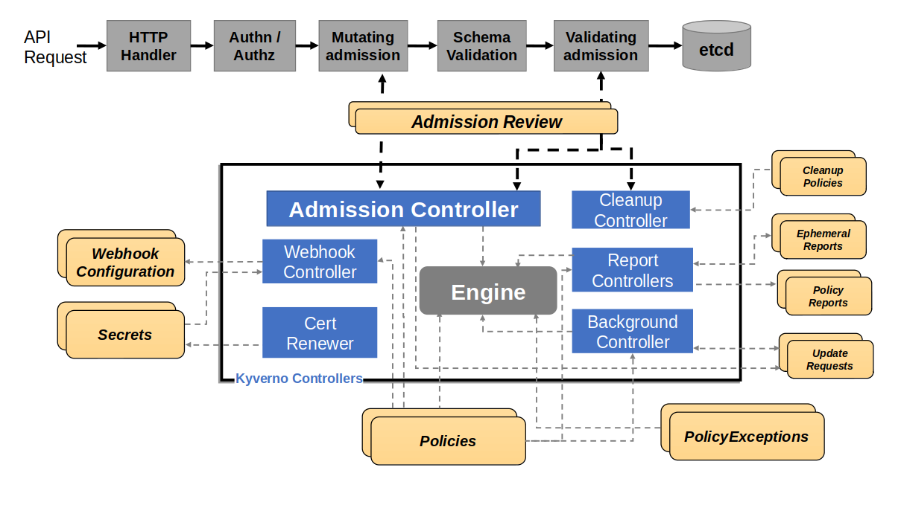
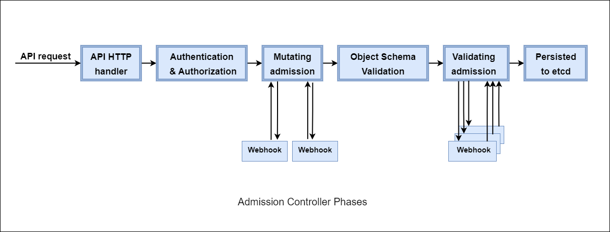
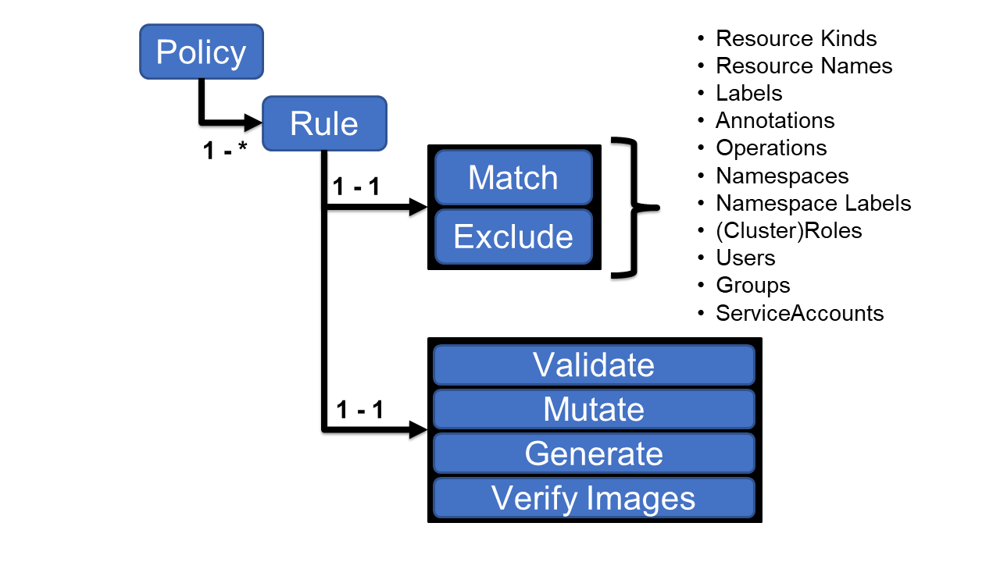

# Kyverno Certified Associate

_This exam is an online, proctored, multiple-choice exam._

## Resources

* <https://kyverno.io/docs/>

## Topics

<details>
  <summary>Fundamentals of Kyverno (18%)</summary>

* Kyverno Policies & Rules
* YAML Manifests
* Admission Controllers
* OCI Images

Kyverno is **a cloud native policy engine**. Originally built for Kubernetes but can now also be used outside of Kubernetes.

Kyverno allows platform engineers to automate security, compliance and best practices validation and deliver secure self-service to application teams.

## How Kyverno works

### Installing

The simplest way of installing `kyverno` is to use: `kubectl create -f <https://github.com/kyverno/kyverno/releases/latest/download/install.yaml>`

The following components are installed in the `kyverno` namespace:

* Kyverno Admission Controller
* Kyverno Background Controller
* Kyverno Cleanup Controller
* Kyverno Report Controller

### Admission Controls

Kyverno runs as a **dynamic admission controller** in a Kubernetes cluster. Kyverno receives **validating** and **mutating** admission **webhook HTTP callbacks** from the Kubernetes API server.

Mutating policies can be written as overlays (like Kustomize) OR as **JSON patches**. Validating policies als use an overlay style syntax, with support for pattern matching and conditional (if-then-else) processing.

Policy **enforcement** is captured using **Kubernetes** events. For requests that are either allowed or existed prior to introduction of a Kyverno policy then Kyverno creates **Policy Reports** in the cluster which contain a running list of resources matched by a policy, their status and more.

High-level architecture of Kyverno:



The **Webhook** is the server that handles incoming **AdmissionReview** requests from the Kubernetes API server and sends them to the **Engine** for processing.

The **Cert Renewer** is responsible for watching and renewing the certificates, stored as Kubernetes Secrets, needed by the webhook.

The **Background Controller** handles all generate and mutate-existing policies by reconciling `UpdateRequest`, which is a intermediary resource. And the **Report Controller** handle creaion and reconciliation of Policy Reports.

Kyverno supports **high-availability**, which means that controllers that are selected for installation are configured to run multile replicas.

Admission controllers are components responsilbe for:

* Validating
* Modifying

requests as part of the adminssions process. These components can be seen as **extensibility** points for Kubernetes. **Used to control the outcome when new resources are being created**.

Admission controller can be **validating** or **mutating**. A single controller _could_ do both. **ALL admissions controller functions AFTER authn and authz** but BEFORE data is persisted to etcd.



#### Two types of admission controllers

* `MutatingAdmissionWebhook` - modify
* `ValidatingAdmissionWebhook` - validate whether the request should be allowed to be created or not.

These differ from the built-in admissions controllers, so they are known as **dynamic admission controllers**.

Use cases for dynamic admission controllers:

* Security
* Governance
* Config management
* Fine-grained RBAC
* Multi-tenancy
* Cost control
* Supply chain security

#### Dynamic Admission Controllers

A DAC are those which are implemented as part of the `MutatingAdmissionWebhook` and `ValidatingAdmissionWebhook` admissions controllers. These contain two parts:

* Webhook
  * What resources to send
  * Where they should be sent
  * What the response behavior should be
* Controller
  * Listens and responds to requests sent to it by **the API server**.

##### Webhook

Defines a "bridge" between the API server and a seperate piece of software. Can be:

* `ValidatingWebhookConfiguration` - contract governing validations
* `MutatingWebhookConfiguration`  - contract governing mutations

Example:

```
apiVersion: admissionregistration.k8s.io/v1
kind: ValidatingWebhookConfiguration
metadata:
  name: kyverno-resource-validating-webhook-cfg
webhooks:
  - name: validate.kyverno.svc-fail  ## The name of this webhook
    rules:                           ## What resources should be sent
      - apiGroups:
          - apps
        apiVersions:
          - v1
        operations:
          - CREATE
        resources:
          - deployments
    clientConfig:                    ## Where the resources should be sent
      caBundle: LS0t<snip>0tLS0K
      service:
        name: kyverno-svc
        namespace: kyverno
        path: /validate/fail
        port: 443
    timeoutSeconds: 10               ## How long should the API server wait
    failurePolicy: Fail              ## What should happen after the wait is over
```

##### Controller

The controller is the software that listens on requests sent by the API server. Typically implemented by a controller running in the same cluster as a Pod.

The instruction on how to respond to requsets is provided in the form of a **policy**.

Controllers receiving reqeusts from the Kubernetes API server do so over HTTP/REST, the contents of that request are "packaging" or "wrapping" of the resource. This package is called an `AdmissionReview`.

The API server wraps the matching resource in another resource called an `AdmissionReview` which contains a number of descriptive data about that request:

* What **type** of operation is being performed (CREATE, UPDATE, DELETE, CONNECT)
* The user making the request
* The resource being acted upon (most important!)
* Other metadata

Example:

```
{
    "kind": "AdmissionReview",
    "apiVersion": "admission.k8s.io/v1",
    "request": {
        "uid": "3d4fc6c1-7906-47d9-b7da-fc2b22353643",
        "kind": {
            "group": "",
            "version": "v1",
            "kind": "Pod"
        },
        "resource": {
            "group": "",
            "version": "v1",
            "resource": "pods"
        },
        "requestKind": {
            "group": "",
            "version": "v1",
            "kind": "Pod"
        },
        "requestResource": {
            "group": "",
            "version": "v1",
            "resource": "pods"
        },
        "name": "mypod",
        "namespace": "foo",
        "operation": "CREATE",
        "userInfo": {
            "username": "thomas",
            "uid": "404d34c4-47ff-4d40-b25b-4ec4197cdf63"
        },
        "object": {
            "kind": "Pod",
            "apiVersion": "v1",
            "metadata": {
                "name": "mypod",
                "creationTimestamp": null
            },
            "spec": {
                "containers": [
                    {
                        "name": "busybox",
                        "image": "busybox",
                        "resources": {}
                    }
                ]
            },
            "status": {}
        },
        "oldObject": null,
        "dryRun": false,
        "options": {
            "kind": "CreateOptions",
            "apiVersion": "meta.k8s.io/v1"
        }
    }
}
```

Note the various fields in the request!

## Kyverno Policies & Rules

Kyverno can match resources using the resource's fields such as:

* kind
* name
* label
* selectors

Policies are defined using `Custom Resource Definitions` (CRDs) in Kubernetes. Each policy contains one or more rules.

A `ClusterPolicy` contains a list of rules.

Policies with validation rules can be used to block insecure or non-compliant configurations by setting the:

* `failureAction` to `Enforce`

Or validation rules can be applied using periodic scans with results available as `policy reports`.

**Rules in a policy are applied in the order of _definition_**.

During admission control **mutation rules** are applied **BEFORE** validation rules - this allows validation of changes made during mutation.

Note that **ALL** mutation rules are applied **first** across all policies before any validation rules are applied.

Structure of a policy:



The rules are:

* Each rule consists of a `match` and an optional `exclude` declaration.
* One of the following types:
  * `validate`
  * `mutate`
  * `generate`
  * `verifyImages`
  Each rule can only have a single child declaration of these types.

Policies can be defined as cluster-wide resources using the `ClusterPolicy` resource or namespaced resource called `Policy`.

Additinal policy types are:

* Policy Exception
* Cleanup Policies

</details>

<details>
  <summary>Installation, Configuration and Upgrades (18%)</summary>

* Helm-based Installation and Configuration
* Kyverno Custom Resource Definitions (CRDs)
* Controller Configuration with Flags
* Configuring Kyverno RBAC, roles, and permissions
* High Availability Installations
* Upgrading Kyverno

## Helm-based Installation and Configuration

The Helm chart is the recommended way to install Kyverno in a Kubernetes cluster, in production.

There's two installation methods:

* Standalone installation with Helm, using default values.
* High-availability installation with Helm, setting primarily the replicas counts to at least 2.
  * admission controller = 3
  * background controller = 2
  * cleanup controller = 2
  * report controller = 2

By default the Kyverno Namespace will be **excluded** using a `namespaceSelector` configured with the immutable label `kubernetes.io/metadata.name`. Additional namespaces can be excluded.

To install a pre-release (RC) you can use `--devel` flag with Helm to install e.g. the latest pre-release version available.

## Kyverno Custom Resource Definitions (CRDs)

| Category | CRD | Scope | Description |
|-----------|-----|--------|-------------|
| **Core Policies** | `policies.kyverno.io` | Namespaced | The basic Kyverno policy type. Defines validation, mutation, generation, and other rules scoped to a namespace. |
|  | `clusterpolicies.kyverno.io` | Cluster-wide | Same as above, but applies cluster-wide (not bound to any namespace). |
| **Cleanup Policies** | `cleanuppolicies.kyverno.io` | Namespaced | Defines rules for automatically deleting resources in a namespace. |
|  | `clustercleanuppolicies.kyverno.io` | Cluster-wide | Same as above, but applies cluster-wide. Useful for global cleanup of CRDs, nodes, etc. |
| **Reporting** | `ephemeralreports.reports.kyverno.io` | Namespaced | Temporary reports summarizing policy evaluations on namespaced resources. |
|  | `clusterephemeralreports.reports.kyverno.io` | Cluster-wide | Temporary reports summarizing evaluations of cluster-scoped resources. |
| **Specialized Policy Subtypes** | `validatingpolicies.policies.kyverno.io` | Namespaced | Represents the validation rules (like admission control checks). |
|  | `mutatingpolicies.policies.kyverno.io` | Namespaced | Represents mutation logic (e.g., defaulting fields). |
|  | `generatingpolicies.policies.kyverno.io` | Namespaced | Represents resource generation rules (creating new objects from a policy). |
|  | `deletingpolicies.policies.kyverno.io` | Namespaced | Represents cleanup/deletion-type logic. |
|  | `imagevalidatingpolicies.policies.kyverno.io` | Namespaced | Specialized policies for image verification (signatures, attestations). |
| **Policy Exceptions** | `policyexceptions.kyverno.io` | Namespaced | Defines which resources or rules are exempt from which policies. |
|  | `policyexceptions.policies.kyverno.io` | Cluster-wide | Cluster-level equivalent of above. |
| **Global Context** | `globalcontextentries.kyverno.io` | Cluster-wide | Allows adding global, reusable context data for use in CEL or JMESPath expressions in policies. |
| **Internal Processing** | `updaterequests.kyverno.io` | Cluster-wide | Internal Kyverno CRD used to track and queue background processing of “generate” rules. |

---

### Notes

* 🧩 **You usually define only `Policy` or `ClusterPolicy`.**  
  The other CRDs are created and managed automatically by Kyverno.
* 🧹 **Cleanup Policies** let Kyverno automatically delete resources matching criteria.  
* 📊 **Ephemeral Reports** store short-lived evaluation results for dashboards or `kyverno-cli`.  
* 🔐 **Policy Exceptions** provide per-resource or per-namespace exclusions.  
* 🧠 **Global Context** is used to inject reusable context into all policy evaluations.  
* ⚙️ **UpdateRequests** are Kyverno’s background job queue for generate/sync rules.

## Controller Configuration with Flags

Container flags, the following flags can be used to control the **advanced bhavior** of the various Kyverno controllers and should be set on the main container in the form of arguments:

Reports Controller:

* `aggregationWorkers`, number of internal worker threads.
* `backgroundScan`, enable/disable background scans.
* `policyReports`, enables policy reports system.

Admission Controller:

* `dumpPatches`, toggles debug mode.

Background Controller:

* `genWorkers`, number of generation worker threads, for concurrent processing.

For ABR:

* `enablePolicyException`, set to true to enable PolicyException capability.

## Configuring Kyverno RBAC, roles, and permissions

Kyverno creates several Roles, ClusterRoles, RoleBindings and ClusterRoleBindings, some of may need to be customized depending on additional functionality required.

The following roles are installed in the `kyverno` namespace:

* `kyverno:admission-controller`
* `kyverno:background-controller`
* `kyverno:cleanup-controller`
* `kyverno:reports-controller`

Kyverno uses aggregated `ClusterRoles` to search for and combine `ClusterRoles` which apply to Kyverno. Each controller has its own `ClusterRoles`.

Those ending in **core** are the aggregate ClusterRoles which are then aggregated by the top-level role without the **core** suffix.

The Kyverno:

* Admission
* Background
* Reports

controllers have a role binding to the built-in `view` role. This allows these Kyverno controllers view access to most namespaced resources. Thes are possible to customize using:

```yaml
admissionController.rbac.viewRoleName
backgroundController.rbac.viewRoleName
reportsController.rbac.viewRoleName
```

Kyvernos default permissions are designed to cover commonly used and security non-critical resources. To extend a controllers permission, add a **new role** with one or more of the following labels:

admission-controller: `rbac.kyverno.io/aggregate-to-admission-controller: "true"`
background-controller: `rbac.kyverno.io/aggregate-to-background-controller: "true"`
reports-controller: `rbac.kyverno.io/aggregate-to-reports-controller: "true"`
clean-up-controller: `rbac.kyverno.io/aggregate-to-cleanup-controller: "true"`

To **avoid upgrade issues** it is **highly recommended** that default roles are not modified but new roles are used to extend them!

Example:

```yaml
apiVersion: rbac.authorization.k8s.io/v1
kind: ClusterRole
metadata:
  name: kyverno:create-deployments
  labels:
    rbac.kyverno.io/aggregate-to-background-controller: "true"  
rules:
- apiGroups:
  - apps
  resources:
  - deployments
  verbs:
  - create
  - update
```

If a Kyverno validate an mutate policies operates on a cumstom resource the **background** and **reports** controllers needs to be provided permissions to manage the resource:

```yaml
apiVersion: rbac.authorization.k8s.io/v1
kind: ClusterRole
metadata:
  name: kyverno:virtualservers:edit
  labels:
    rbac.kyverno.io/aggregate-to-background-controller: "true"
rules:
- apiGroups:
  - cis.f5.com
  resources:
  - virtualservers
  verbs:
  - update
---
apiVersion: rbac.authorization.k8s.io/v1
kind: ClusterRole
metadata:
  name: kyverno:virtualservers:view
  labels:
    rbac.kyverno.io/aggregate-to-background-controller: "true"
    rbac.kyverno.io/aggregate-to-reports-controller: "true"
rules:
- apiGroups:
  - cis.f5.com
  resources:
  - virtualservers
  verbs:
  - get
  - list
  - watch
```

A ClusterRole binding is required for the Admission controller to grant it to generate the ValidatingAdmissionPolicies:

```yaml
apiVersion: rbac.authorization.k8s.io/v1
kind: ClusterRole
metadata:
  name: kyverno:generate-validatingadmissionpolicy
  labels:
    rbac.kyverno.io/aggregate-to-admission-controller: "true"
rules:
- apiGroups:
  - admissionregistration.k8s.io
  resources:
  - validatingadmissionpolicies
  - validatingadmissionpolicybindings
  verbs:
  - get
  - list
  - watch
  - create
  - update
  - delete
```

## High Availability Installations

High-Availability installations of Kyverno involves:

* Set replica count to at least 2 for each controller.
* Its per-controller basis!

Multiple replicas does not mean higher scale or perfoermance across all controllers.

The different capabilities of Kyverno are decoupled into seperate controllers. Each controller runs in it's own **Kubernetes Deployment**.

Admission Controller:

* Receives AdmissionReview requests from the API server, via validation and mutating webhooks.
* Processes validation, mutatation and image validating rules.
* Policy validation
* Process policy exceptions
* Generates EphemeralReport and ClusterEphemeralReport for processing by the Reports Controller.

Reports Controller:

* Responsible for creation and reconciliation of the final PolicyReport and ClusterPolicyReport custom resources.
* Performs background scans and generates, processes and converts EphemeralReports

Background Controller:

* Processes generate and mutate existing rules of Policy or ClusterPolicy.
* Processes policy add, update and delete events.
* Has no relationship to the Reports Controller for background scans.

Cleanup Controller

* Processes CleanupPolicy and DeletingPolicy resources
* Manages and renews certificates as Kubernetes Secrets for use in the webhook
* Performs policy validation for the CleanupPolicy and ClusterCleanupPolicy resources

### How HA works in Kyverno

#### Admission Controller

Always required.

Does not use leader election for inbound webhook requests which means AdmissionReview requests can be distributed across all replicas.

Minimum supported replica count: 3

Extra replicas **can** be used for both availability and scale! Vertical scaling is also possible.

#### Reports Controller

Responsible for **all** report processing logic.

Stateful, so it requires leader election, regardless of the number of replicas. Only a single replica will handle repots processing at any given time.

Multiple replicas can only be used for avaialbility.

#### Background Controller

Responsible for handling of generate and mutate-existing rules.

Also stateful and requires leader election.

Multiple replicas configured for the background controller can only be used for availability. Vertical scaling is possible. Also increasing the number of internal workers with `--genWorkers` flag.

#### Cleanup Controller

Responsible for handling cleanup policies via creation of CronJobs.

It has components which require leader election.

Multiple replicas configured for the clleanup controller can be used for both availability and scale.

Clusters with many concurrent cleanup invocations will see increased throughput when multiple replicas are configured. Vertical scaling is also possible.

CronJobs are created and managed on a 1:1 relationship.

## Upgrading Kyverno

Helm and YAML.

### Upgrade Steps

1. Backup your existing configuration.
2. Update the Helm repository:

   ```bash
   helm repo update
   ```

3. Upgrade Kyverno using Helm:

   ```bash
   helm upgrade kyverno kyverno/kyverno --namespace kyverno --reuse-values
   ```

4. Verify the upgrade:

   ```bash
   kubectl get pods -n kyverno
   ```

</details>

<details>
  <summary>Kyverno CLI (12%)</summary>

* apply
* test
* jp
* Installing Kyverno CLI

## Apply

The `apply` command is used to **perform a dry run** on one or more policies with a given set of input resources. This can be useful to determine a policy effectiveness prior to committing to a cluster. The apply command can show the mutated resources as an output.

The input resources can either be resource manifests or can be taken from a running cluster.

It supports files from:

* URLs both as policies and resources

Examples:

```bash
kyverno apply /path/to/policy.yaml --resource /path/to/resource.yaml # Dry run a policy against a resource file
```

Point a dir to run all!

Use `--exceptions-with-resources` to apply PolicyExceptions from the provided resources.

Use `-o <dir|file>` to output mutated resources to a directory or file.

Note that:

_A PolicyException is a Namespaced Custom Resource which allows a resource(s) to be allowed past a given policy and rule combination. It can be used to exempt any resource from any Kyverno rule type although it is primarily intended for use with validate rules. A PolicyException encapsulates the familiar match/exclude statements used in Policy and ClusterPolicy resources but adds an exceptions{} object to select the policy and rule name(s) used to form the exception._

Use `-f` or `--values-file` for applying multiple policies to multiple resources while passing a file containing variables and their values. Variables specified can be of various types include AdmissionReview fields, ConfigMap context data, API call context data, and Global Context Entries.

Use `-u` or `--userinfo` for applying policies while passing an optional user_info.yaml file which contains necessary admission request data made during the request.

```yaml

apiVersion: cli.kyverno.io/v1alpha1
kind: Values
metadata:
  name: values
policies:

- name: <policy1 name>
    rules:
  - name: <rule1 name>
      values:
        <context variable1 in policy1 rule1>: <value>
        <context variable2 in policy1 rule1>: <value>
```

If a resource-specific value and a global value have the same variable name, the resource value takes precedence over the global value!

The `apply` command can be used to apply native Kubernetes policies and their corresponding bindings to resources, allowing you to test them locally without a cluster.

## Test

The `test` command is used to test a given set of resources against one or more policies to check desired results, declared in advance in a seperate test manifest file.

Useful when you wish to declare what your expected results should be by defining the intent which the assist with locating discrepancies should those results change.

`test` works by **scanning** a given location:

* Git repository
* Local directory

and executing the tests defined within. The rule types:

* validate
* mutate
* generate

are currently supported. The command looks **recursively** for YAML files with policy test declarations and execute those.

In every test there are four desired results which can be tested for:

* Pass
* Skip
* Fail
* Warn

The test declaration consists of the following parts:

* The `policies` element which lists one or more policies to be applied.
* The `resources` element which lists one or more resources to which the policies are applied.
* The `exceptions` element which lists one or more policy exceptions. Cannot be used with ValidatingAdmissionPolicy. Optional.
* The `variables` element which defines a file in which variables and their values are stored for use in the policy test. Optional depending on policy content.
* The `userinfo` element which declares admission request data for subjects and roles. Optional depending on policy content.
* The `results` element which declares the expected results. Depending on the type of rule being tested, this section may vary.
* The `checks` element which declares the assertions to be evaluated against the results (see Working with Assertion Trees).

## jp

The Kyverno CLI has a [`jp`](https://kyverno.io/docs/kyverno-cli/usage/jp/) subcommand which makes it possible to test not only the custom filters endemic to Kyverno but also the full array of capabilities of JSMESPath.

## Auto-Gen rules

Kubernetes has many higher-level controllers that directly or indirectly manage Pods, namely the Deployment, DaemonSet, StatefulSet, Job, and CronJob resources. Third-party custom resources may also “wrap” or leverage the Pod template as part of their resources as well.

Kyverno solves this issue by supporting automatic generation of policy rules for higher-level controllers from a rule written exclusively for a Pod. For rules which match on Pods in addition to other kinds, auto-generation is not activated.

</details>

<details>
  <summary>Applying Policies (10%)</summary>

* Applying Policy in Cluster
* Resource Selection
* Common Policy Settings for Kyverno Rules

## Applying Policy in Cluster

You can apply policies in three different ways:

* In Clusters, when installing Kyverno it runs as a dynamic admission controller in a Kubernetes cluster. You can create policies directly with e.g. `kubectl apply -f policy.yaml`. Exceptions to polcies shall be added as `PolicyException` resources. Cleanup policies is another resource used to remove existing resources based upon a definition and schedule.
* In Pipelines, use the `kyverno` CLI to apply polcies to YAML resource manifest files as part of a software delivery pipeline. Allows for integrating Kyverno into GitOps style workflows and checks for policy compliance of resource manifests before they are committed to version control and applied to clusters.
* Via APIs, Kyverno JSON policies and the new ValidatingPolicy and ImageValidatingPolicy types can be applied to _any_ JSON payloads. Policies can be applied via a Goland SDK or web service.

## Resource Selection

There's a couple of ways to identify and filter resources for rule evaluation. The `match` and `exclude` filter control the **scope** to which rules are applied. They have the **same** structure and can each contain **ONLY ONE** of the two elements:

* `any` - specify filters which are **OR**ed together. ANYORED.
* `all` - specify filters which are **AND**ed together. ALLANDED.

### Resource filters

The following resource filters can be specified under an `any` or `all`clause:

* `resources` - select by name, namespaces, kinds
* `subjects` - select users, groups and service accounts
* `roles` - namespaced roles
* `clusterRoles` - cluster-wide roles

_At least one element must be specified in a `match.(any|all).resources.kinds` or `exclude` block._

_Wildcards are supported in the `resources.kinds` and `subject` fields._

Supported formats:

* Group/Version/Kind
* Version/Kind
* Kind

Wildcard examples in the `kinds` field:

* `Group/*/Kind`
* `Group/*/*`
* `*/Kind`
* `*`

Use a `/` or `.` as a seprator between parent and subresource.

Using parent resources followed by its subresource is **neccessary** to be explicit in the matching decision.

In the AdmissionReview request flow:

validation/mutation webhook -> Check if resource and user information matches OR should be excluded from processing -> Process and apply logic to mutate, validate or generate resources.

### Match statements

IN EVERY RULE THERE MUST BE A SINGLE `match` STATEMENT to function as the filter to which the rule will apply!

Example:

```yaml
match:
  any:
  - resources:
      kinds: 
      - Service
      names: 
      - staging
      operations:
      - CREATE
  - resources:
      kinds: 
      - Service
      namespaces:
      - prod
      operations:
      - CREATE
```

This match statement matches all resources that EITHER have the kind Service with name `staging` OR have the kind Service and being created in the `prod` namespace.

The `operations[]` field are optimal but **recommeneded**.

By combining multiple elements in the `match` statement you can be more selective as to which resources you wish to process.

```yaml
match:
  any:
  - resources:
      names: 
      - "prod-*"
      - "staging"
      kinds:
      - Service
      operations:
      - CREATE
  - resources:
      kinds:
      - Service
      operations:
      - CREATE
    subjects:
    - kind: User
      name: dave
```

Here we've filtered out Services that begin with the text `prod-` OR have the name `staging`. The second block matches Servies being created by the `dave` user regardless of the of the Servbice.

With GVK you can:

```yaml
match:
  any:
  - resources:
      kinds:
      - networking.k8s.io/v1/NetworkPolicy

OR

match:
  any:
  - resources:
      kinds:
      - v1/NetworkPolicy
```

Supported formats:

* `*`
* `*pattern*`
* `*pattern`
* `pattern?`
* `patte?rn`

Example:

```yaml
apiVersion: kyverno.io/v1
kind: ClusterPolicy
metadata:
  name: require-labels
spec:
  background: false
  rules:
  - name: check-for-labels
    match:
      any:
      - resources:
          kinds:
          - "*"
          operations:
          - CREATE
    validate:
      failureAction: Audit
      message: "The label `app.kubernetes.io/name` is required."
      pattern:
        metadata:
          labels:
            app.kubernetes.io/name: "?*"
```

All resources kind are checked for the existence of a label having key `app.kubernetes.io/name` during CREATE operations. The **problem** with this is that it will send all resources to Kyverno for evaluation which can be a performance issue.

You can also use a `namspaceSelector` to select/exclude namespaces based on labels:

```yaml
match:
  any:
  - resources:
      kinds:
      - Pod
      namespaceSelector:
        matchLabels:
          organization: engineering
```

### Match a Deployment or StatefulSet with a specific label

```yaml
match:
  any:
  # AND across kinds and namespaceSelector
  - resources:
      # OR inside list of kinds
      kinds:
      - Deployment
      - StatefulSet
      operations:
      - CREATE
      - UPDATE
      selector:
        matchLabels:
          app: critical
```

Uses the following logic: **"AND across types but an OR within list types"**.

Remember this one: _RULES ARE APPLIED IN THE ORDER OF DEFINITION!_

### Combining `match` and `exclude`

In some cases where a subset of resources selected in a `match` block need to be omitted from processing, you may optionally use an `exclude` block.

ALL MATCH AND EXCLUDE CONDITIONS MUST BE SATISFIED FOR A RESOURCE TO BE SELECTED FOR THE POLICY RULE!

The default operations for validating resources are:

* CONNECT
* CREATE
* UPDATE
* DELETE

For mutating resources:

* CREATE
* UPDATE

</details>

<details>
  <summary>Writing Policies (32%)</summary>

* Validation Rules
* Preconditions
* Background Scans
* Mutation Rules
* Generation Rules
* VerifyImage Rules
* Variables & API Calls in Policies
* JSON Patches
* Autogen Rules
* Cleanup Policies
* Common Expression Language (CEL)

</details>

<details>
  <summary>Policy Management (10%)</summary>
  
* Policy Reports
* PolicyExceptions
* Kyverno Metrics

</details>
