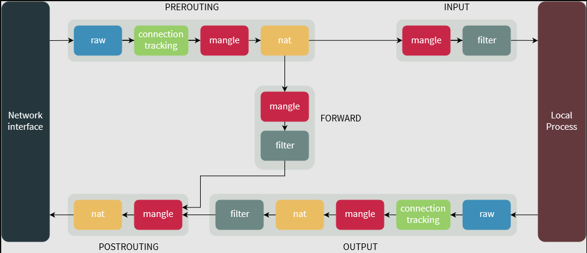

# Linux Foundation Certified System Administrator

_This exam is an online, proctored and performance-based exam._

## Exam details

* Duration: 2 hours
* You'll get access to two exam simulators before the exam to practice via Killer Shell! Check your Killer Shell dashboard!

## Resources

* Killer Coda scenarios: <https://killercoda.com/pawelpiwosz/course/linuxFundamentals>
* Make sure you use the LFCS simulator exams in Killer Shell to practice!
* If you want a course, check out this: <https://www.udemy.com/course/linux-foundation-certified-systems-administrator-lfcs> or through KodeKloud!

## Creating a local Ubuntu server for practice

_Note that this can be done on any Linux distribution supporting `libvirt` and `virt-install`, but there's a million different ways of starting up a small lab environment!_

1. Create a new SSH key pair for cloud-init user 'ubuntu':

```bash
ssh-keygen -t ed25519 -C "ubuntu" -f ~/.ssh/ubuntu
cat ~/.ssh/ubuntu.pub
```

_Don't forget to paste the public key content to `user-data` file provided here in `cloud-init/user-data`!_

1. Download the Ubuntu Cloud image, i downloaded 24.04 LTS from here: <https://cloud-images.ubuntu.com/noble/>

```bash

1. Start the VM with `virt-install`:

```bash
virt-install --name ubuntu01 \
  --memory 2048 \
  --os-variant detect=on,name=ubuntunoble \
  --disk size=10,backing_store="$(pwd)/noble-server-cloudimg-amd64.img",bus=virtio \
  --cloud-init user-data="$(pwd)/user-data",meta-data="$(pwd)/meta-data",network-config="$(pwd)/network-config" \
  --network network=default,model=virtio \
  --graphics none
```

## Topics

<details>
  <summary>Fundamentals!</summary>

This is not a exam topic but rather a place to put important fundamental commands and knowledge that might or might not be directly asked in the exam, but is important to know!

## Hard and Soft links

Inode numbers are used to track data, where pieces of data are stored and also metadata. the file points at the inode number and the inode number points at the data. The Links count in `stat` will be 1 since it's a single file pointing at the inode, the number is a hard link.

`ln path_to_target_file path_to_link_file`

Stored once accessed from multiple locations. When all hard links are deleted the data is deleted, or marked as overwriteable.

You can only hard link to files on the same filesystem.

The permissions to a soft link doesn't matter.

`ln -s path_to_target_file path_to_link_file`, note the `l` in the output of `ls -l` for soft links.

## File and directory permissions

`chgrp` to change group ownership of a file or directory.
`groups` to see which groups a user is in.

Permission identifiers:

```
d = directory
- = regular file
l = symbolic link
s = socket
p = pipe
b = block device
```

SUID, a special permission that allows users to run an executable with the permissions of the executable's owner.
SGID, applies on both executable and directories.
Sticky Bit, restrict file deletion in that director besides the file owner, directory owner and root.

## Finding files and directorires

```bash
-mtime -2
-mtime +2
-mtime 2
-newermt "-2 hours"
```

```bash
sudo find /usr -type f -newermt "-2 hours"
sudo find /usr -size +5M -size -10M
```

</details>

<details>
  <summary>Operations Deployment (25%)</summary>

* Configure kernel parameters, persistent and non-persistent
* Diagnose, identify, manage, and troubleshoot processes and services
* Manage or schedule jobs for executing commands
* Search for, install, validate, and maintain software packages or repositories
* Recover from hardware, operating system, or filesystem failures
* Manage Virtual Machines (libvirt)
* Configure container engines, create and manage containers
* Create and enforce MAC using SELinux

## Configure kenrnel parameters, persistent and non-persistent

```bash
sysctl net.ipv4.ip_forward                          # Check current value
sysctl -n net.ipv4.ip_forward                       # Check current value (numeric only)
sysctl -w net.ipv4.ip_forward=1                     # Set non-persistent kernel parameter
echo "net.ipv4.ip_forward = 1" >> /etc/sysctl.conf  # Set persistent kernel parameter
sysctl -p                                           # Apply changes from sysctl.conf
```

## Diagnose, identify, manage, and troubleshoot processes and services

```bash
ps -aux
pgrep -a cron
nice -n 10 <command>
systemctl status <service_name>
systemctl start <service_name>
systemctl stop <service_name>
systemctl restart <service_name>
systemctl list-units --type=service --state=running
systemctl list-unit-files --type=service --state=disabled
systemctl cat ssh.service

systemctl edit --full ssh.service
systemctl revert ssh.service

systemctl reload ssh.service
systemctl reload-or-restart ssh.service

systemctl mask atd.service # prevent a service from starting if another service depends on it
```

### Processes

```
ps -a #uses the UNIX 
ps a #BSD
```

Process within `[]` are kernel processes, internally.

`ps -U username` to see processes for a specific user.
`ps 1` to see processes for a specific PID.

Niceness ranges from -20 (highest priority) to 19 (lowest priority).

`nice -n ll bash`
`ps lax` long listing with extra details.

`ps fax` to see process tree.
`ps faux` to see process tree with user information.

0-19 can only be set by users, root can set -20 to 19.

Change niceness of running process with `renice`:

```
bash
ps fax
# get PID
renice 7 <PID>
```

Note the log! You cannot renice a process to a higher priority than it already has unless you are root.

Signals:

```bash
kill -L # list signals
kill -SIGHUP <PID> # send SIGHUP to process
```

To kill a process we can:

```bash
kill -SIGKILL
kill -KILL
kill -9 <PID>
```

Backgound and foreground processes:

```bash
sleep 180 # wait for 3 minutes
```

Ctrl+Z # suspend process

```bash
bg %1 # resume in background
fg %1 # resume in foreground
```

```
sleep 300 & # start in background
```

Use `lsof` to see open files and which processes are using them!

Logs:

```bash
journalctl /usr/bin/sudo # view logs for specific binary
journalctl -u ssh.service # view logs for specific service
journalctl -f # follow logs in real-time
journalctl -S "2024-06-01 12:00:00" -U "2024-06-01 14:00:00" # logs between specific time range
journalctl -p err -g "failed" # logs with specific priority and matching a pattern
journalctl -b 0 # logs from current boot
journalctl -b -1 # logs from previous boot
```

## Manage or schedule jobs for executing commands

```bash
crontab -l
crontab -e
systemctl list-timers --all
```

Cron:

* Minute
* Hour
* Day of month
* Month
* Day of week

Anacron:

* Period in days
* Delay in minutes

at:

* for tasks that only run once

Check syntax of `cron` file with `cat /etc/crontab`.

For `anacron` check `/etc/anacrontab`. Four fields:

* Period in days
* Delay in minutes
* Job identifier
* Command to run

`anacron -T` to test without running jobs.

For `at` use `atq` to list jobs, `atrm <job_number>` to remove a job.

## Search for, install, validate, and maintain software packages or repositories

```bash
apt update
apt upgrade
apt install <package_name>
dpkg -l | grep <package_name>
dpkg -i <package_file>.deb
```

## Recover from hardware, operating system, or filesystem failures

```bash
journalctl -p err # severity level er
journalctl -b     # logs from current boot
```

```bash
df -h               # check disk space
free -h             # check memory usage
uptime              # check system load
lscpu               # check CPU information
lspci               # check PCI devices
```

Before checking a file system for errors, we need to unmount it!

```bash
sudo xfs_repair -v /dev/sdb1
```

```bash
sudo fsck.ext4 -v -f -p /dev/vdb2 # use -p
```

`systemctl list-dependencies` to see dependencies of a service.

## Create and enforce MAC using SELinux

selinux is a kernel module, enabled by default. Needs a bit of configuration to work properly on Ubuntu:

```bash
sudo selinux-activate # then reboot
```

```bash
ls -lZ
ps axZ
sestatus
getenforce
setenforce 0  # permissive
setenforce 1  # enforcing
id -Z
semanage -u # list SELinux users
```

```bash
sudo audit2why --all | grep ssh
sudo audit2allow --all -M mymodule
# then install the module in selinux with semodule -i mymodule.pp
```

To make `setenforce` persistent, edit `/etc/selinux/config` and set `SELINUX=enforcing` or `permissive`. Then you need to reboot.

To change context:

```bash
sudo chcon -u unconfined_u /var/log/auth.log # change user context
sudo chcon -r unconfined_u /var/log/auth.log # change role context
sudo chcon -t unconfined_u /var/log/auth.log # change type context
```

Check:

```bash
seinfo -u
seinfo -r
seinfo -t
```

Copy contexts from another similar file:

```bash
sudo chcon --reference=/var/log/dmesg /var/log/auth.log
```

How about new files and directories? Restore context with data from the database where the info is stored about certain files and dirs:

```bash
sudo restorecon -R /var/www # only restores the label
```

To `restorecon` all labels pass the `-F` flag!

Future proofing to survive reinstalls/reboots:

```bash
sudo semanage fcontext --add --type var_log_t "/var/www/10`
sudo semanage fcontext --list # show regexp
sudo semanage fcontext --add --type nfs_t "/nfs/share(/.*)?"
sudo restorecon -R /nfs/
```

Instead of only configuring type definitions we can use booleans:

```bash
sudo setsebool virt_use_nfs 1 # allow virt to use nfs
sudo semanage port --list | grep ssh
ssh_port_t                     tcp      22
sudo semanage port --add --type ssh_port_t --proto tcp 2222 # add port 2222 for ssh
ssh_port_t                     tcp      2222, 22
```

## Manage Virtual Machines (libvirt)

`virsh` - manage VMS from the CLI.

```bash
virsh list --all
virsh reset TestMachine
virsh shutdown TestMachine
virsh destroy TestMachine # unplug the power
virsh undefine TestMachine # remove the VM definition
```

Use `virsh help <command>` to get help on a specific command.

```bash
virsh autostart TestMachine # enable autostart
virsh autostart --disable TestMachine # disable autostart
virsh dominfo TestMachine # get info about the VM
```

Domain == VM.

Update the TestMachine to have 2 CPUs, power off and restart to make sure it sticks:

```bash
virsh setvcpus TestMachine 2 --config # update config
virsh setvcpus TestMachine 2 --config --maximum # update live VM
```

Change memory:

```bash
virsh setmaxmem TestMachine 4G --config # set max memory
virsh setmem TestMachine 2G --config # set current memory
# shutdown + destroy + start to apply changes
```

Use `qemu-img` to resize and get info about disk images:

```bash
qemu-img info /var/lib/libvirt/images/TestMachine.qcow2 # get info about the disk image
qemu-img resize /var/lib/libvirt/images/TestMachine.qcow2 10G # resize the disk image
```

Use `virt-intall` to create new VMs:

```bash
virt-install --name TestMachine --ram 2048 --vcpus 2 --disk
```

Use `--import` to import existing image with OS installed, we're not installing a new OS!

Full example:

```bash
virt-install \
  --osinfo ubuntu24.04 \
  --name ubuntu1 \
  --memory 2048 \
  --vcpus 1 \
  --import \
  --disk /var/lib/libvirt/images/ubuntu24.04.img \
  --graphics none
```

use `detect=on` to detect the OS variant automatically.

Set the root password:

```bash
virt-customize -a /var/lib/libvirt/images/ubuntu24.04.img --root-password password:mysecretpassword
```

To install a OS on a Virtual Machine:

```bash
virt-install \
  --osinfo detect=on \
  --name omarchy01 \
  --memory 2048 \
  --vcpus 2 \
  --disk size=25 \
  --location  \
  --graphics none \
  --network network=default,model=virtio \
  --extra-args "console=ttyS0"
```

</details>

<details>
  <summary>Networking (25%)</summary>

* Configure IPv4 and IPv6 networking and hostname resolution
* Set and synchronize system time using time servers
* Monitor and troubleshoot networking
* Configure the OpenSSH server and client
* Configure packet filtering, port redirection, and NAT
* Configure static routing
* Configure bridge and bonding devices
* Implement reverse proxies and load balancers

## Configure IPv4 and IPv6 networking and hostname resolution

```bash
sudo netplan get # get current netplan config
ls /etc/netplan/ # list netplan config files
sudo cat /etc/netplan.d/99-cloud-init.yaml # view specific netplan config file
sudo netplan apply # apply changes
```

```yaml
network:
  version: 2
  ethernets:
    enp0s8:
      dhcp4: false
      dhcp6: false
      addresses:
        - 10.0.0.9/24
      nameservers:
        addresses:
          - 8.8.4.4
          - 8.8.8.8
      routes:
        - to: 192.168.0.0/24
          via: 10.0.0.100
```

```bash
sudo netplan try --timeout 30 # test netplan config with rollback
```

## Set and synchronize system time using time servers

```bash
resolvectl status
sudo vim /etc/systemd/resolved.conf # set DNS servers globally
sudo systemctl restart systemd-resolved.service
```

## Configure bridge and bonding devices

Bridge between networks.
Bond tie multiple network interfaces into a single logical interface for redundancy or increased throughput.

Bonding modes:

* mode=0 (balance-rr) - round-robin
* mode=1 (active-backup) - active-backup
* mode=2 (balance-xor) - XOR
* mode=3 (broadcast) - broadcast
* mode=4 (802.3ad) - LACP
* mode=5 (balance-tlb) - adaptive transmit load balancing
* mode=6 (balance-alb) - adaptive load balancing

Check examples here:

```
ls -l /usr/share/doc/netplan/examples/*
```

## Configure packet filtering, port redirection, and NAT

```bash
sudo ufw status
sudo ufw allow 22/tcp
sudo ufw status verbose
sudo ufw status numbered
sudo ufw delete 1
```

### Port Redirection



PREROUTING table is used to alter packets as they arrive.

To make iptables rules persistent across reboots install `iptables-persistent` package:

```bash
sudo apt install iptables-persistent
sudo netfilter-persistent save
sudo iptables --list-rules --table nat # view nat table rules
sudo iptables --flush --table nat # start over
man ufw-framework # search for PREROUTING to find the example, add the source!
```

### Various iptables examples

Port redirection:

```bash
sudo iptables -t nat -A PREROUTING -p tcp --dport 8080 -j REDIRECT --to-port 80
sudo iptables -t nat -A PREROUTING -s 192.168.0.0/24 -p tcp --dport 9080 -j REDIRECT --to-port 8080
```

Default blocking policy:

```bash
iptables -P INPUT DROP
```

Common allow rules:

```bash
iptables -A INPUT -p tcp --dport 22 -j ACCEPT
iptables -A INPUT -p tcp --dport 80 -j ACCEPT
iptables -A INPUT -i lo -j ACCEPT
```

Common block rules:

```bash
iptables -A INPUT -s 192.168.1.50 -j DROP
iptables -A INPUT -s 10.0.0.0/24 -j REJECT
```

## Configure the OpenSSH server and client

Check configuration:

```bash
sshd -T | grep -i X11Forwarding
```

`Match User` and `Match Group` are possible to use when filtering and matching on users and groups in the SSH config!

Files in `sshd_config.d` are loaded in lexical (alphabetical) order, then call a file `99_` to make sure it's loaded first.

## Implement reverse proxies and load balancers

`nginx` example:

```bash
server {
    listen 80;
    server_name example.com;

    location / {
        proxy_pass http://backend_servers;
        proxy_set_header Host $host;
        proxy_set_header X-Real-IP $remote_addr;
        proxy_set_header X-Forwarded-For $proxy_add_x_forwarded_for;
        proxy_set_header X-Forwarded-Proto $scheme;
    }
}

```bash
nginx -t # test config
```

Enable sites:

```bash
sudo ln -s /etc/nginx/sites-available/reverse_proxy.conf /etc/nginx
```

</details>

<details>
  <summary>Storage (20%)</summary>

* Configure and manage LVM storage
* Manage and configure the virtual file system
* Create, manage, and troubleshoot filesystems
* Use remote filesystems and network block devices
* Configure and manage swap space
* Configure filesystem automounters
* Monitor storage performance

## Manage and configure the virtual file system

Use `lsblk` to see block devices:

```bash
NAME    MAJ:MIN RM  SIZE RO TYPE MOUNTPOINTS
sr0      11:0    1 1024M  0 rom
vda     253:0    0   10G  0 disk
├─vda1  253:1    0    9G  0 part /
├─vda14 253:14   0    4M  0 part
├─vda15 253:15   0  106M  0 part /boot/efi
└─vda16 259:0    0  913M  0 part /boot
```

List partitions with `fdisk`:

```bash
sudo fdisk --list /dev/sda
```

Use `cfdisk` to create partitions on a disk interactively!

If you have a running VM you can add a new disk to with the following steps:

```bash
sudo virsh attach-device your_vm_name /path/to/newdisk.xml --persistent
# newdisk.xml example
<disk type='file' device='disk'>
  <driver name='qemu' type='qcow2'/>
  <source file='/var/lib/libvirt/images/newdisk.qcow2'/>
  <target dev='vdb' bus='virtio'/>
</disk>
sudo virsh attach-device ubuntu01 newdisk.xml --persistent
```

And then check with `lsblk` again to see the new disk, after that run `sudo cfdisk /dev/vdb` to create a new partition on the disk.

## Configure and manage LVM storage

```
PV = Physical Volume - physical storage device, hard drive. /dev/sdb. pvcreate!
VG = Volume Group - storage pool, combines multiple PVs. vgcreate <my pool> /dev/sdb /dev/sdc
LV = Logical Volume - the usuable partition, a slice taken from the VG, format this with a filesystem like ext4. lvcreate -L 10G -n <my pool> <my pool>.
```

Use `lvmdiskscan` to see available LVM physical volumes:

```bash
  /dev/vda16 [     913.00 MiB]
  /dev/vda1  [      <9.00 GiB]
  /dev/vda14 [       4.00 MiB]
  /dev/vda15 [     106.00 MiB]
  /dev/vdc   [       5.00 GiB]
  /dev/vdd   [       5.00 GiB]
  /dev/vde   [       5.00 GiB]
  3 disks
  4 partitions
  0 LVM physical volume whole disks
  0 LVM physical volumes
```

Create PVs:

```bash
sudo pvcreate /dev/vdc /dev/vdd
sudo pvs
PV         VG Fmt  Attr PSize PFree
/dev/vdc      lvm2 ---  5.00g 5.00g
/dev/vdd      lvm2 ---  5.00g 5.00g
```

Add PVs to VG:

```bash
sudo vgcreate data_vg /dev/vdc /dev/vdd
Volume group "data_vg" successfully created
```

Extebd VG with new PV:

```bash
sudo pvcreate /dev/vde
sudo vgextend data_vg /dev/vde
Volume group "data_vg" successfully extended
```

Check VGs:

```bash
sudo vgs
VG      #PV #LV #SN Attr   VSize   VFree
data_vg   3   0   0 wz--n- <14.99g <14.99g
```

Reduce the VG:

```bash
sudo vgreduce data_vg /dev/vde
  Removed "/dev/vde" from volume group "data_vg"
ubuntu@ubuntu01:~$ sudo vgs
  VG      #PV #LV #SN Attr   VSize VFree
  data_vg   2   0   0 wz--n- 9.99g 9.99g
```

Remove PV:

```bash
sudo pvremove /dev/vde
```

Create LV:

```bash
ubuntu@ubuntu01:~$ sudo lvcreate --size 6G --name partition2 data_vg
  Logical volume "partition2" created.
ubuntu@ubuntu01:~$ sudo lvs
  LV         VG      Attr       LSize Pool Origin Data%  Meta%  Move Log Cpy%Sync Convert
  partition2 data_vg -wi-a----- 6.00g
ubuntu@ubuntu01:~$ sudo lvresize --extents 100%VG data_vg/partition2
  Size of logical volume data_vg/partition2 changed from 6.00 GiB (1536 extents) to 9.99 GiB (2558 extents).
  Logical volume data_vg/partition2 successfully resized.
ubuntu@ubuntu01:~$ sudo lvs
  LV         VG      Attr       LSize Pool Origin Data%  Meta%  Move Log Cpy%Sync Convert
  partition2 data_vg -wi-a----- 9.99g
```

Resize if filesystem is ext4:

```bash
sudo lvresize --resizefs --size 3G /dev/data_vg/partition2
sudo resize2fs /dev/data_vg/partition2
```

Flow:

1. `pvcreate /dev/sdb`
2. `vgcreate vg_data /dev/sdb /dev/sdc`
3. `lvcreate -L 10G -n lv_projects vg_data`
4. `mkfs -t ext4 /dev/vg_data/lv_projects`
5. Mount!

Use `pvdisplay`, `vgdisplay` and `lvdisplay`.

Use PE extents instead of megabytes:

```bash
lvcreate -l 100%FREE -n lv_data vg_data
```

```bash
sudo pvcreate /dev/vdc                     # create physical volume
sudo vgcreate data_vg /dev/vdc             # create volume group
sudo lvcreate -L 5G -n data_lv data_vg     # create logical volume
sudo lvextend -L +2G /dev/data_vg/data_lv  # extend logical volume with 2GB + the already allocated size
sudo lvreduce -L -1G /dev/data_vg/data_lv  # reduce logical volume
sudo vgextend data_vg /dev/vdd             # extend volume group
sudo vgreduce data_vg /dev/vdd             # reduce volume group
```

## Configure and manage swap space

_Assumes you have a VM with an extra disk `/dev/vdb` attached, see above sections!_

```bash
sudo mkswap /dev/vdb3  # create swap on partition
sudo swapon /dev/vdb3  # enable swap
sudo swapoff /dev/vdb3 # disable swap
sudo swapon --show     # show active swap
```

A file can be used as SWAP!

## Create, manage, and troubleshoot filesystems

```bash
sudo mkfs -t ext4 /dev/vdb # format disk
sudo mkdir /mnt/data     # create mount point
sudo mount /dev/vdb /mnt/data # mount disk
sudo rm -rf /mnt/backup001/.trash/* # remove files
```

## Configure filesystem automounters

```bash
sudo mount /dev/vdb1 /mnt/
sudo umount /mnt/
```

Use `/etc/fstab` to make mounts persistent across reboots! Example:

```bash
/dev/vdb1 /backup ext4 defaults 0 2
```

And then reboot!

Use `findmnt` to see mounted filesystems:

```bash
sudo findmnt -t ext4
TARGET    SOURCE     FSTYPE OPTIONS
/         /dev/vda1  ext4   rw,relatime,seclabel,discard,errors=remount-ro,commit=30
├─/backup /dev/vdb1  ext4   rw,relatime,seclabel
└─/boot   /dev/vda16 ext4   rw,relatime,seclabel
```

Mount a read only filesystem:

```bash
sudo mount -o ro /dev/vdb2 /mnt/
```

Mount with read-only, no executions allowed and no suid bits:

```bash
sudo mount -o ro,nosuid,noexec /dev/vdb2 /mnt/
```

Use `remount` to change mount options on the fly:

```bash
sudo mount -o remount,rw /mnt/
```

## Use remote filesystems and network block devices

After changing `/etc/exports` on the NFS server run:

```bash
sudo exportfs -r # re-export
```

Install NBD server:

```bash
sudo apt install nbd-server
```

then open up the `/etc/nbd-server/config` file and add:

```plaintext
[generic]
  allowlist = true

[partition2]
  exportname = /dev/vdb2
```

## Monitor storage performance

Install `sysstat` package to get `iostat` command:

```bash
sudo apt install sysstat
```

`iostat` is used to monitor system input/output device loading by observing the time the devices are active in relation to their average transfer rates.

`pidstat` is used to monitor individual tasks currently being managed by the Linux kernel.

</details>

<details>
  <summary>Essential Commands (20%)</summary>

* Basic Git Operations
* Create, configure, and troubleshoot services
* Monitor and troubleshoot system performance and services
* Determine application and service specific constraints
* Troubleshoot diskspace issues
* Work with SSL certificates

</details>

<details>
  <summary>Users and Groups (10%)</summary>

* Create and manage local user and group accounts
* Manage personal and system-wide environment profiles
* Configure user resource limits
* Configure and manage ACLs
* Configure the system to use LDAP user and group accounts

## Create and manage local user and group accounts

```bash
sudo adduser john # interactive
sudo passwd john # set password
sudo deluser john --remove-home john # delete user and home dir
sudo adduser --shell /bin/bash --home /home/john john
cat /etc/passwd | grep john # check user info
id # check user id and group id
whoami # check current user
sudo adduser --system --no-create-home sysacc # create system account
```

To change `john`'s details later on:

```bash
sudo usermod --home /home/newhome --move-home john
sudo usermod --login jane john # change username
sudo usermod --shell /bin/zsh john # change shell
sudo usermod --lock jane # lock account
```

Change age of password:

```bash
sudo chage -l john # list password info
sudo chage --lastday 0 john # force password change on next login
sudo chage --lastday -1 john # remove forced password change
sudo chage --maxdays 30 john # set max days before password change
```

### Groups

```bash
sudo groupadd developers
sudo gpasswd --add john developers
sudo gpasswd --delete john developers
sudo usermod -g developers john # change primary group
sudo groupmod --new-name programmers developers
```

## Manage personal and system-wide environment profiles

```bash
printenv # print environment variables
env # print environment variables
```

Change `/etc/environment` for system-wide environment variables.

Top run a command on login add a script to `/etc/profile.d/`!

### Manage templates

Use /etc/skel/ to copy default files to new users home directories!

## Configure user resource limits

Change the `/etc/security/limits.conf` file!

`domain` can be:

* username
* @groupname
* * (all users)

`type` can be:

* `soft` (soft limit)
* `hard` (hard limit) not overwriteable!
* `-` (both)

`item` can be:

* `core` (core file size in blocks)
* `data` (data seg size in KB)
* `fsize` (file size in blocks)
* `memlock` (max locked memory in KB)
* `nofile` (number of open files)
* `nproc` (number of processes)
* `rss` (resident set size in KB)

`value` is the limit value.

`ulimit -a` to see current limits.

## Configure and manage ACLs

```bash
groups
```

```bash
sudo gpasswd -a john sudo
```

Change `sudoers` file with `visudo`!

```
%sudo   ALL=(ALL:ALL) ALL
```

Means all hosts, all users, all commands.

</details>
