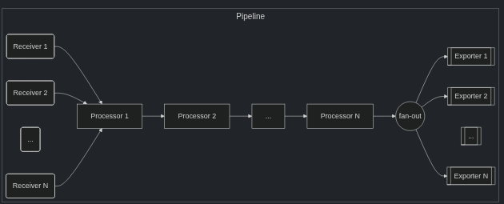
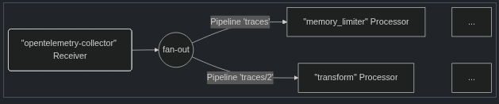
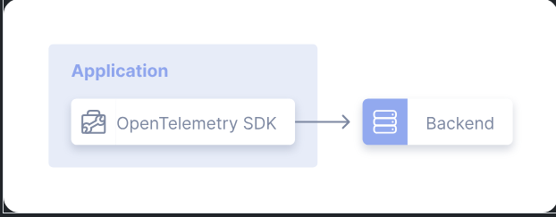
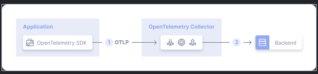
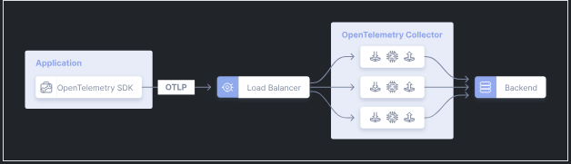

# OpenTelemetry Certified Associate

_This exam is an online, proctored, multiple-choice exam._

## Resources

## Topics

<details>
  <summary>Fundamentals of Observability (18%)</summary>

* Telemetry Data
* Semantic Conventions
* Instrumentation
* Analysis and Outcomes

## Telemetry Data

The purpose of OpenTelemtry is to:

* collect
* process
* export

signals. Signals are _categories of telemetry_. Metrics, logs, traces and baggage are examples of signals.

Each signal represents a _coherent_, _stand-alone_ set of functionality. Each signal follows a separate lifecycle.

Signals are system outputs that describe the underlying activity of the operating system and applications running on a platform, a measurement at a specific point in time:

* temperature
* memory usage
* an event that you want to trace

OpenTelemetry supports:

* Traces
* Metrics
* Logs
* Baggage

### Traces

The path of a request through your application.

Gives you the big picture of what happens when a request is made to an application. A _root_ span is identified by the lack of a `parent_id`, `null`. All spans in a trace will have the same `trace_id`. All spans shares the same `trace_id` which makes it into a trace!

* _Tracer Provider_, sometimes called `TracerProvider` is a factor for Tracers. In most apps a Tracer Provider is initialized once and its lifecycle matches the applications lifecycle. The initialization also includes Resource and Exporter initialization.
* _Tracer_, creates spans containing information about what is happening for a given operation, such as a request in a service.
* _Trace_ Exporter, send traces to a consumer. Example: OpenTelemetry Collector.
* _Context Propagation_, is the core concept that enables Distributed Tracing. With _context propagation_ spans can be correlated with each other and assembled into a trace.
* _Span_, unit of work or operation. Building block of traces. In OTEL they include the following information:
  * _Name_
  * _Parent Span ID_
  * _Start and End Timestamps_
  * _Span Context_, an immutable object on every span that contains:
    * _Trace ID_
    * _Span ID_
    * _Trace Flags,_ binary encoding containing information about the trace
    * _Trace State_
  * _Attributes_, key-value pairs that contain metadata that you can use to annotate a Span to carry information about the operation it is tracking. You can add attributes to spans _during_ or _after_ span creation. Rules:
    * Keys must be non-null string values
    * Values mush be a non-null string, boolean, floating point value, integer or an array of these values
  * _Span Events_, a structured log message, or annotation on a Span.
  * _Span Links_, associate on span with one or more spans, casual relationship.
  * _Span Status_
    * _Unset_ - default, completed without an error.
    * _Ok_ - explicitly mareked as error-free by the dev or application.
    * _Error_ - Some error occurred in the operation it tracks.
  * _Span Kind_, is ahint to the tracing backend as to how the trace should be assembled. Can be:
    * _Internal_ - Span is used for internal operations.
    * _Server_ - Span is used to track a request to a server.
    * _Client_ - Span is used to track a request to a client.
    * _Producer_ - Span is used to track an event produced by the application.
    * _Consumer_ - Span is used to track an event consumed by the application.

When to use Span Events vs Span Attributes:

Consider wheter a specific timestamp is meaningful, if its meaningful add it as data to a span event if it isnt meaningful, attach the data as span attributes.

### Metrics

A measurement captured at runtime.

The moment of capture is known as a _metric event_.

MEter Provider is factory for Meter instaces. A meter creates metric instruments, capturing measurements about a service at runtime.

Metric Exporter send metric data to a consumer.

Metric instruments are defined by:

* Name
* Kind
* Unit (optional)
* Description (optional)

These are chosen by the dev.

The instrument kind can be one of the following:

* _Counter_ - Value that accumulates over time.
* _Asynchronous Counter_ - Value that accumulates over time, but is updated asynchronously.
* _UpDownCounter_ - Value that can increase or decrease over time.
* _Asynchronous UpDownCounter_ - Value that can increase or decrease over time, but is updated asynchronously.
* _Histogram_ - A representation of the distribution of values.
* _Gauge_ - Measures a current value at the time it is read.
* _Asynchronous Gauge_ - Measures a current value at the time it is read, but is updated asynchronously.

Aggregation is the technique whereby a large number of measurements are combined into either exact or estimated statistics about metric events that took place during a time window.

OTLP API provides a default aggregation for each instrument _which can be overridden by views_.

A view provides SDK users with the flexibility to customize the metrics output by the SDK. You can customize which metric instruments are to be processed or ignored.

### Logs

A recording of an event.

A log is a timestamped text record, struvtured or unstructured with optional metadata.

OTLP SDKs and autoinstrumentation utlizie several components to automatically correlate logs with traces.

A structured log is log whose textual data format follows a consistent, machine-readable structure. E.g. JSON.

For infrastructure components, CLF is commonly used:

```
127.0.0.1 - johndoe [04/Aug/2024:12:34:56 -0400] "POST /api/v1/login HTTP/1.1" 200 1234
```

Unstructured logs are logs that dont follow a consistent structure, more human readable and used in development. Difficult to parse. Might need pre-processing them to be human readaable.

Semistructured logs are logs that does use some self-consistent pattern but may not use the same formatting and delimiters across different systems.

Log record respresents the recording of an event, a log record in OTLP contains two kinds of fields:

* Named top-level fields of specific type and meaning
* Resource and attributes fields of arbitrary valu e and type

| Field Name | Description |
|---|---|
| Timestamp | Time when the event occurred. |
| ObservedTimestamp | Time when the event was observed. |
| TraceId | Request trace ID. |
| SpanId | Request span ID. |
| TraceFlags | W3C trace flag. |
| SeverityText | The severity text (also known as log level). |
| SeverityNumber | Numerical value of the severity. |
| Body | The body of the log record. |
| Resource | Describes the source of the log. |
| InstrumentationScope | Describes the scope that emitted the log. |
| Attributes | Additional information about the event. |

### Baggage

Contextual information that is passed between signals.

Propagate any data you like alongside context. Resides next to context. Key-value store.

Baggate means you can pass data across services and processes making it available to all signals.

By using Contextual Propagation to pass baggage across these services the clientId is available to any additional spans, metrics or logs.

Use Baggage to include information typically available only at the start of a request further downstream.

Keep in mind that downstream services could propagate Baggage outside your network.

Baggage is not the same as attributes, a common use case for Baggage is to add data to Span Attributes across a whole trace.

## Semantic Conventions

OpenTelemetry deinfes semantic conventions or _sematic attributes_ that specify common names for different kind of operations and data.

[The Semantic Conventions](https://opentelemetry.io/docs/specs/semconv/) define a common set of (semantic) attributes which provide meaning to data when collecting, producing and consuming it.

Metrics Conventions:

* Metric Naming
  * Use snake case
* Labeling
  * Attach contextual metadata to metrics
  * Avoid high cardinality labels, this can hurt performance

Traces Conventions:

* Span Naming
  * Use clear, descriptive names
  * Use snake case
* Attributes
  * Similar to labels in metrics, span attributes provide context such as HTTP status codes, method names or error messages
* Context Propagation
  * Ensure that semantic conventions are followed to maintain consistent trace context across services

Logs Conventions:

* Structured logging
  * Utilize key-value pairs in log messages to enable better parsing and searching
  * Instead of plain text, format logs with keys like `timestamp`, `severity`, and `message`
* Consistent Field Names
  * Adopt a standard naming schema for common log fields to facilitate correlation with metrics and traces
* Log Levels
  * Standardize log severity levels to maintain uniformity across different application and services

## Instrumentation

For a system to be observable it muse be **instrumented**. Code from the systems components must emit signals such as traces, metrics and logs.

Theres two ways to instrument your code:

* Code based solutions via official APIs and SDKs
  * Deeper insight and rich telemetry from your application itself.
* Zero-code solutions
  * Great to get started, or when you cant modify the application you need to get telemetry out of.

Other OTEL benefits:

* Libraries can leverage the OpenTelemetry API as a dependency, which will have no impact on applications using that library

Zero-code instrumentation adds the OTEL API and SDK capabilities to your application typically as an agent or agent-like installation. The mechanism is typically one of:

* bytecode manipulation
* monkey patching
* eBPF

## Analysis and Outcomes

The goal of observability is to provide insights into the behavior and performance of systems, enabling teams to:

* Identify and troubleshoot issues quickly
* Optimize system performance and resource utilization
* Enhance user experience through better reliability and responsiveness
* Make informed decisions based on data-driven insights

Data aggregation, `sum()`, `avg_over_time()` and `max_over_time()` are examples of analysis functions that can be used to analyze telemetry data.

Visualization tools like Grafana, Kibana, and Jaeger can be used to create dashboards and visual representations of telemetry data.

Outcome based analysis involves using telemetry data to measure the impact of changes, such as:

* Performance improvements
* SLO, SLI and SLAs

Analysis transforms raw telemetry data into insights that drive decision-making, helping to ensure systems meet performance and reliability targets.

</details>

<details>
  <summary>The OpenTelemetry API and SDK (46%)</summary>

* Data Model
* Composability and Extension
* Configuration
* Signals (Tracing, Metric, Log)
* SDK Pipelines
* Context Propagation
* Agents

The OpenTelemtry data model defines standardized representations for telemetry data, ensuring consistency across different languages and systems.

_OpenTelemetry is a unified framework for capturing observability signals across your cloud-native environment._

* The API - set of language specific interfaces that you use to instrument your application code. Establishes a standard way for telemetry data without imposing implementation details.
* The SDK - the concrete implementation of the OTEL API that processes and exports telemetry data. Provides advanced configuration, processing pipelines and extension points.

## Data Model

Concepts:

* Resources - metadata that identifies the source of telemetry data.

```go
package main

import (
    "go.opentelemetry.io/otel/sdk/resource"
    semconv "go.opentelemetry.io/otel/semconv/v1.21.0"
)

func main() {
    res, err := resource.New(
        context.Background(),
        resource.WithAttributes(
            semconv.ServiceNameKey.String("payment-service"),
            semconv.ServiceVersionKey.String("1.2.3"),
            semconv.DeploymentEnvironmentKey.String("production"),
        ),
    )
    if err != nil {
        panic(err)
    }

    // Use `res` when creating TracerProvider or MeterProvider
    _ = res
}
```

* Spans
  * Individual operations withing a trace
  * Contains start/end times, attributes, events and links

```go
package main

import (
    "context"
    "fmt"

    "go.opentelemetry.io/otel"
    "go.opentelemetry.io/otel/codes"
    "go.opentelemetry.io/otel/trace"
)

func processPayment(ctx context.Context, tracer trace.Tracer, paymentID string, amount float64) {
    // Start a span
    ctx, span := tracer.Start(ctx, "processPayment",
        trace.WithAttributes(
            attribute.String("payment.id", paymentID),
            attribute.Float64("payment.amount", amount),
        ),
    )
    defer span.End() // Ensure span ends

    // Simulate processing
    if err := func() error {
        // Example validation
        if amount <= 0 {
            return fmt.Errorf("invalid payment amount")
        }

        span.AddEvent("payment.validated")

        // More processing here...

        return nil
    }(); err != nil {
        span.RecordError(err)
        span.SetStatus(codes.Error, "Payment processing failed")
    }
}
```

* Metrics
  * Numerical measurements over time
  * Types include counters, gauges, histograms and summaries

```go
package main

import (
    "context"
    "time"

    "go.opentelemetry.io/otel"
    "go.opentelemetry.io/otel/attribute"
    "go.opentelemetry.io/otel/metric"
)

func main() {
    ctx := context.Background()

    // Get a meter
    meter := otel.Meter("example.com/payment-service")

    // Create a counter metric
    paymentCounter := metric.Must(meter).NewInt64Counter(
        "payment.processed",
        metric.WithDescription("Counts processed payments"),
    )

    // Increment counter
    paymentCounter.Add(ctx, 1, attribute.String("status", "success"))

    // Create a histogram metric
    latencyRecorder := metric.Must(meter).NewFloat64Histogram(
        "payment.latency",
        metric.WithDescription("Records payment processing latency"),
    )

    // Record a value
    processingTime := 123.45 // milliseconds
    latencyRecorder.Record(ctx, processingTime, attribute.String("status", "success"))

    // Sleep a bit so the program doesn't exit immediately (if needed in example)
    time.Sleep(time.Second)
}
```

* Logs
  * Structured or unstructured text records
  * Can be correlated with traces via context

```go
package main

import (
    "go.uber.org/zap"
)

func main() {
    logger, _ := zap.NewProduction()
    defer logger.Sync() // flushes buffer, if any

    paymentID := "12345"
    amount := 100.0

    // Structured logging
    logger.Info("Processing payment",
        zap.String("payment_id", paymentID),
        zap.Float64("amount", amount),
    )
}
```

## Composability and Extension

Concepts:

* Providers - Configurable components for trace, metric and log processing. Enable customization of telemetry pipelines.
* Extensions - Custom components that enhance functionality. Custom samplers, processors and exporters.
* Pluggable Exporters - Components that send telemetry data to backends. Support for multiple destinations simultaneously.

## Configuration

OpenTelemetry provides various configuration options to customize the behaviour according to application needs.

Concepts:

* SDK Configuration - Control sampling, batching and export behavior. Can be set programmatically or via environment variables.
* Environment Variables - Standardized variables for configuration. Allows runtime configuration without code changes.
* Configuration Best Practices - Use a consistent naming approach for spans and metrics. Configure appropriate sampling strategies. Set reasonable batch sizes and timeouts.

## SDK Pipelines

* Trace Pipeline - Components include Tracer Provider, Span Processors and Exporters. Controls how spans are created, processed and exported.
* Metric Pipeline - Components include Meter Provider, Reader and Exporter. Aggregates and exports metric data.
* Log Pipeline - Componentes include Logger Provider, Processor and Exporter. Controls log processing and correlation.
* Custom Pipeline Processors - Filter, transform or enrich telemetry data.

Understanding SDK pipelines is crucial because they control how telemetry data flows through the system. Properly configured pipelines ensure efficient data collection, processing, and export while managing resource usage and maintaining data quality. Mastering pipeline configuration allows you to implement custom processing logic, optimize performance, and ensure reliable telemetry delivery.

## Context Propagation

Context propagation enables tracing across service boundaries in dsitributed systems by passing metadata between components.

* Trace context - W3C trace context standard. Includes `trace_id`, `span_id` and `trace_flags`. Example is HTTP headers.
* Propagators - Extract and inject context across boundaries. Support different protocols and formats.
* Baggage - User degined key-value pairs that travel with the context. Provides additional correlation attributes.
* Cross Platform Propagation - Consistent context across different languages. Allows full distributed tracing.

Context propagation is the foundation of distributed tracing, enabling the correlation of operations across multiple services. Without proper context propagation, it's impossible to track requests through microservices architectures.

## Agents

OpenTelemetry agents provide **automatic instrumentation** without modifying application code, simplifying the adoption of observability.

* Automatic Instrumentation - Language specific agents for zero-code instrumentation. Intercepts common libraries and frameworks
* Auto Instrumentation Libraries - Provides telemery with minimal configuration.
* Configuration Management - Control agent behavior via environment variables. Selective instrumentation and filtering.
* Agent Deployment Strategies - Sidecar container model, host-level agent deployment, build-time integration.

On a typical VM/container user applications are running in some Pods with an OpenTelemetry library. Previously the library did all the recording, collecting, sampling and aggregation of traces, metrics and logs. And then either exported the data to other persistent storage backedns through the library exporters or displayed it on local zpages.

Drawbacks:

* Reimplemntation of exporters and zpages in native languages
* Ruby/PHP has a hard time to do the stats aggregation in process

To mitigate these drawbacks you can run the Otel Collector as an agent, as a daemon in the VM/container. Once it's deployed it can retrieve traces, metrics and logs and the export them to multiple backends.

</details>

<details>
  <summary>The OpenTelemetry Collector (26%)</summary>

* Configuration
* Deployment
* Scaling
* Pipelines
* Transforming Data

The OpenTelemetry Collector is an exectuable file that can receive telemetry, process it and export it to multiple targets, such as observability backends.

## Pipelines

Receiveing, processing and exporting are done via **pipelines**.

A pipeline defines a **path** that data follows **in the Collector**: from reception, to processing (or modification) and finally to export. All components of a pipeline must support the particular data type, otherwise the `pipeline.ErrSignalNotSupported` error is returned.



* Pipelines can have on or more receeivers, data from all receivers are **pushed** to the first processor and from that processor to the next one and so on until the last processor pushes the data to all exporters.

A pipeline are **contructed** during Collector startup based on pipeline definition in the configuration. A pipeline typically looks like this:

## Receivers

Typically listens on a network port and receive telemetry data. They can also actively obtain data, like scrapers. **Usually** one receiver is configured to send received data to one pipeline. However it is also possible to configure the same receiver to send the same dreceived data to multiple pipelines.

```yaml
receivers:
  otlp:
    protocols:
      grpc:
        endpoint: localhost:4317

service:
  pipelines:
    traces: # a pipeline of “traces” type
      receivers: [otlp]
      processors: [memory_limiter, batch]
      exporters: [otlp]
    traces/2: # another pipeline of “traces” type
      receivers: [otlp]
      processors: [transform]
      exporters: [otlp]
```

`otlp` will send the same data to pipeline `traces` and pipeline `traces/2`.

`type[/name]`is the configuration composite key name to use.

Visually:



## Exporters

Exporters **typically** send data they get to a destination on a network. But they can send the data elsewhere. The `debug` exporter writes the telemetry data to the logging destination.

You can allow multiple exporters of the same type, in the same pipeline:

```yaml
exporters:
  otlp/1:
    endpoint: example.com:4317
  otlp/2:
    endpoint: localhost:14317
```

## Processors

A pipeline can contain sequentially connected processors. The first one get the data from one or more receivers and the last one sends the data to one or more exporters in the pipeline.

All processers between the first and last receives the data from ONLY one preceding processor and send data to only one succeeding processor.

Processors can modify the data before forward. Such as adding or removing attributes from spans. Or drop data.

Each processor in several pipelines always gets its own instance. Each instance has its own state, and they're never shared between pipelines.

```yaml
processors:
  batch:
    send_batch_size: 10000
    timeout: 10s

service:
  pipelines:
    traces: # a pipeline of “traces” type
      receivers: [zipkin]
      processors: [batch]
      exporters: [otlp]
    traces/2: # another pipeline of “traces” type
      receivers: [otlp]
      processors: [batch]
      exporters: [otlp]
```

_The same name of the processor must not be referenced multiple times in the processors key of a single pipeline._

## Scaling

* Scale on each signal type independently
* Seperate clusters
* Horizontal scaling of collectors

When to scale is the question:

* **Memory consumption**: One hint is the `otelcol_processor_refused_spans` a `memory_limiter` processor of the pipeline has a this metric. This processor allows you to restrict the amount of memory the Collector can use. This metric is available for each telmetery data type.
* Queue sizes for exporters: `otelcol_exporter_queue_capacity` and `otelcol_exporter_queue_size`. Collector will queue data in memery while **waiting** for a worker to become available to send the data. It will reject data if there arent **enough workers or the backend is too slow**. Scale when it reaches 60-70% of capacity.

Dont scale if the problem is on the database side, more collectors wont help.

Scaling is not a problem, add more replicas and distribute traffic among them using a load balancer.

## Deployment

* No Collector
  * Simplest pattern is to not use a Collector at all:
  
  * Pros
    * Simple
    * No moving parts
  * Cons
    * Requires code changes
    * Strong coupling between app and backend
    * Limited number of exportes per lang impl
* Agent
  * Applications are _instrumented_ using an OTEL SDK OR other collectors (using OTLP exporter) that sends telemetry signals to a collector instance running with the application or on the same host.
    
  * Pros
    * Simple
    * Clear 1:1 mapping between app and collector
  * Cons
    * Scalability
    * Inflexible
* Gateway
  * Telemetry signals are sent to a single OTLP endpoint provided by one or more collector instances running i.e. a deployment in Kubernetes. Use an LB to spread the load across the instances:
    
    Use a the tail sampling processor so that all spans for a given trace reach the same collector.
  * Pros
    * Separation of concerns
    * Centralized mgmt of policies (filtering logs etc)
  * Cons
    * One more thing to maintain (OMTM)
    * Added latency
    * Higher overall resource usage

Note that all metric data streams within OTLP must have a **single writer** and a **globally unique identity**. Concurrent access from multiple applications that modify or report on the same data can lead to data loss or degraded data quality.

You might hit: Error on ingesting out-of-order samples in Prometheus as a backend.

Two jobs has the identical targets and the order of timestamps are incorrect.

Best practice is to use:

* Kubernetes attributes processor to add labels to different Kubernetes resources
* Use the resource detector processor to detect resource information from the host and collect resource metadata.

</details>

<details>
  <summary>Maintaining and Debugging Observability Pipelines (10%)</summary>

* Context Propagation
* Debugging Pipelines
* Error Handling
* Schema Management

## Context Propagation

* Use standard propagation formats which ensures interoperability between different services.
* Propagate only necesary metadata which reduces payload size and improves performance
* Implement baggage limits to prevent excessive memory usage and potential leaks

## Debugging Pipelines

1. Verify Data Collection: Check that application instrumentation is working.
2. Inspect Exporters: Ensure data is being sent to the correct destination.
3. Analyze Processing Pipelines: Review filters, aggregations, and transformations.
4. Monitor Logs and Metrics: Enable debug logs and use telemetry data to identify issues.

Dead letter queues!

## Scehma Management

_Schema management ensures that telemetry data remains consistent even as metric, log, and trace formats evolve._

* Use versioning in schema definitions - Prevents breaking changes
* Maintain backward compatibility - Ensures older telemetry data remains useful
* Document schema changes - Helps teams understand metric and label updates

</details>
