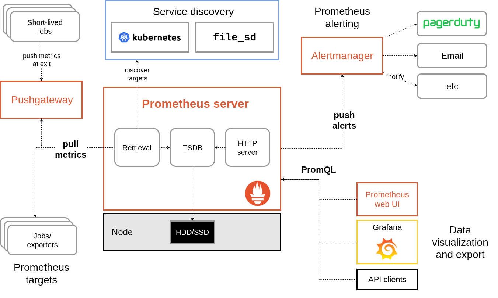
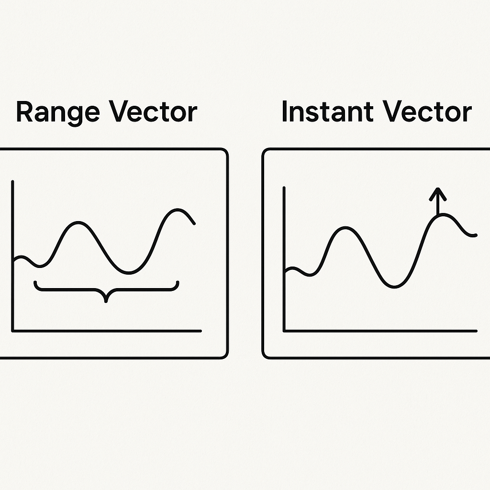
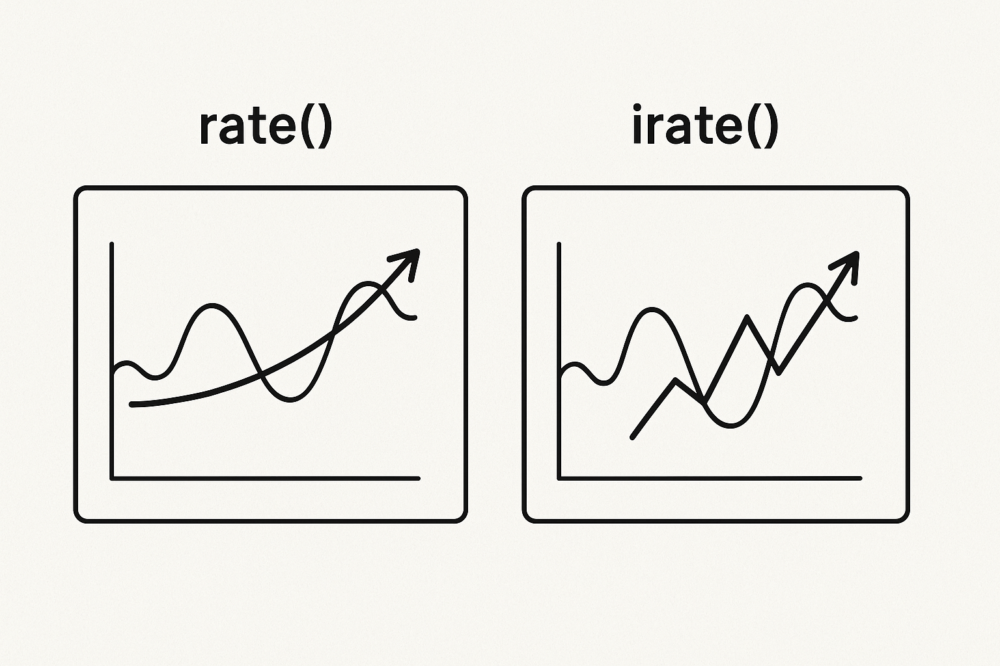

# Prometheus Certified Professional

_This exam is an online, proctored, multiple-choice exam._

## Resources

* <https://training.linuxfoundation.org/certification/prometheus-certified-associate/>
* <https://prometheus.io/docs/introduction/overview/>
* <https://github.com/hugoprudente/pca-preparation-guide>

## Topics

<details>
  <summary>Observability Concepts (18%)</summary>

Prometheus is an open-source systems monitoring and alerting toolkit.

Features:

* Multi-dimensional data model with time series data identified by metric name and key/value pairs
* PromQL, flexible query language to leverage this dimensionality
* No reliance on distributed storage, single nodes are autonomous
* Time series collection happens via a _pull model over HTTP_
* Pushing time series is supported
* Targets are discovered via service discovery or static configuration

## Metrics

Metrics are _numerical measurements_ in layperson terms. The term _time series_ refers to the recording of changes over time.

Metric types:

* **Counter**: A cumulative metric that represents a single monotonically increasing counter. It can only increase or be reset to zero. Do **not** use a counter for values that can decrease. For example, do not use a counter to track the number of currently running processes.
* **Gauge**: A metric that represents a single numerical value that can arbitrarily go up and down. Usually used for values like temperatures, current memory, concurrent requests.
* **Histogram**: Samples observations (usually things like request duration or response sizes) and counts them in configurable buckets. It also provides a sum of all observed values.
  
  A histogram with a base metric of `<basename>` exposes multiple time series during a scrape:
  * Cumulative counters for the observations buckets, exposed as `<basename>_bucket{le=<upper_inclusive_bound>}`
  * The **total sum** of all observed values, exposed as `<basename>_sum`
  * The count of events that have been observed, exposed as `<basename>_count`

  Use the `histogram_quantile()` function to calculate quantiles from histograms or even aggregations of histograms.

  Suitable for calculating an Apdex score. Application Performance Index.

* **Summary**: Similar to a histogram, samples observations like request durations and response sizes.

## Understand logs and events

Using the Prometheus query log, it has the ability to log all the queries run by the engine to a log file, as of `2.16.0`. This guide demonstrates how to use that log file.

To enable it:

1. Adapt the configuration to add or remove query log configurations in the `prometheus.yml` file:

   ```yaml
   global:
     query_log_file: "/var/log/prometheus/query.log"
     # Additional configurations can be added here
   ```

2. Reload the Prometheus server configuration by `POST`ing to the `/-/reload` endpoint. Needs the `--web.enable-lifecycle` flag to be set when starting the Prometheus server. Use `SIGHUP` to the Prometheus process.

The format:

* `params`: The query. The start and end timestamp, the step and the actual query statement.
* `stats`: Statistics. Currently, it contains internal engine timers.
* `ts`: The timestamp.

Add log rotation since Prometheus will not do this.

### Events

Prometheus is not an event-based system. Some monitoring systems are event-based; they report each individual event (HTTP request, an exception) to a central monitoring system immediately **as it happens**. This system aggregates the events into metrics (StatsD is the prime example of this), or stores it for later processing, like the ELK stack.

In such a system, pulling would be problematic indeed: the instrumented service would have to buffer events between pulls, and the pull would have to happen incredibly frequently.

Prometheus is only interested in regularly collecting the **current state** of a given set of metrics, not the underlying events that led to the generation of those metrics.

The resulting monitoring traffic is low, and the pull-based approach does not create problems in this case.

## Tracing and Spans

Prometheus supports OpenTelemetry protocol ingestion through HTTP.

`tracing_config` configures exporting traces from Prometheus to a tracing backend via the OTLP protocol. Tracing is currently an experimental feature and could change in the future.

### Traces

A trace represents the whole journey of a request or an action as it moves through all the nodes of a distributed system.

### Spans

A span is an **operation** of work taking place on a service. E.g. a web server responding to an HTTP request.

## Push vs Pull

Pulling over HTTP offers a number of advantages:

* You can start extra monitoring instances as needed, e.g. on your laptop when developing changes.
* You can more easily and reliably tell if a target is down.
* You can manually go to a target and inspect its health with a web browser.

## Service Discovery

## Basics of SLOs, SLAs, and SLIs

**SLI**, Service Level Indicator, is a quantitative measure of some aspect of the level of service that is provided. Examples include request latency, error rate, and availability.

It answers the question: "What are we measuring?"

Examples:

* Latency
* Availability
* Error Rate
* Throughput
* Durability
* Freshness

**SLO**, Service Level Objective, is a target value or range of values for a service level that is measured by an SLI.

It answers the question: "What's our goal for this measurement?"

Examples:

* Latency SLO: "95% of HTTP requests will complete in less than 300ms over a 28-day rolling window."
* Pod Start Duration SLO (from your example): "95% of pods will start in less than 2.7 seconds over a 5-minute window." (Though for a real SLO, you'd likely use a longer window like 7 or 28 days for stability.)

**SLA**, Service Level Agreement, is a formal agreement between a service provider and a customer that defines the level of service expected from the service provider. It includes specific SLOs and the consequences if those SLOs are not met.

It answers the question: "What happens if we don't meet our agreed-upon goals?"

Examples:

* "Our cloud service guarantees 99.9% uptime for your virtual machines. If availability falls below this threshold in any given month, you will receive a 10% service credit for that month's bill."
* "We aim to respond to all support tickets within 24 hours. If we fail to meet this response time, you will receive a 5% discount on your next invoice."

Imagine you're delivering pizzas:

* SLI (Indicator): The time it takes to deliver a pizza. (You measure each delivery).
* SLO (Objective): "95% of pizzas will be delivered within 30 minutes." (Your internal target for quality).
* SLA (Agreement): "If we don't deliver your pizza within 30 minutes, it's free." (The promise to the customer with a consequence).

</details>

<details>

  <summary>Prometheus Fundamentals (20%)</summary>

## System Architecture



Prometheus **scrapes** metrics from **instrumented jobs**, either directly or via an intermediary push gateway for **short-lived jobs**.

Prometheus works well for recording any purely numeric time series. It fits both machine-centric monitoring as well as monitoring of highly dynamic service-oriented architectures.

Designed for readability.

If you need 100% accuracy, such as per-request billing, Prometheus is not a good choice as the collected data will likely not be detailed and complete enough. In that case, it's better to use some other system to collect and analyze the data for billing, and use Prometheus for the rest of your monitoring.

Components:

* Main Prometheus server
* Client libraries
* Push gateway
* Special purpose exporters
* an Alertmanager to handle alerts
* various support tools

## Configuration and Scraping

### Prometheus Configuration

```yaml
global:
  scrape_interval: 15s
  evaluation_interval: 15s

scrape_configs:
  - job_name: 'node'
    static_configs:
    - targets: ['localhost:9100']
```

### Scrape configuration basics

```yaml
scrape_configs:
  - job_name: 'myapp'
    metrics_path: '/custom_metrics'
    scrape_interval: 10s
    static_configs:
      - targets: ['10.0.0.1:8080', '10.0.0.2:8080']
```

### Example: Scraping Kubernetes Pods

```yaml
scrape_configs:
  - job_name: 'kubernetes-pods'
    kubernetes_sd_configs:
      - role: pod
    relabel_configs:
      - source_labels: [__meta_kubernetes_pod_annotation_prometheus_io_scrape]
        action: keep
        regex: true
      - source_labels: [__meta_kubernetes_pod_annotation_prometheus_io_path]
        target_label: __metrics_path__
        regex: (.+)
      - source_labels: [__address__, __meta_kubernetes_pod_annotation_prometheus_io_port]
        target_label: __address__
        regex: (.+):(?:\d+);(\d+)
        replacement: $1:$2
        action: replace
```

```yaml
[ Pod Annotation ]
  |
  |  __meta_kubernetes_pod_annotation_prometheus_io_scrape = "true"
  |--> KEEP
  |
  |  __meta_kubernetes_pod_annotation_prometheus_io_path = "/metrics"
  |--> SET --> __metrics_path__ = "/metrics"
  |
  |  __address__ = "10.42.0.15:8080"
  |  __meta_kubernetes_pod_annotation_prometheus_io_port = "9100"
  |--> SET --> __address__ = "10.42.0.15:9100"
  |
[ Scrape Target Ready ]
  --> GET http://10.42.0.15:9100/metrics
```

## Understanding Prometheus Limitations

Prometheus is a powerful monitoring and alerting toolkit, but it has several important limitations to be aware of:

* **Not a Long-Term Storage Solution**: Prometheus is designed for short- to medium-term storage. For long-term retention, you need to integrate with remote storage solutions (e.g., Thanos, Cortex, Mimir).

* **Single Node Autonomy**: Each Prometheus server is standalone and does not natively cluster for high availability or horizontal scalability. You must run multiple instances and handle federation or use third-party solutions for HA.

* **Scaling Challenges**: Prometheus can struggle with very large environments (tens of millions of time series) due to memory and storage constraints. Sharding and federation can help, but add complexity.

* **No Built-in User Authentication/Authorization**: Prometheus does not provide built-in authentication or role-based access control (RBAC). You must use a reverse proxy or external solution to secure endpoints.

* **Limited Query Language for Some Use Cases**: PromQL is powerful for time series analysis, but can be limiting for complex joins, subqueries, or non-time-series data.

* **Pull Model Limitations**: The pull model works well for most use cases, but can be problematic for ephemeral or short-lived jobs. The Pushgateway is a workaround, but has its own limitations (e.g., no automatic expiry of metrics).

* **No Native Event or Log Collection**: Prometheus is focused on metrics, not logs or events. You need to use other tools (e.g., Loki, ELK) for logs and events.

* **Alerting Limitations**: Alertmanager is powerful, but lacks some advanced features found in dedicated alerting systems (e.g., multi-tenancy, advanced silencing, or alert deduplication across clusters).

* **No Built-in Data Encryption**: Prometheus does not encrypt data at rest or in transit by default. You must configure TLS and storage encryption yourself.

* **Label Cardinality**: High cardinality (many unique label combinations) can cause performance and storage issues. Careful metric and label design is required.

## Data Model and Labels

### Metric names

* Metric names SHOULD specify the **general feature** of a system that is being measured, e.g., `http_requests_total` - the total number of HTTP requests received.
* Metric names MAY use any UTF-8 characters.
* Metric names SHOULD match the regex: `[a-zA-Z_:][a-zA-Z0-9_:]*` which means they can contain letters, digits, underscores, and colons.

### Labels

Labels let you capture different instances of the same metric. For example: all HTTP requests that used the method `POST` to the `/api/tracks` handler. This is the **"dimensional data model"** of Prometheus.

The query language allows for filtering and aggregation based on these dimensions.

Any **change** of *_any_  label value, including adding or removing labels, will create a new time series.

Naming convention:

* Label names MAY use any UTF-8 characters.
* Label names beginning with `__` (underscores) MUST be reserved for internal Prometheus use.
* Label names SHOULD match the regex `[a-zA-Z_][a-zA-Z0-9_]*` for the best experience and compatibility with other tools. Same as metric names.
* Label values MAY contain any UTF-8 characters.
* Labels with an empty label value are considered equivalent to labels that do not exist.

### Notation

Given a metric name and a set of labels, time series are frequently identified using this notation:

`<metric_name>{<label_name>=<label_value>, <label_name>=<label_value>, ...}`

For example, a time series with the metric name `api_http_requests_total` and the labels `method="POST"` and `handler="/messages"` would be represented as:

`api_http_requests_total{method="POST", handler="/messages"}`

Same notation that **OpenTSDB** uses.

## Exposition Format

_Metrics exposition in the classic Prometheus use case is dominated by strings because all the metric names, label names, and label values take **much more space than the float64 sample values**, even if the latter are represented in a potentially more verbose text form._

OpenMetrics is a specification built upon and carefully extending the Prometheus exposition format. OpenMetrics v2 is ongoing.

Metrics can be exposed to Prometheus using a **simple text-based** exposition format. There are various client libraries that implement this format for you.

Basic info:

* Transmission is done over HTTP.
* Encoding is UTF-8.
* HTTP `Content-Type` is `text/plain; version=0.0.4`. A missing version will lead to **fall-back to the most recent text format version.**
* HTTP `Content-Encoding` (optional): `gzip`
* Advantages:
  * Human-readable
  * Easy to assemble
  * Readable line by line
* Limitations:
  * Verbose
  * Docstrings not integral part of the syntax; no or little metric contract validation
  * Parsing cost
* Supported metric primitives
  * Counter
  * Gauge
  * Histogram
  * Summary
  * Untyped

</details>

<details>

  <summary>PromQL (28%)</summary>

PromQL provides a functional query language called PromQL that lets the user select and aggregate time series data in real time.

It can be an **instant query**, evaluated at one point in time, or a **range query**, evaluated at equally-spaced steps between a start and end time.

In the UI the Table tab is for instant queries and the Graph tab is for range queries.

An expression or sub-expression can evaluate to one of four types:

* **Instant vector**: a set of time series containing a single sample for each series, sharing the same timestamp.
* **Range vector**: a set of time series containing a range of data points over time for each time series.
* **Scalar**: a simple numeric floating point value.
* **String**: a string value, currently unused.



## Selecting Data

**Instant vector selectors** allow the selection of a set of time series and a single sample value for each at a given timestamp (point in time).

`http_requests_total` returns the most recent sample for each. It's possible to filter these time series further by appending a comma-separated list of matchers in curly braces `{}`.

`http_requests_total{job="prometheus",group="canary"}`

You can use the following operators when doing label matching:

* `=` - exact string match.
* `!=` - not equal to the provided string
* `=~` - regex-match the provided string
* `!~` - not regex-matched

Regex matches are fully anchored:

`env=~"foo"` == `env=~"^foo$"`

_Empty label matchers also select all time series that do not have the specific label set at all._

_Multiple matchers can be used for the same label name._

`{__name__=~"job:.*"}` matches all metrics that have a name starting with `job:`.

Range vector selector literals work like instant vector literals except that they select a range of samples back from the current instant.

`http_requests_total{job="prometheus"}[5m]`, in this example, we select all the values recorded less than 5m ago for all time series that have the metric name and job label set.

The `offset` modifier allows changing the time offset for individual instant and range vectors in a query.

## Rates and Derivatives



The `rate()` function calculates the per-second average rate of increase of a counter over a specified time range:

`rate(http_requests_total[5m])` _per second average increase rate, breaks in monotonicity (counter reset) are automatically adjusted for._

When combining `rate()` with an aggregation operator e.g. `sum()` _ALWAYS_ use rate first then sum. Otherwise `rate()` cannot detect counter resets.

The `irate()` function calculates the per-second instant rate of increase of the time series in a range vector. Based on the two last data points.

Use `irate()` with counters only.

`irate` should only be used for volatile, fast moving counters. Use `rate` for slow moving counters.

## Aggregating over time

Smooth noisy data or extract time-based statistics from range vectors using the `avg_over_time()`, `min_over_time()`, `max_over_time()`, `sum_over_time()`, and `count_over_time()` functions.

Visualize rolling averages or trends.

## Aggregating over dimensions

Combine series by removing labels and aggregating across them, example: Sum all HTTP requests, regardless of job or instances:

```
sum(http_requests_total)
```

## Binary operators

Arithmetic: +, -, *, /, %, ^
Comparison: ==, !=, >, <, >=, <=
Logical set ops: and, or, unless

```
rate(requests_total[1m]) / ignoring(instance) rate(cpu_total[1m])
```

You can use `on()` to match only specific labels, use `ignoring()` to exclude specific labels.

## Histograms

Analyzing distributions, such as request durations or response sizes.

Histograms and summaries are more complex metric types. Not only does a single histogram or summary create a multitude of time series, it is also more difficult to use these metric types correctly.

Both of these sample observations, typically request durations or response sizes.

A straightforward use of histograms is to count observations falling into particular buckets of observation values.

Two rules of thumb:

1. If you need to aggregate, choose histograms.
2. Otherwise, choose a histogram if you have an idea of the range and distribution of values that will be observed. Choose a summary if you need an accurate quantile, no matter what the range and distribution of the values is.

### Apdex

You might have an SLO (Service Level Objective) to serve 95% of requests within 300ms. Configure a histogram to have a bucket with an upper limit of 0.3 seconds. Now you can directly express the relative amount of requests served within 300ms and easily alert if the value drops below 95%:

```
sum(rate(http_request_duration_seconds_bucket{le="0.3"}[5m])) by (job)
/
sum(rate(http_request_duration_seconds_count[5m])) by (job)
```

### Quantiles

You can use both summaries and histograms to calculate quantiles. Where 0 <= q <= 1. The 0.5 quantile is the median, the 0.9 quantile is the 90th percentile, and so on.

Let's say we don't want to display the percentage of requests served within 300ms, but rather the 95th percentile of request durations. We can use the `histogram_quantile()` function to calculate this from a histogram:

```
histogram_quantile(0.95, sum(rate(http_request_duration_seconds_bucket[5m])) by (le))
```

Quantile/Percentile Cheat Sheet (Simple & Short)

The Xth Percentile (Px) means:

* X% of things are AT OR BELOW this value.
* (100 - X)% of things are ABOVE this value.

Common Percentiles & What They Indicate:

* P50 (Median): The "typical" experience. Half are faster, half are slower.
* P90: What 90% of users/events experience. Good for general performance.
* P95: A common benchmark. 95% are at or below this. Filters out the worst few.
* P99 (Tail Latency): The "worst-case" for almost everyone (slowest 1%). Crucial for finding rare but painful issues.

Key Takeaways:

* Average (Mean) is misleading: A few slow events can drastically inflate it.
* Percentiles show the spread: How consistent is performance, especially for the slower events.
* Small gap P90-P99: Good! Performance is consistent, few extreme outliers.
* Large gap P90-P99: Bad! Your "worst case" is significantly worse than typical. Investigate the tail!

## Timestamp Metrics

`timestamp(node_cpu_seconds_total)` would return the timestamp of the latest sample of the `node_cpu_seconds_total` time series.

`time()` returns the current time in seconds since the epoch. Example: `time() - timestamp(node_cpu_seconds_total)` would return the time since the last sample of the `node_cpu_seconds_total` time series.

`timestamp(v instant-vector)` returns the timestamp of each of the samples of the given vector as the number of seconds since January 1, 1970 UTC. It acts on float and histogram samples in the same way.

`<aggregation>_over_time()`

The following functions allow aggregating each series of a given range vector over time and return an instant vector with per-series aggregation results:

* `avg_over_time(range-vector)` - Average value of all float or histogram samples in the specified interval.
* `min_over_time(range-vector)` - Minimum value of all float or histogram samples in the specified interval.
* `max_over_time(range-vector)` - Maximum value of all float or histogram samples in the specified interval.
* `sum_over_time(range-vector)` - Sum of all float or histogram samples in the specified interval.
* `count_over_time(range-vector)` - Count of all samples in the specified interval.

</details>

<details>

  <summary>Instrumentation and Exporters (16%)</summary>

## Client Libraries

## Instrumentation

## Exporters

## Structuring and naming metrics

</details>

<details>

  <summary>Alerting and Dashboarding (18%)</summary>

## Dashboarding basics

## Configuring Alerting rules

## Understand and Use Alertmanager

## Alerting basics (when, what, and why)

</details>
